# Learning with Code: DiffusionGemma
### A teardown of every component, straight from the source

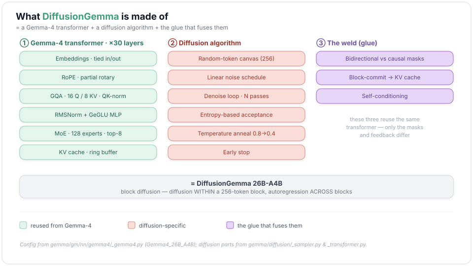

*The parts list: a stock Gemma-4 engine, a diffusion algorithm, and the glue that fuses them.*

DiffusionGemma gets more interesting the closer you look at it. I got curious, so I traced its inference process end to end, one component at a time, and tried to lay each piece out clearly enough to follow in the code itself, not just nod along to the idea.

Underneath, it's a regular Gemma-4 model — the same tokenizer, the same attention-and-MoE stack. What changes is how it writes. A normal LLM produces one token at a time, left to right. DiffusionGemma starts from a whole block of random noise and cleans it up into text over a handful of denoising steps, deciding the entire block at once.

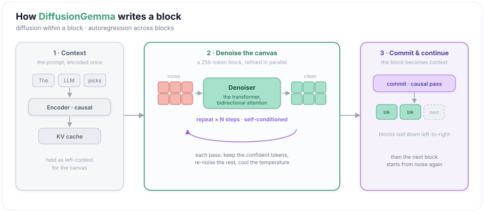

*The shape of one generation: encode the prompt, denoise a block of noise into clean text over a few steps, commit it, and start the next.*

If diffusion for text is new to you, I'd start with [Maarten Grootendorst's "A Visual Guide to DiffusionGemma"](https://newsletter.maartengrootendorst.com/p/a-visual-guide-to-diffusiongemma). It's a lovely, picture-first tour of how DiffusionGemma works and the diffusion ideas behind it, and it'll give you the intuition. From here I'll assume that intuition and head for the code.

At each moving part I pulled together the math, the code (and the exact file it lives in), how it differs from the usual alternative, and the paper behind it. DiffusionGemma is just Gemma-4 run as a diffusion model, so the code lives in [google-deepmind/gemma](https://github.com/google-deepmind/gemma/tree/main/gemma/diffusion), split between the diffusion loop and the shared Gemma-4 network.

**The model at a glance** — from the `Gemma4_26B_A4B` config:

| | | |
|---|---|---|
| vocab **262,144** · width **2,816** | **30 layers** (5 local : 1 global) | **GQA** 16 Q / 8 KV · head_dim 256 |
| sliding window **1,024** | **MoE** 128 experts · top-8 (+ shared MLP 2,112) | RoPE θ **10k local / 1M global** |
| tied embeddings | final-logit soft-cap **30** | ~**26B** total / ~**4B** active · multimodal |

---

## 1 · Tokens & embeddings

Every model has to turn token ids, which are just integers, into vectors at the input, and turn vectors back into scores over the vocabulary at the output. DiffusionGemma uses **one shared matrix** for both ends (weight tying), and scales each looked-up vector by $\sqrt{d}$ so it lands in the range the rest of the network expects:

$$e_i = E_{x_i}\sqrt{d},\qquad \ell = h E^{\top}$$

Reading those symbols: $E$ is the shared embedding table, $x_i$ a token id and $e_i$ its embedding, and $d$ the model width. At the output end, $h$ is the network's final hidden state and $\ell$ ("ell") the **logits** it turns into — one score for every token in the vocabulary. Picking an actual token from those logits is a separate step; in DiffusionGemma it's the whole denoising loop (§13–14).

There's a third move tucked into the embedder that looks pointless right now: it takes a whole *probability distribution* over tokens and averages it into one soft embedding. Hold onto it. It's the hook the diffusion loop uses later to feed each step its own previous guess (§12).

```python
# gemma/gm/nn/gemma4/_modules.py · Embedder
def setup(self):                                       # one shared table for both ends (weight tying)
    self.input_embedding_table = self.param(           # the single [vocab_size, embed_dim] matrix
        'input_embedding', nn.initializers.normal(), (self.vocab_size, self.embed_dim))
    # (multimodal / per-layer-input projections also set up here — omitted)

def encode(self, x):                                   # token ids → vectors (the INPUT end)
    x = self.input_embedding_table[(x,)]               # gather one row per id: [..., embed_dim]
    x *= jnp.sqrt(self.embed_dim).astype(x.dtype)      # scale by √d so it lands in the trained range
    return x

def decode(self, x):                                   # hidden state → logits (the OUTPUT end)
    return jnp.dot(x, self.input_embedding_table.T)    # SAME matrix, transposed (tied) → [..., vocab]

def encode_logits(self, x):                            # a whole DISTRIBUTION → one soft embedding
    probs = jax.nn.softmax(x.astype(jnp.float32), -1).astype(x.dtype)   # logits → probabilities
    x = jnp.einsum('...v,ve->...e', probs, self.input_embedding_table)  # prob-weighted average of rows
    x *= jnp.sqrt(self.embed_dim).astype(x.dtype)      # same √d scaling as encode — this hooks §12
    return x
```

Why tie it? Keeping separate input and output embeddings costs another `vocab × d`, about **0.74B parameters** here, and usually buys little. Tying halves the biggest matrix in the model, and sharing it makes sense: the same matrix that turns a word into a vector going in also scores that word coming out. The `encode_logits` trick is the odd one. A normal LLM never needs to embed a *distribution*; DiffusionGemma does, and §12 is the reason.

*Reference: weight tying — Press & Wolf, [arXiv:1608.05859](https://arxiv.org/abs/1608.05859).*

---

## 2 · RMSNorm

Stack thirty layers and the residual stream drifts. Magnitudes creep up, and training gets unstable. The fix is to renormalize before each sub-layer. RMSNorm is the cheap version: it skips the mean-subtraction that LayerNorm does and just divides by the vector's root-mean-square, then applies a learned gain:

$$\bar{x} = \frac{x}{\sqrt{\tfrac{1}{d}\sum_i x_i^2 + \epsilon}} \odot g,\qquad \epsilon = 10^{-6}$$

Here $g$ is a learned per-feature gain, and $\epsilon$ a tiny constant that keeps the division stable.

```python
# gemma/gm/nn/gemma4/_layers.py · RMSNorm
class RMSNorm(nn.Module):
    with_scale: bool = True                            # some norms skip it (value_norm, §12 post_norm)

    @nn.compact
    def __call__(self, x):
        var = jnp.mean(jnp.square(x), axis=-1, keepdims=True)   # mean square, no centering
        normed = x * jax.lax.rsqrt(var + 1e-06)                 # divide by the RMS (rsqrt, not 1/sqrt)
        if self.with_scale:                            # apply the learned per-feature gain g
            scale = self.param('scale', nn.initializers.ones, (x.shape[-1]))   # one gain per feature
            scale = jnp.expand_dims(scale, axis=range(len(x.shape) - 1))        # [D] → [1,..,1,D]
            normed = normed * scale                    # x̄ ⊙ g
        return normed
```

Dropping the mean-centering is the whole difference from **LayerNorm**. You compute one fewer statistic and carry no bias term, and the RMSNorm paper measured it 7–64% faster across different models, with no real quality loss. Gemma leans on it hard, wrapping every sub-layer in *two* RMSNorms, one before and one after — the sandwich in §15's layer diagram.

*Reference: RMSNorm — Zhang & Sennrich, [arXiv:1910.07467](https://arxiv.org/abs/1910.07467).*

---

## 3 · RoPE — teaching attention where the words are

Plain attention has a blind spot: on its own it has **no idea what order the tokens came in**. Feed it *"dog bites man"* or *"man bites dog"* and, before you add anything, it returns the same thing. So every transformer needs some way to slip *position* into the math. RoPE's answer: instead of *adding* a position signal, it **rotates** each query and key by an angle that grows with the token's position.

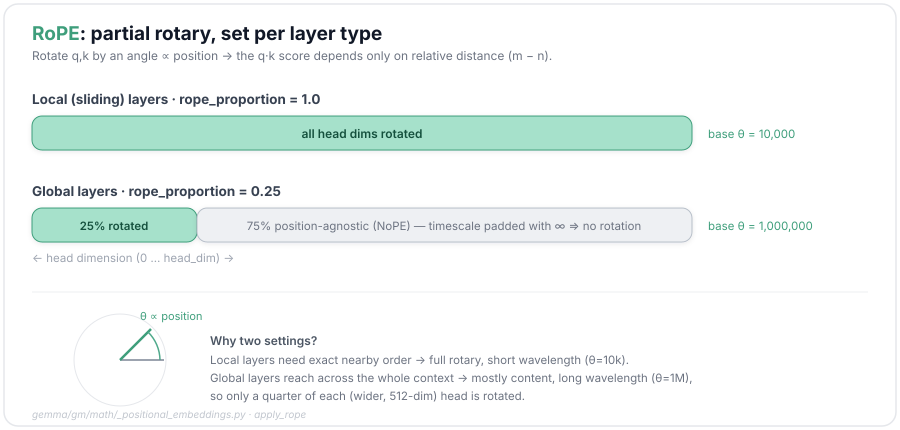

Rotation works because of what happens in the dot product. Rotate the query at position $m$ and the key at position $n$, multiply them, and the two rotations partly cancel. What survives depends only on the **gap** $m-n$, not on $m$ or $n$ on their own. That gives you *relative* position for free, folded right into the attention score. In practice `gemma` splits each head vector in half and pairs dimension $i$ with dimension $i+d/2$, spinning each such pair by $m\theta_i$:

$$\theta_i = \text{base}^{-2i/d}$$

$$x'_{i} = x_{i}\cos m\theta_i - x_{i+d/2}\sin m\theta_i,\qquad
x'_{i+d/2} = x_{i}\sin m\theta_i + x_{i+d/2}\cos m\theta_i$$

— which gives exactly the property we wanted, $\langle\mathrm{RoPE}(q,m),\mathrm{RoPE}(k,n)\rangle = f(q,k, m-n)$ for some function $f$ of the gap alone. (A notation note: in this section $d$ is the per-head dimension, 256 — not §1's model width.)

(The original RoPE paper pairs *adjacent* dimensions $(2i, 2i{+}1)$; `gemma`, like most implementations, pairs the two *halves* $(i, i{+}d/2)$ instead — the same rotation, just a fixed relabeling of which dimensions pair up, so the relative-position property is unchanged.)

DiffusionGemma puts a wrinkle on this: it doesn't always rotate the *whole* vector. On the long-range **global** layers it rotates only a **quarter** of the dimensions and leaves the rest flat (a trick people call "NoPE"), at a much longer wavelength (base $10^6$ instead of $10^4$). The thinking is that a layer reaching across the whole context cares more about *what* a token says than exactly *where* it sits. The way it skips rotation is tidy: it pads the *timescale* table (a timescale is a wavelength, 1/frequency) with $\infty$, and dividing a position by $\infty$ gives an angle of $0$:

```python
# gemma/gm/math/_positional_embeddings.py · apply_rope
rope_angles = int(rope_proportion * head_dim // 2)          # pairs to rotate (¼ on global layers)
freq_exponents = (2.0 / head_dim) * jnp.arange(rope_angles) # the 2i/d exponents, one per 2-D pair
timescale = jnp.pad(base_frequency ** freq_exponents,       # → a wavelength per pair
                    (0, head_dim // 2 - rope_angles), constant_values=(0, jnp.inf))  # ∞ ⇒ NoPE
angle = positions[..., None] / timescale                    # position m → its angle for each pair
sin, cos = jnp.sin(angle), jnp.cos(angle)                   # ← this is where cos and sin come from
first, second = jnp.split(inputs, 2, axis=-1)               # split in half: pair dim i with dim i+d/2
out = jnp.concatenate([first*cos - second*sin, second*cos + first*sin], -1)   # the 2×2 rotation
```

RoPE runs on the query and key vectors; §4 is where they actually meet, in the attention dot product.

RoPE wasn't the first attempt at this. Lining up the options shows why it stuck:

| approach | how it encodes position | relative? | holds up at long range? |
|---|---|---|---|
| Sinusoidal absolute (Vaswani '17) | adds fixed sin/cos to the vector | ✗ absolute | weakly |
| Learned absolute (GPT-2, BERT) | adds a learned per-position vector | ✗ | no — capped at training length |
| ALiBi (Press '21) | biases attention by a linear penalty on distance | ✓ in the logits | strongly |
| **RoPE (Su '21)** | rotates q and k | **✓ in the dot product** | decently (better with a bigger base) |

The absolute schemes pin a token to *where* it sits. RoPE and ALiBi instead encode *how far apart* two tokens are, which is closer to what attention wants. DiffusionGemma's partial-rotary, big-base setup is a dial between full relative position and none at all, pushing its global layers toward mostly content.

*References: RoPE/RoFormer — Su et al., [arXiv:2104.09864](https://arxiv.org/abs/2104.09864); ALiBi — Press et al., [arXiv:2108.12409](https://arxiv.org/abs/2108.12409).*

---

## 4 · Attention, and why it shares heads (GQA)

Attention is where tokens look at each other. At inference, the thing that usually caps your context length and batch size is its memory: the **KV cache** holding every past token's keys and values. DiffusionGemma shrinks that with **Grouped-Query Attention**. It keeps all 16 query heads but lets groups of them *share* one key/value head, so the cache holds 8 KV heads instead of 16.

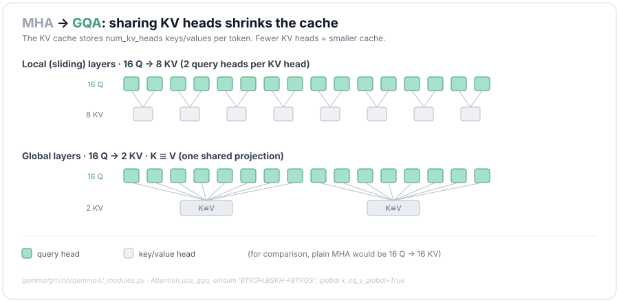

The attention math is the usual dot product, with one Gemma quirk: there is **no** $1/\sqrt{d_k}$ scaling (the usual key-dimension normalizer) anywhere in this code — the QK-norm below does that job. GQA only changes the bookkeeping (here $G = 16/8 = 2$ query heads per KV head):

$$\mathrm{Attn}(Q,K,V)=\mathrm{softmax}\left(QK^{\top}\right)V,\qquad \text{KV cache} \propto \text{number of KV heads}$$

```python
# gemma/gm/nn/gemma4/_modules.py · Attention
def setup(self):                                       # how Q, K, V are created
    self.q_einsum   = Einsum((num_heads,     features, key_size))    # query proj → 16 heads
    self.kv_einsum  = Einsum((2, num_kv_heads, features, key_size))  # key+value → 8 heads (GQA)
    self.query_norm = RMSNorm(); self.key_norm = RMSNorm()          # QK-norm on q and k
    self.value_norm = RMSNorm(with_scale=False)
    self.attn_vec_einsum = Einsum((num_heads, key_size, features))   # output projection

def __call__(self, x, segment_pos, cache, attn_mask):
    # 1 — project x into queries / keys / values, then QK-norm and RoPE
    q = apply_rope(self.query_norm(self.q_einsum('BTD,NDH->BTNH', x)), segment_pos, ...) # [B,T,16,H]
    k, v = self.kv_einsum('BSD,CKDH->CBSKH', x)        # C=2 (k,v); K=8 kv heads (GQA)
    k = apply_rope(self.key_norm(k), segment_pos, ...); v = self.value_norm(v)
    # 2 — write k, v into the ring-buffer KV cache (§7)
    idx = (cache['end_index'][:, None] + jnp.arange(seq_len)) % cache_size
    k = cache['k'].at[batch, idx].set(k); v = cache['v'].at[batch, idx].set(v)
    # 3 — GQA: fold the 16 query heads into 8 groups, each sharing one KV head
    b, t, n, h = q.shape
    q = q.reshape(b, t, num_kv_heads, n // num_kv_heads, h)          # [B,T, K=8, G=2, H]
    logits = jnp.einsum('BTKGH,BSKH->BTKGS', q, k).reshape(b, t, n, -1)   # Q·Kᵀ per query head
    # (gemma4 can tanh-cap these logits, but this config sets attn_logits_soft_cap=None — no cap)
    # 4 — mask → softmax → weighted sum of values → output projection
    logits = jnp.where(attn_mask[..., None, :], logits, K_MASK)   # K_MASK ≈ -2.4e38, a huge negative
    probs  = jax.nn.softmax(logits, -1).reshape(b, t, num_kv_heads, n // num_kv_heads, -1)
    out    = jnp.einsum('BTKGS,BSKH->BTKGH', probs, v).reshape(b, t, n, h)
    return self.attn_vec_einsum('BTNH,NHD->BTD', out)  # [B, T, features]
```

GQA sits in the middle of a spectrum that trades cache size against quality:

| | #KV heads | cache | quality |
|---|---|---|---|
| **MHA** (Vaswani '17) | = #Q (16) | largest | best |
| **GQA** (Ainslie '23) ← DiffusionGemma's local layers | **8** | medium | ≈ MHA |
| **MQA** (Shazeer '19) | 1 | smallest | slight drop |

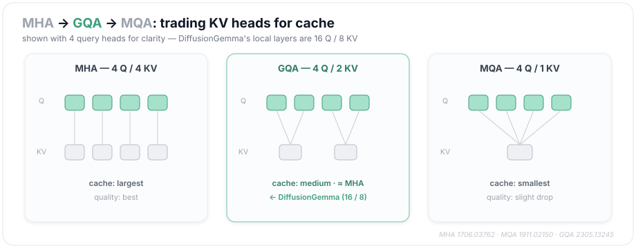

Two Gemma details ride along. **QK-norm** RMS-normalizes the queries and keys *before* the dot product; it's what stands in for the missing $1/\sqrt{d_k}$ and keeps the logits from blowing up at scale. And the rare **global** layers go leaner still (2 KV heads, 512-dim, `k_eq_v=True` in the config, so one projection serves as both K and V): capacity spent where it gets used a lot, saved where it doesn't. One thing you *won't* find here is a soft-cap on the attention logits — this config turns that off (`attn_logits_soft_cap=None`). The **30** in the table is the *final-logit* soft-cap, applied to $hE^\top$ right after §1's decode (`final_logit_softcap=30.0`, applied in `gemma/diffusion/_transformer.py`).

*References: MHA — Vaswani et al., [arXiv:1706.03762](https://arxiv.org/abs/1706.03762); MQA — Shazeer, [arXiv:1911.02150](https://arxiv.org/abs/1911.02150); GQA — Ainslie et al., [arXiv:2305.13245](https://arxiv.org/abs/2305.13245); QK-norm — Henry et al., [arXiv:2010.04245](https://arxiv.org/abs/2010.04245).*

---

## 5 · The MLP is a gate (GeGLU)

After attention, every position runs through a feed-forward block. It's a **gated** one rather than a plain MLP. You project the input twice, push one projection through GELU, and use that as a learned *valve* on the other:

$$\mathrm{GeGLU}(x) = \big(\mathrm{GELU}(xW_{1})\odot (xW_{2})\big) W_{3}$$

Here $W_1$ and $W_2$ are the two input projections (stored as one tensor below) and $W_3$ the projection back to the model width.

```python
# gemma/gm/nn/gemma4/_modules.py · FeedForward
class FeedForward(nn.Module):
    features: int      # = embed_dim
    hidden_dim: int

    @nn.compact
    def __call__(self, x):
        gating = Einsum(shape=(2, self.hidden_dim, self.features),   # ONE tensor holds BOTH gate projs
                        weight_name='gating_einsum')
        gate = gating('...F,NHF->...NH', x)            # → [..., 2, hidden_dim]: both projections
        act = nn.gelu(gate[..., 0, :]) * gate[..., 1, :]   # GELU(gate0) ⊙ gate1 → GeGLU (NOT SwiGLU)
        linear = Einsum(shape=(self.hidden_dim, self.features),      # project hidden_dim → features
                        weight_name='linear')
        return linear('...H,HF->...F', act)            # [..., features]
```

This belongs to a small family of "GLU variants" that differ only in the gate's nonlinearity. **GeGLU** uses GELU (Gemma's choice), **SwiGLU** uses SiLU (LLaMA, PaLM), and there's a ReLU version, ReGLU, that nobody here ships. They all beat a plain feed-forward at the same parameter count, and picking between them is mostly empirical. One thing to get right, since people often assume otherwise: Gemma uses **GeGLU, not SwiGLU**.

*Reference: GLU Variants — Shazeer, [arXiv:2002.05202](https://arxiv.org/abs/2002.05202).*

---

## 6 · Mixture-of-Experts (where the "A4B" comes from)

This is how a 26B model does only ~4B of work per token. Each layer holds **128 expert FFNs plus one shared FFN**. Every token runs through the shared one and its **top-8** experts, and nothing else. So the model has a lot of total capacity but only pays for a slice of it on any given token.

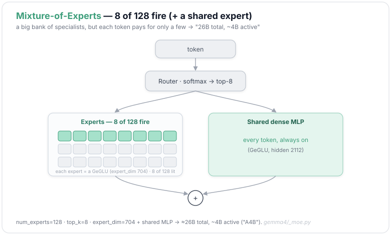

A small router scores the experts, keeps the best 8, renormalizes their weights; the output is the shared branch plus those weighted experts:

$$g=\mathrm{softmax}\big(\tfrac{1}{\sqrt{d}} \bar{x}W_r\big),\quad \mathcal{T}=\mathrm{top}\text{-}k(g),\quad
y=\mathrm{FFN_{shared}}(x)+\sum_{e\in\mathcal{T}}\frac{g_e}{\sum_{j\in\mathcal{T}}g_j} s_e \mathrm{FFN_e}(x)$$

Here $\bar{x}$ is the RMS-normed input, $W_r$ the router's small weight matrix and $g$ its scores over the experts, $\mathcal{T}$ the top-8 set it keeps, $\mathrm{FFN_e}$ the $e$-th expert, and $s_e$ a small learned per-expert output scale; $\mathrm{FFN_{shared}}$ is the always-on shared branch. Every $\mathrm{FFN}$ here (each expert and the shared branch) is a **GeGLU**, the same $\mathrm{gelu}(x_1)\odot x_2$ block as §5, just narrower: expert hidden **704** vs the shared **2,112**.

```python
# gemma/gm/nn/gemma4/_moe.py · MoERagged
def setup(self):                                       # 128 experts + a router
    self.router_logits = Einsum((features, num_experts))            # token → a score per expert
    self.gating_einsum = Weight((num_experts, 2, hidden_dim, features))  # each expert's GeGLU gate (×2)
    self.linear        = Weight((num_experts, hidden_dim, features))     # each expert's output proj
    self.per_expert_scale = self.param('per_expert_scale', nn.initializers.ones, (num_experts,))
    self.router_scale     = self.param('router_scale', nn.initializers.ones, (features,))
    self.router_norm      = RMSNorm(with_scale=False)

def _router(self, router_logits):
    router_probs = jax.nn.softmax(router_logits, -1)   # a probability per expert
    _, choices = jax.lax.approx_max_k(router_logits, k=8)           # keep the top-8 of 128
    weights = router_probs / _renormalization_factor(router_probs, choices)  # renormalize over the 8
    return weights, choices

def __call__(self, x, unnormalized_x):
    # 1 — route: RMS-norm, scale by 1/√d and a learned gain, then score every expert
    router_in = self.router_norm(unnormalized_x) * jax.lax.rsqrt(features) * self.router_scale
    logits = self.router_logits('BSD,DE->BSE', router_in)
    weights, choices = self._router(logits)
    # 2 — group tokens by chosen expert, run each group through its expert (ragged_dot for speed)
    n_per_expert, sorted_x, unsort, w = _expert_dispatch(x, choices, weights)
    # (gating/linear weights are pre-reshaped for ragged_dot: [E,2,H,F] → [E,F,2·H])
    gate = jax.lax.ragged_dot(sorted_x, self.gating_einsum(), group_sizes=n_per_expert)  # [B, 2·hidden]
    x1, x2 = jnp.split(gate, 2, -1)                 # the 2·hidden → two halves: gate, value
    act = nn.gelu(x1) * x2                           # ← GeGLU (per expert, same block as §5)
    expert_out = jax.lax.ragged_dot(act, self.linear(), group_sizes=n_per_expert)   # → back to features
    expert_out = expert_out * per_expert_scale[expert_indices, None]   # × the learned per-expert s_e
    # 3 — scatter each token's outputs back, combine its 8 experts by router weight
    out = _expert_collect(expert_out, unsort)
    return jnp.einsum('blkd,blk->bld', out, w)         # weighted sum over the 8 experts
    # the always-on shared dense MLP is added to this, in the Block
```

A plain **dense** layer fires every parameter for every token. **Switch Transformer** goes to the far end with top-1 routing and maximal sparsity. DiffusionGemma sits in the **shared-expert** camp that DeepSeekMoE popularized: a few always-on shared parameters for the common patterns, plus a lot of specialists you only pay for when the router calls them. That's what "26B total, ~4B active" is describing.

The layer also runs **per token**: each token routes and computes on its own, and nothing looks across tokens. Unlike attention, its cost grows linearly with sequence length, not quadratically. (It's also *dropless*: no expert has a capacity cap, so a token's output depends only on its own vector, never on how many others chose the same expert.)

*References: Switch Transformer — Fedus et al., [arXiv:2101.03961](https://arxiv.org/abs/2101.03961); DeepSeekMoE — Dai et al., [arXiv:2401.06066](https://arxiv.org/abs/2401.06066).*

---

## 7 · The KV cache (and sliding windows)

Generation reuses the past, so you cache it. You keep every past token's keys and values around rather than recompute them each step. DiffusionGemma's cache is a fixed-size **ring buffer**. New entries land at `(end_index + i) mod cache_size` and wrap around when it fills, so memory never grows without bound.

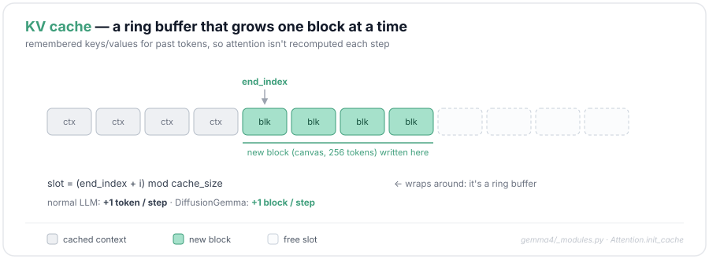

```python
# gemma/gm/nn/gemma4/_modules.py · Attention (cache write)
def __call__(self, x, segment_pos, cache, attn_mask, ...):
    # ... q/k/v projected, QK-normed, RoPE applied (see §4) ...
    if cache is not None:                              # left-aligned ring buffer, fixed size
        end_index = cache['end_index']                 # [batch] — how many tokens written so far
        cache_size = cache['v'].shape[1]; seq_len = x.shape[1]
        indices = (end_index[:, None] + jnp.arange(seq_len)[None, :]) % cache_size   # ring: wraps
        batch_idx = jnp.arange(x.shape[0])[:, None]
        value_proj = cache['v'].at[batch_idx, indices].set(value_proj)   # scatter-write V into the ring
        key_proj   = cache['k'].at[batch_idx, indices].set(key_proj)     # scatter-write K into the ring
        cache_positions = (                          # also remember each slot's abs position
            cache['positions'].at[batch_idx, indices].set(segment_pos))  # (the sliding mask needs it)
    # ... logits = einsum(q, k) [+ soft-cap] ...
    if self.attn_type == AttentionType.LOCAL_SLIDING and not skip_sliding_mask:
        sliding_mask = _create_sliding_mask(           # LOCAL layers only: a ±window band
            segment_pos, cache_positions=cache_positions,
            sliding_window_size=self.sliding_window_size)     # 1024 on the local layers
        attn_mask *= sliding_mask                      # AND it into the causal/padding mask
    # ... softmax(masked logits) · V → output ...

# the band itself — a key is visible only within ±window of the query position:
def _create_sliding_mask(positions, *, cache_positions, sliding_window_size):
    cache_positions = cache_positions[..., None, :]    # [B, 1, cache_len]  (a key's abs position)
    positions       = positions[..., :, None]          # [B, L, 1]          (a query's abs position)
    sliding_mask  = cache_positions > positions - sliding_window_size   # not too far in the past
    sliding_mask *= cache_positions < positions + sliding_window_size   # not too far in the future
    return sliding_mask
```

If every layer attended to everything, you'd pay $O(n^2)$ and a cache that keeps growing. Accurate, but expensive. DiffusionGemma runs **5 local : 1 global** instead. Five layers in six attend only within a 1,024-token window, and the sixth reaches across the whole sequence to tie things together. One detail to carry into the diffusion half: here the cache grows **one block at a time**, not one token; §10 picks that up.

*Reference: sliding-window / local attention — Longformer, Beltagy et al., [arXiv:2004.05150](https://arxiv.org/abs/2004.05150).*

---

## 8 · What is "noise" for text? (multinomial diffusion)

Image diffusion adds a little Gaussian noise to continuous pixels. Tokens don't work that way. There's no halfway point between *cat* and *dog*, so text needs a different notion of noise. The classic answer (D3PM) is a **transition matrix** $Q_t$ over the vocabulary. Each forward step says "with some probability, jump this token to another one": $q(x_t\mid x_{t-1})=\mathrm{Cat}(x_t; p=x_{t-1}Q_t)$. The *kind* of jump is a design choice:

$$\underbrace{Q^{\text{unif}}_t=(1-\beta_t)I+\tfrac{\beta_t}{V}\mathbf{1}\mathbf{1}^\top}_{\text{become a random token}}\qquad\text{vs}\qquad \underbrace{Q^{\text{abs}}_t: \text{token}\to[\text{MASK}]}_{\text{become a blank}}$$

Here $Q_t$ is the transition matrix for step $t$, $\beta_t$ how much corruption that step adds, $V$ the vocabulary size, $I$ the identity, and $\mathbf{1}\mathbf{1}^\top$ the all-ones matrix that spreads probability evenly across the vocabulary.

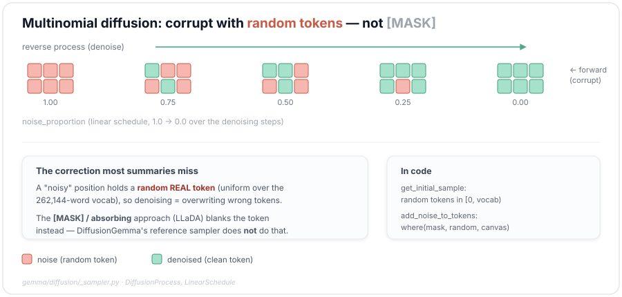

This is the part the code makes obvious and the write-ups usually miss. Almost every recent text-diffusion model (LLaDA, MDLM, BD3-LMs) corrupts by **masking**: it blanks tokens to `[MASK]`, BERT-style. DiffusionGemma's reference sampler doesn't. It starts the canvas (the block, while it's still being denoised) as **uniformly random tokens** and corrupts by swapping in more random tokens. That's the **uniform / multinomial** kernel:

```python
# gemma/diffusion/_sampler.py · DiffusionProcess
def get_initial_sample(self, rng, batch_size, canvas_length, text_vocab_size):
    # The canvas starts as RANDOM real tokens, not [MASK].
    return jax.random.randint(rng, shape=(batch_size, canvas_length),   # every slot a random id
                              minval=0, maxval=text_vocab_size)

def add_noise_to_tokens(self, rng, canvas_tokens, noise_proportion, text_vocab_size):
    rng_mask, rng_tokens = jax.random.split(rng)
    prob_noise = jax.vmap(self.noise_schedule.noise_probability)(noise_proportion)  # p = np (§9)
    noise_mask = jax.random.bernoulli(rng_mask, p=prob_noise[:, None],   # flip each slot w.p. p
                                      shape=canvas_tokens.shape)
    random_tokens = jax.random.randint(rng_tokens, shape=canvas_tokens.shape,       # fresh randoms
                                       minval=0, maxval=text_vocab_size)
    # corrupt = OVERWRITE the masked slots with random tokens (keep the rest)
    return jnp.where(noise_mask, random_tokens, canvas_tokens)
```

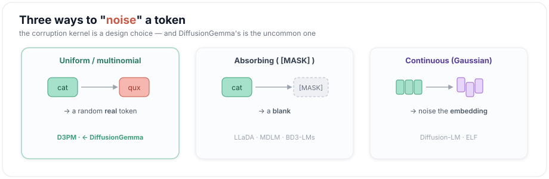

So a noisy position holds a real word that happens to be wrong, and denoising means finding and overwriting the wrong ones. There's a third option too: the **continuous** branch (Diffusion-LM, ELF) works in embedding space, adding Gaussian noise or a learned flow over the *embeddings*, and only rounds to tokens at the end. DiffusionGemma mixes its sources. It took the block *structure* from BD3-LMs, which masks, but the *corruption* from D3PM's uniform kernel.

*References: D3PM — Austin et al., [arXiv:2107.03006](https://arxiv.org/abs/2107.03006); Multinomial Diffusion — Hoogeboom et al., [arXiv:2102.05379](https://arxiv.org/abs/2102.05379); LLaDA — [arXiv:2502.09992](https://arxiv.org/abs/2502.09992); Diffusion-LM — [arXiv:2205.14217](https://arxiv.org/abs/2205.14217); ELF — [arXiv:2605.10938](https://arxiv.org/abs/2605.10938).*

---

## 9 · The noise schedule

Corruption is what happens to a token; the schedule sets how much of it happens, and when. DiffusionGemma keeps the schedule about as simple as possible. It's **linear**: the noise proportion walks down evenly from all-noise to clean.

$$\text{noise proportion}(i) = 1 - \frac{i}{N},\qquad i = 0,\dots,N \quad (1.0 \to 0.0)$$

Here $N$ is `max_denoising_steps`, the step budget for one block.

```python
# gemma/diffusion/_sampler.py · LinearSchedule
@dataclasses.dataclass(frozen=True)
class LinearSchedule:                                    # the schedule is the identity — nothing clever
    def noise_probability(self, noise_proportion):
        return noise_proportion                          # p(np) = np
    def derivative_noise_probability(self, noise_proportion):
        del noise_proportion
        return jnp.array(1.0)                             # d/d(np) = 1  (defined, never called)

# gemma/diffusion/_sampler.py · DiffusionSampler.sample_next_canvas — the step schedule
# noise_proportions[0] = 1.0 (all noise) … [max_denoising_steps] = 0.0 (clean)
noise_proportions = 1.0 - jnp.arange(max_denoising_steps + 1) / max_denoising_steps  # even 1.0→0.0
# per step: current = noise_proportions[step], target = noise_proportions[step + 1]
```

Image diffusion usually prefers a **cosine** schedule, which erodes information more gently and tends to need fewer steps. BD3-LMs go further and *learn* the schedule to cut gradient variance. DiffusionGemma stays linear and lets the temperature schedule (§14) handle the adaptive part. That `noise_proportion` does more than bookkeeping, though: it's the input that drives the temperature.

*References: cosine schedule — Nichol & Dhariwal, [arXiv:2102.09672](https://arxiv.org/abs/2102.09672); learned schedule — BD3-LMs, [arXiv:2503.09573](https://arxiv.org/abs/2503.09573).*

---

## 10 · Block diffusion — diffuse the block, autoregress the sequence

Pure diffusion is fast and parallel but rigid: fixed length, no KV-cache reuse. Pure autoregression is flexible but strictly one token at a time. **Block diffusion** splits the difference. It runs diffusion *inside* a fixed block of tokens, then lays the blocks down *autoregressively*, left to right.

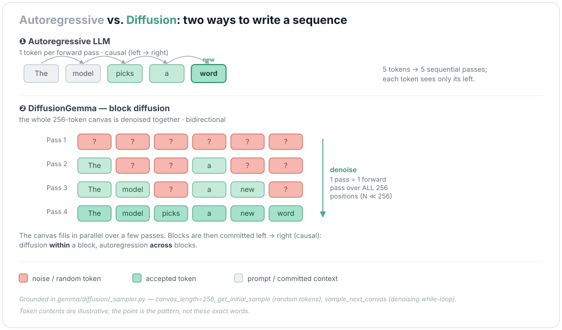

Generating a block goes like this: start a 256-token canvas of noise (`canvas_length = 256` in the released sampler), run a handful of denoising steps over it, then **commit** it to the KV cache and move to the next block:

```python
# gemma/diffusion/_sampler.py · DiffusionSampler._sample_step  (the per-block loop)
canvas = self.sample_next_canvas(                        # run N denoising steps over ONE block
    canvas_length=self.canvas_length, max_denoising_steps=self.max_denoising_steps,
    batch_size=batch_size, cache=cache, params=params, rng=sample_rng)

# stop the block at the first EOS and PAD the tail (per-sequence)
canvas, batch_has_stop_token = _truncate_canvas_at_stop_tokens(
    canvas, end_tokens=self.end_tokens, canvas_length=self.canvas_length, done=state.done)

cache = self.append_tokens_to_cache(                     # COMMIT the block: a causal forward pass
    tokens=canvas, cache=cache, params=params)           # writes its K/V so the next block sees it

# advance the write head by one whole block, record the tokens, carry the cache forward
indices = jnp.arange(self.canvas_length) + state.step
predicted_tokens = state.predicted_tokens.at[:, indices].set(canvas)
# → returns SamplingState(step = state.step + canvas_length, cache=cache, …)  next block starts here
```

Because each block is finished before the next one starts, you can keep a KV cache, still sample a whole block in parallel, and still produce variable-length output — none of which pure diffusion offers. This hybrid, from BD3-LMs, is how DiffusionGemma writes anything longer than one block, and it's the reason "diffusion within a block, autoregression across blocks" keeps coming up.

*Reference: Block Diffusion (BD3-LMs) — Arriola et al., [arXiv:2503.09573](https://arxiv.org/abs/2503.09573).*

---

## 11 · One transformer, three attention masks

A causal LLM only ever looks left. A diffusion denoiser has to look **both ways**: to fix the token at position 3, it wants positions 1 through 256. DiffusionGemma gets both behaviors from the *same* weights by handing attention a different mask depending on what it's doing. The two main ones:

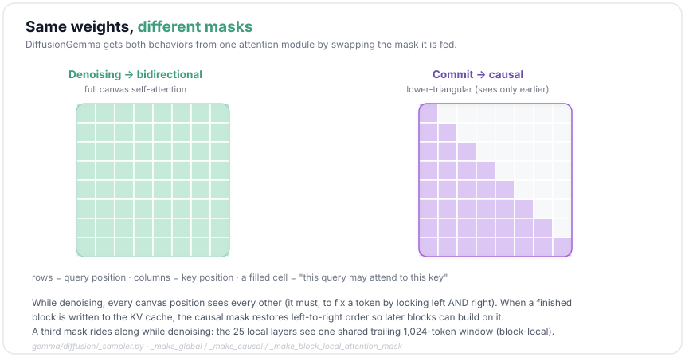

```python
# gemma/diffusion/_sampler.py · _make_global_attention_mask  (GLOBAL layers, while denoising)
def _make_global_attention_mask(batch_size, canvas_length, cache_length, num_valid_tokens):
    if cache_length is None:                             # no cache → the canvas is all there is:
        return jnp.ones((batch_size, canvas_length, canvas_length), dtype=jnp.bool_)  # full bidi
    # with a cache: canvas + every already-committed token is visible to every canvas position
    total_valid = jnp.minimum(num_valid_tokens + canvas_length, cache_length)
    mask = jnp.arange(cache_length)[None, :] < total_valid[:, None]        # all valid slots = True
    return jnp.broadcast_to(mask[:, None, :], (batch_size, canvas_length, cache_length))

# gemma/diffusion/_sampler.py · _make_causal_attention_mask  (used WHILE committing a block)
def _make_causal_attention_mask(batch_size, canvas_length, cache_length, num_valid_cache_tokens):
    if cache_length is None:
        causal = jnp.tril(jnp.ones((canvas_length, canvas_length), dtype=jnp.bool_))   # lower-tri
        return jnp.broadcast_to(causal[None], (batch_size, canvas_length, canvas_length))
    valid = jnp.minimum(num_valid_cache_tokens, cache_length)
    mask = jnp.broadcast_to(                             # 1) see all previously-committed tokens
        jnp.arange(cache_length)[None, None, :] < valid[:, None, None],
        (batch_size, canvas_length, cache_length))
    write_idx = (num_valid_cache_tokens[:, None]         # 2) among the NEW tokens: strictly causal
                 + jnp.arange(canvas_length)[None, :]) % cache_length         # ring-buffer positions
    causal = jnp.tril(jnp.ones((canvas_length, canvas_length), dtype=jnp.bool_))
    b_idx = jnp.arange(batch_size)[:, None, None]; s_idx = jnp.arange(canvas_length)[None, :, None]
    return mask.at[b_idx, s_idx, write_idx[:, None, :]].set(causal[None])
```

The third mask is the one most layers actually use. While denoising, only the 5 **global** layers get the bidirectional mask above; the 25 **local** sliding-window layers get a *block-local* variant — every canvas token sees the same trailing window of committed context, plus the whole canvas:

```python
# gemma/diffusion/_sampler.py · _make_block_local_attention_mask  (LOCAL layers, while denoising)
context_end   = num_valid_tokens                                   # first canvas slot in the cache
context_start = jnp.maximum(context_end - sliding_window_size, 0)  # …the last 1,024 committed tokens
context_mask  = (cache_indices >= context_start[:, None]) & (cache_indices < context_end[:, None])
canvas_end    = jnp.minimum(num_valid_tokens + canvas_length, cache_length)
canvas_mask   = (cache_indices >= num_valid_tokens[:, None]) & (cache_indices < canvas_end[:, None])
combined = context_mask | canvas_mask         # one shared window for ALL canvas tokens + full canvas
```

Nothing in the network changes between these cases. Only the mask does. That's what lets one transformer act as a bidirectional denoiser inside a block and still stack blocks in left-to-right order.

*Reference: implementation in `gemma/diffusion/_sampler.py`.*

---

## 12 · Self-conditioning — don't start each step cold

On its own, each denoising step would work out its beliefs from scratch off a noisy canvas. Self-conditioning gives each step a memory of what the last one decided. This is what `encode_logits` from §1 was for: it turns the previous step's logits into a soft embedding, runs that through a small feed-forward, and adds it to the canvas embeddings before the transformer runs.

$$s_{t-1}=\mathrm{enc}(\ell_{t-1}),\qquad x \leftarrow \mathrm{RMSNorm}\big(x + \mathrm{FFN}(\mathrm{RMSNorm}(s_{t-1}))\big)$$

```python
# gemma/diffusion/_transformer.py · SelfConditioning
class SelfConditioning(nn.Module):
    features: int; hidden_dim: int
    def setup(self):
        self.pre_norm  = _layers.RMSNorm()                      # norm the incoming belief
        self.ffw       = _modules.FeedForward(features=self.features, hidden_dim=self.hidden_dim)
        self.post_norm = _layers.RMSNorm(with_scale=False)      # norm the sum (no learned gain)
    def __call__(self, *, canvas_embeddings, self_conditioning_signal):
        sc_signal = self.ffw(self.pre_norm(self_conditioning_signal))   # last belief → a correction
        return self.post_norm(canvas_embeddings + sc_signal)    # post_norm(canvas + ffw(pre_norm(sig)))

# gemma/diffusion/_transformer.py · DiffusionMixin — the first step is cold
is_zero_sc = jnp.all(sc_embeddings == 0.0)                      # step 0 has no previous guess
sc_signal  = jnp.where(is_zero_sc, jnp.zeros_like(inputs.embeddings), sc_embeddings)  # → zeros
inputs = inputs.replace(embeddings=self.self_conditioner(      # fold belief into the canvas embeds
    canvas_embeddings=inputs.embeddings, self_conditioning_signal=sc_signal))

# gemma/diffusion/_sampler.py · sample_step — build NEXT step's signal from this step's guess
new_sc = self.model.apply({'params': params}, shaped_prediction,   # temp-shaped logits (§14)
    method=lambda self, x: self.embedder.encode_logits(x))     # distribution → one soft embedding (§1)
```

On the first step there's no previous guess, so the signal is just zeros. The idea comes from continuous diffusion ("Analog Bits") and carries over to tokens through that probability-weighted embedding. It earns its keep by steadying the denoising.

*Reference: self-conditioning — Chen et al. (Analog Bits), [arXiv:2208.04202](https://arxiv.org/abs/2208.04202).*

---

## 13 · Which tokens to keep? (entropy-based acceptance)

Each denoising step has to decide which noisy positions are good enough to lock in. DiffusionGemma doesn't fix the count ahead of time. It goes by **confidence**, measured as entropy. It samples a candidate per position, sorts them from most to least confident, and accepts a prefix while a cumulative entropy budget lasts. Whatever's rejected gets re-noised and tried again next step.

$$H_i=-\sum_v p_{iv}\log p_{iv},\qquad \text{accept } i \iff \sum_{j: \mathrm{rank}(j)<\mathrm{rank}(i)} H_j  \le  \text{entropy bound} (=0.1)$$

Here $H_i$ is the entropy at position $i$ (low means confident), $p_{iv}$ the probability it puts on token $v$, and $\mathrm{rank}$ orders positions from most to least confident — you accept them in that order while the entropy already accepted stays under the bound.

```python
# gemma/diffusion/_sampler.py · SampleFromPredictions   (entropy_bound = 0.1)
def __call__(self, *, rng, denoiser_logits, canvas,
             current_noise_proportion, target_noise_proportion):
    categorical_rng, noise_rng = jax.random.split(rng)
    denoiser_tokens = jax.random.categorical(categorical_rng,    # sample ONE candidate per position
                                             denoiser_logits.astype(jnp.float32))
    # per-position entropy H = -Σ p·log p  (low = confident)
    log_probs = jax.nn.log_softmax(denoiser_logits.astype(jnp.float32))
    probs = jnp.exp(log_probs)
    safe_log_probs = jnp.where(probs == 0, 0.0, log_probs)       # guard log(0)
    token_entropy = -jnp.sum(safe_log_probs * probs, axis=-1)    # [B, L]
    # sort by confidence, accept a PREFIX under the entropy budget
    sorted_index   = jnp.argsort(token_entropy, axis=-1)         # most confident first
    sorted_entropy = jnp.take_along_axis(token_entropy, sorted_index, axis=-1)
    accumulated    = jnp.cumsum(sorted_entropy, axis=-1)
    sorted_mask = (accumulated - sorted_entropy) <= self.entropy_bound   # keep while budget lasts
    # scatter the prefix-mask back to the ORIGINAL positions (NOT sorted order)
    selection_mask = (jnp.zeros_like(sorted_index, dtype=jnp.bool_)
        .at[jnp.arange(canvas.shape[0])[:, None], sorted_index].set(sorted_mask))
    # accepted → keep the denoiser's token; rejected → RE-NOISE with a fresh random token
    random_tokens = jax.random.randint(noise_rng, shape=canvas.shape, minval=0,
                                       maxval=self.text_vocab_size)
    return jnp.where(selection_mask, denoiser_tokens, random_tokens)
```

The usual alternative is to unmask a **fixed number** of tokens per step (LLaDA-style), or to set a fixed confidence threshold. Both are rigid. The entropy budget lets the count come out on its own: a handful while the model is unsure, many once it's confident.

*Reference: implementation in `gemma/diffusion/_sampler.py` (`SampleFromPredictions`).*

---

## 14 · Sampling temperature & knowing when to stop

Two last knobs, both tied to how clean the canvas already is. The temperature **anneals**: hot while the canvas is mostly noise, where there's little to lose by exploring, and cool as it firms up, where you want to be careful. And the loop can stop early once the canvas has settled, instead of spending its whole step budget. Two rules watch for that: one tracks the mean entropy of the predictions, the other whether the tokens stopped changing between steps. The released sampler chains them and stops only when **both** agree; the bare `DiffusionSampler` class defaults to no early stopping at all.

$$T(\text{np}) = T_{\min} + (T_{\max}-T_{\min})\big(1-(1-\text{np})^{e}\big),\quad [T_{\min},T_{\max}]=[0.4, 0.8]$$
$$\text{stop} \iff \underbrace{\overline{H} \le 0.005}_{\text{entropy rule}}  \textbf{and}  \underbrace{\arg\max \ell = \text{previous canvas}}_{\text{stability rule}}$$

Here $\text{np}$ is the noise proportion from §9 (1 = all noise, 0 = clean), $e$ a shaping exponent, and $\overline{H}$ the canvas's mean per-token entropy.

```python
# gemma/diffusion/_sampler.py · AnnealingTemperatureShaper   (min 0.4, max 0.8, exponent 1.0)
def __call__(self, logits, noise_proportion):                   # np: ~1 (noisy) → ~0 (clean)
    # fraction 1 - (1-np)**e : runs 1 → 0 as the canvas firms up
    frac = 1.0 - (1.0 - noise_proportion.astype(logits.dtype)) ** self.config.exponent
    temperature = (frac                                         # scale into [min, max]
        * (self.config.max_temperature - self.config.min_temperature)) + self.config.min_temperature
    return (logits / temperature[:, None, None]).astype(logits.dtype)   # hot early, cool late

# gemma/diffusion/_early_stopping.py · EntropyEarlyStop   (entropy_threshold = 0.005)
def should_stop(self, *, step, canvas, previous_canvas, logits):
    log_probs = jax.nn.log_softmax(logits); probs = jnp.exp(log_probs)
    log_probs = jnp.where(probs == 0, 0.0, log_probs)          # guard log(0)
    entropy_per_token = -jnp.sum(log_probs * probs, axis=-1)   # H per position
    return jnp.mean(entropy_per_token, axis=-1) <= self.entropy_threshold   # mean H ≤ 0.005 → stop

# gemma/diffusion/_early_stopping.py · TokenStabilityEarlyStop
def should_stop(self, *, step, canvas, previous_canvas, logits):
    most_likely_tokens = jnp.argmax(logits, axis=-1)           # this step's argmax
    return jnp.all(most_likely_tokens == previous_canvas, axis=-1)   # unchanged vs last canvas → stop

# gemma/diffusion/_chat_sampler.py — the released default chains them: stop only when BOTH say stop
early_stop_fn = ChainedEarlyStop((TokenStabilityEarlyStop(), EntropyEarlyStop(0.005)))  # logical AND
```

A **constant** temperature can't be adventurous early and precise late at the same time, and a **fixed step count** either wastes compute after the answer has settled or stops before it has. DiffusionGemma ties both knobs to the live state of the canvas instead.

*Reference: implementation in `gemma/diffusion/_sampler.py`, `_early_stopping.py`, `_chat_sampler.py`.*

---

## 15 · Putting it together — one block, end to end

First, the layer itself — §2's norm sandwich, assembled. Each of the 30 layers wraps its attention (§3–4) and its MoE (§5–6) between pre- and post-RMSNorms, with residual adds around both:

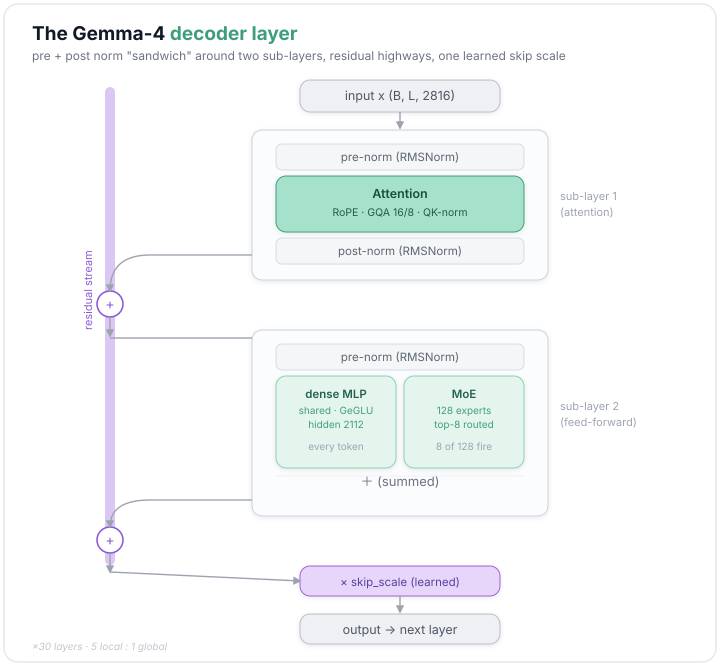

Then the loop that runs around that stack:

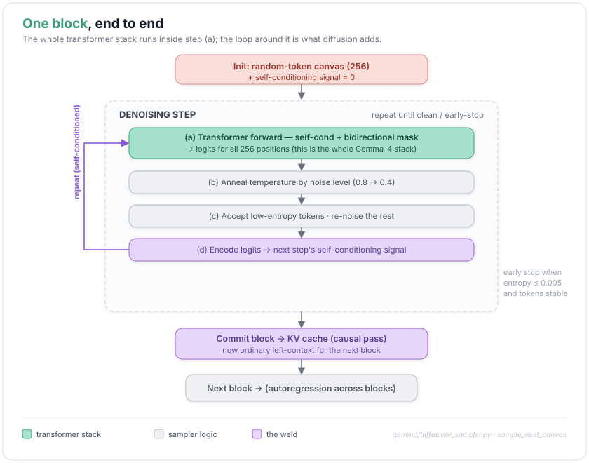

Now the pieces run as one loop. Start a block as a random canvas (§8). Then repeat a denoising step: run the transformer with its self-conditioning signal and the denoising masks (§3–7, §11–12), shape the logits with the annealed temperature (§14), accept the most-confident tokens and re-noise the rest (§13), and encode those logits into the signal for the next step (§12). Keep going until the canvas is clean or early-stops (§14). Commit the finished block to the KV cache with a causal pass (§10–11), and start the next one. That loop, wrapped around the engine of §1–7, is DiffusionGemma.

In code, end to end: encode the prompt into the cache, then emit one block at a time (denoise it over a few steps, commit it) until the model stops, and decode. Here's the whole pipeline flattened, then the one module it leans on:

```python
# the whole pipeline, prompt → text — flattened from Sampler.sample / SamplerLoop._sample_loop /
#  DiffusionSampler._sample_step  (gm/text/_sampler.py, _sampler_loop.py, diffusion/_sampler.py)

tokens = tokenizer.encode(prompt, add_bos=True)               # BOS on a first turn
cache  = prefill(tokens, params, ...)      # a causal pass writes the prompt KV (gm/text/_prefill.py)
# (diffusion sets keep_last_prefill_kv=True so the cache index lines up with the first canvas slot)
state = SamplingState(cache=cache, step=0, done=False, predicted_tokens=zeros)
# emit one BLOCK per iteration, left → right, until done / max length / cache full (§10)
while (state.step < max_new_tokens) & ~jnp.all(state.done) & ~state.cache_info.is_full:
    canvas = sample_next_canvas(cache=state.cache, params=params, rng=...)   # denoise a block ↓ (§8–14)
    canvas, stop = _truncate_canvas_at_stop_tokens(canvas, end_tokens)       # cut at the first EOS
    cache = append_tokens_to_cache(canvas, cache=state.cache, params=params) # commit, causal (§11)
    state = advance(state, cache=cache, block=canvas, done=state.done | stop)  # step += canvas_length
tokens = _mask_tokens_after_end_tokens(state.predicted_tokens, end_tokens)   # drop anything after EOS
text   = tokenizer.decode(tokens)                                            # tokens → text

# ── the one module that loop leans on: denoise ONE block over up to N steps (§8–14) ──
def sample_next_canvas(*, canvas_length, max_denoising_steps, cache, params, rng):
    canvas = diffusion_process.get_initial_sample(...)    # start from RANDOM tokens (§8)
    sc     = jnp.zeros((batch, canvas_length, embed_dim)) # self-cond signal starts empty (§12)
    mask   = _make_global_attention_mask(...)             # + a block-local one for local layers (§11)
    noise_proportions = 1.0 - jnp.arange(max_denoising_steps + 1) / max_denoising_steps   # §9
    def body(c):                                          # one denoising step over the canvas
        out = sample_step(   # transformer forward → temp-shape → entropy-accept (§1–7, 13, 14)
            canvas=c.canvas, sc_embeddings=c.sc_embeddings, cache=cache, attention_mask=mask,
            current_noise_proportion=noise_proportions[c.step],
            target_noise_proportion=noise_proportions[c.step + 1], params=params, rng=...)
        done = c.done | early_stop_fn.should_stop(        # the chained early-stop rules (§14)
            canvas=out.sampled_tokens, previous_canvas=c.canvas, logits=out.logits)
        canvas = jnp.where(c.done[:, None], c.canvas, out.sampled_tokens)   # freeze finished rows
        return _WhileLoopCarry(step=c.step + 1, canvas=canvas,
                               sc_embeddings=out.sc_embeddings, done=done)
    init = _WhileLoopCarry(step=0, canvas=canvas, sc_embeddings=sc, done=jnp.zeros(batch, bool))
    return jax.lax.while_loop(
        lambda c: ~jnp.all(c.done) & (c.step < max_denoising_steps), body, init).canvas
```

*Reference: `gemma/gm/text/_sampler.py`, `_sampler_loop.py`, `_prefill.py`; `gemma/diffusion/_sampler.py`, `_chat_sampler.py`.*

---

## Wrapping up

That's DiffusionGemma end to end, from the first embedding lookup to the last committed block. I hope it made the model click.

If you spot an error or think I've misread something, please tell me — I'd rather fix it than leave it wrong. And if a part didn't land, or there's another model you'd like to see taken apart like this, I'd love to hear it; that's exactly the kind of thing I want to write next. Thanks for reading.

*Code: [`google-deepmind/gemma`](https://github.com/google-deepmind/gemma) — `gemma/diffusion/` + `gemma/gm/nn/gemma4/`.*


## Citation

If you'd like to cite this post:

> Shen, Hongyu. "Learning with Code: DiffusionGemma". *Agent Learning Notes*, Jul 2026.
> https://github.com/drshy-org/agent-learning-notes/tree/main/learning-with-code/diffusiongemma

```bibtex
@article{shen2026diffusiongemma,
  title   = {Learning with Code: DiffusionGemma},
  author  = {Shen, Hongyu},
  journal = {Agent Learning Notes},
  year    = {2026},
  month   = {Jul},
  url     = {https://github.com/drshy-org/agent-learning-notes/tree/main/learning-with-code/diffusiongemma}
}
```

---

*© 2026 Hongyu Shen — original writing and figures, all rights reserved. Code snippets are from [`google-deepmind/gemma`](https://github.com/google-deepmind/gemma) under the Apache 2.0 License; DiffusionGemma and its architecture are © Google DeepMind.*
