# Learning with Code: Nemotron 3
### The 550B that mostly gave up attention

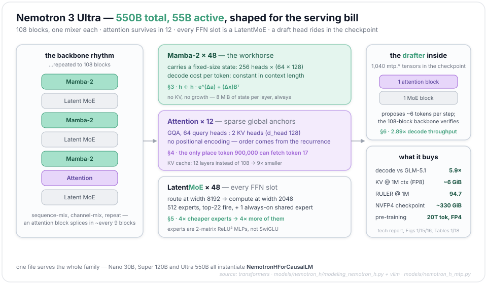

Somewhere in 2025, the expensive part of a language model stopped being the answer and became the conversation. An agent runs for hours, re-reading a growing context on every step, and most of its tokens go to deciding what to do next. NVIDIA Nemotron 3 Ultra — 550 billion parameters, 55 billion active, released June 4, 2026 — is a flagship shaped around that serving bill. None of its parts was invented for agents; what's new is that every one of them is picked for the same ledger. Only 12 of its 108 blocks are attention. Each MoE layer routes to 512 experts that work in a latent space a quarter the model's width, and the checkpoint carries a second, tiny model: a draft head that proposes the next few tokens so the big model only has to check them.

This post takes that machine apart, walking every moving part in the order a token meets it during one step of generation — for each: the **math**, the **code** (and the exact file it lives in), **how it differs from the alternatives**, and the **papers**. The Mamba and MoE sections are interleaved the way the layer stack interleaves them.

New to state-space models or Mixture-of-Experts? Read Maarten Grootendorst's visual guides first — [A Visual Guide to Mamba and State Space Models](https://newsletter.maartengrootendorst.com/p/a-visual-guide-to-mamba-and-state) and [A Visual Guide to Mixture of Experts](https://newsletter.maartengrootendorst.com/p/a-visual-guide-to-mixture-of-experts), the best primers going. This post starts where they leave off, at the code.

Two files carry nearly all the code below. The whole Nemotron 3 family — Nano, Super, Ultra — instantiates one class, `NemotronHForCausalLM`, from [`modeling_nemotron_h.py`](https://github.com/huggingface/transformers/blob/main/src/transformers/models/nemotron_h/modeling_nemotron_h.py) in Hugging Face `transformers`; each released `config.json` names it. The one part that file *refuses to load* is the MTP draft head (multi-token prediction, §6) — the checkpoint ships 1,040 `mtp.*` tensors that the HF port explicitly ignores — so for that component we read [vLLM's `nemotron_h_mtp.py`](https://github.com/vllm-project/vllm/blob/main/vllm/model_executor/models/nemotron_h_mtp.py), where it runs. Weights are on Hugging Face in [BF16](https://huggingface.co/nvidia/NVIDIA-Nemotron-3-Ultra-550B-A55B-BF16) (bfloat16) and [NVFP4](https://huggingface.co/nvidia/NVIDIA-Nemotron-3-Ultra-550B-A55B-NVFP4) (NVIDIA's 4-bit floating-point format); the [Ultra technical report](https://research.nvidia.com/labs/nemotron/files/NVIDIA-Nemotron-3-Ultra-Technical-Report.pdf) and the [Nemotron 3 white paper](https://arxiv.org/abs/2512.20856) fill in the training story.

**The model at a glance** — from the released `config.json` (`NemotronHConfig`):

| | | |
|---|---|---|
| 550B total · 55B active | 108 blocks: 48 Mamba-2 · 48 MoE · 12 attention | model width 8192 |
| 512 experts, top-22, +1 shared | MoE latent width 2048 (a 4× squeeze) | expert FFN 5120, ReLU² |
| GQA: 64 Q heads : 2 KV heads (128-dim) | Mamba-2: 256 heads × 64, state 128, 8 groups | no positional encoding |
| vocabulary 131,072 · untied head | pre-trained on 20T tokens, mostly in NVFP4 | MTP: 1 drafter, 2 shared-weight train steps |

---

## 1 · The layer map — one block, one job

A Llama-style decoder is a single block stamped N times: attention, then a feed-forward network (FFN), with two norms. Nemotron 3 Ultra abandons the stamp. Each of its 108 blocks holds exactly **one** mixer — a Mamba-2 layer, an attention layer, *or* an MoE layer — and the sequence of block types is spelled out, layer by layer, in the config:

```python
# src/transformers/models/nemotron_h/modeling_nemotron_h.py
# · MIXER_TYPES / NemotronHBlock   (here and below: type annotations trimmed from signatures)
MIXER_TYPES = {
    "linear_attention": NemotronHMamba2Mixer,   # the config spells it "mamba"
    "full_attention": NemotronHAttention,       # … and this one "attention"
    "moe": NemotronHMoE,
    "mlp": NemotronHMLP,                        # no "mlp" blocks in Ultra — but the class returns as §5's shared expert
}

class NemotronHBlock(GradientCheckpointingLayer):
    def __init__(self, config, layer_idx):
        super().__init__()
        self.norm = NemotronHRMSNorm(config.hidden_size, eps=config.layer_norm_epsilon)
        self.block_type = config.layers_block_type[layer_idx]
        self.mixer = MIXER_TYPES[self.block_type](config, layer_idx=layer_idx)

    def forward(self, hidden_states, past_key_values=None, attention_mask=None, position_ids=None,
                use_cache=False, **kwargs):
        # hidden_states: (B, T, 8192) — B = batch, T = tokens; the convention below
        residual = hidden_states
        hidden_states = self.norm(hidden_states.to(dtype=self.norm.weight.dtype))
        if self.block_type == "linear_attention":
            hidden_states = self.mixer(hidden_states, cache_params=past_key_values,
                                       attention_mask=attention_mask)
        elif self.block_type == "full_attention":
            hidden_states, _ = self.mixer(hidden_states=hidden_states,
                                          past_key_values=past_key_values,
                                          attention_mask=attention_mask, position_ids=position_ids,
                                          use_cache=use_cache, **kwargs)
        else:   # "moe" / "mlp" — token-local, needs no cache and no mask
            hidden_states = self.mixer(hidden_states)
        hidden_states = residual + hidden_states
        return hidden_states
```

Ultra's `layers_block_type` decodes to a simple rhythm. The backbone alternates Mamba-2 and MoE — sequence mixing, then channel mixing, the same division of labor as attention+FFN — and twelve times, at positions 7, 14, 23, 32, 39, 48, 57, 64, 73, 82, 89 and 98 (counting from 0), an attention block is spliced in between a Mamba block and its MoE. Counting mixers: 48 Mamba-2, 12 attention, 48 MoE. One block in nine gets to look at the whole context directly; everything else flows through recurrent state.

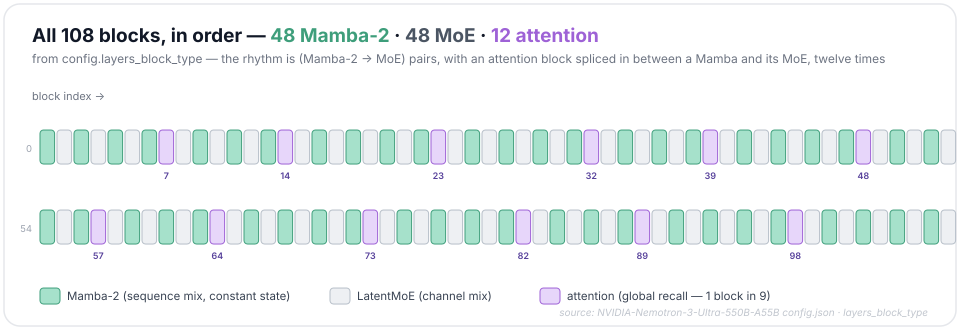

Hybrids are not new — Jamba interleaved one attention layer per seven Mamba layers, and Nemotron-H (this family's direct ancestor) kept attention in ~8% of layers. What Ultra changes is what sits in the FFN slot (every single one is a LatentMoE, §5) and what runs at each scale: the same file serves Nano 30B-A3B with `moe_latent_size: None` and no MTP, Super 120B-A12B with latent 1024, and Ultra with latent 2048.

*References: Nemotron-H — [arXiv:2504.03624](https://arxiv.org/abs/2504.03624) · Jamba — [arXiv:2403.19887](https://arxiv.org/abs/2403.19887).*

---

## 2 · What "selective state space" actually selects

The mixer in §3 is the third Mamba. The family changed twice on the way there, and Ultra leans on both changes.

There have always been two ways to read a sequence. Attention keeps every token and looks back at all of them: perfect recall, with a bill that grows as the context does (§3 and fig. 4 put Ultra's numbers on this). The old alternative is an RNN — squash history into one hidden state, pay the same price for every token. RNNs lost the 2017 war for two reasons, both sitting in the recurrence $h_t = \tanh(W h_{t-1} + U x_t)$. The $\tanh$ chains each step to the one before, so training has to walk the sequence one step at a time. And gradients flowing back through $T$ copies of it vanish or explode. Make the recurrence *linear* and both problems change shape. The computation can be rewritten as a convolution, a parallel scan, or a plain matmul, all things GPUs are good at. And the gradient through time becomes a product of the decay factors the model itself learns — vanishing doesn't disappear, but it stops being an accident of $\tanh$ and becomes something the model controls. A state-space model (SSM) is a linear RNN with structure, and S4, Mamba, and Mamba-2 are three answers to what the structure should be.

The name is literal. The **state** is a small vector $h$ the layer carries as it reads: a running summary of everything so far, like the carry digits in long addition. The **state space** is where that summary lives — fix its size at $N$ numbers and it's $\mathbb{R}^N$, no matter how long the input gets. Each step *writes* the new token into the summary, *decays* what's already there, and *reads* an output back out:

$$h_t = \bar{A} h_{t-1} + \bar{B} x_t, \qquad y_t = C h_t$$

Here $\bar{A}$ does the decaying, $\bar{B} x_t$ does the writing, and $C$ does the reading.

This is a continuous system in disguise. Underneath sits an ordinary differential equation, $h'(t) = A h(t) + B x(t)$, and the discrete rule comes from integrating it across one token's worth of time. Hold the input constant over a step of length $\Delta$ — a *zero-order hold* (ZOH) — and the linear ODE integrates exactly:

$$h(t{+}\Delta) = e^{\Delta A} h(t) + (\Delta A)^{-1}(e^{\Delta A} - I) \Delta B x(t)$$

So $\bar{A} = e^{\Delta A}$ exactly, and the exact $\bar{B}$ collapses to the first-order $\Delta B$ when the step is small. The code splits the difference — exact for the decay, Euler for the write — and its reference scan is the recurrence in three lines:

```python
# state-spaces/mamba · mamba_ssm/ops/selective_scan_interface.py · selective_scan_ref
# einsum letters: b=batch · d=channels (5120) · l=length · n=state (16)
deltaA = torch.exp(torch.einsum('bdl,dn->bdln', delta, A))         # Ā = e^{ΔA}: (B, 5120, T, 16)
deltaB_u = torch.einsum('bdl,bnl,bdl->bdln', delta, B, u)          # B̄·x ≈ ΔB·x: (B, 5120, T, 16)
…
x = deltaA[:, :, i] * x + deltaB_u[:, :, i]                        # state x: (B, 5120, 16), per step
```

The step size is the interesting part — it says how much time "passes" between tokens, which turns out to be the knob for how much the state changes.

**S4**, the 2021 structured-state-space model that first made this recurrence train well on long sequences, learned $A, B, C, \Delta$ as constants: one filter, applied identically to every token. Fixed dynamics buy S4 a third face. Unroll the recurrence from an empty state and every output is the same weighted pattern slid along the input:

$$y_t = \sum_{k \ge 0} C \bar{A}^{k} \bar{B} x_{t-k} \quad\Longrightarrow\quad y = \bar{K} \ast x, \qquad \bar{K} = (C\bar{B},\ C\bar{A}\bar{B},\ C\bar{A}^2\bar{B},\ \dots)$$

One kernel $\bar{K}$, computed once and applied as a convolution — a fast Fourier transform away from $O(T \log T)$ training cost. The trick has one requirement: the coefficient on "$k$ steps ago" must be the same at every position $t$, which is the definition of **linear time-invariance (LTI)**. That bargain gives S4 superb long memory that trains like a CNN, and makes it a hopeless editor: a time-invariant system cannot decide that *this* token is worth writing down hard and *that* one is noise, because deciding would break the property the kernel is built on.

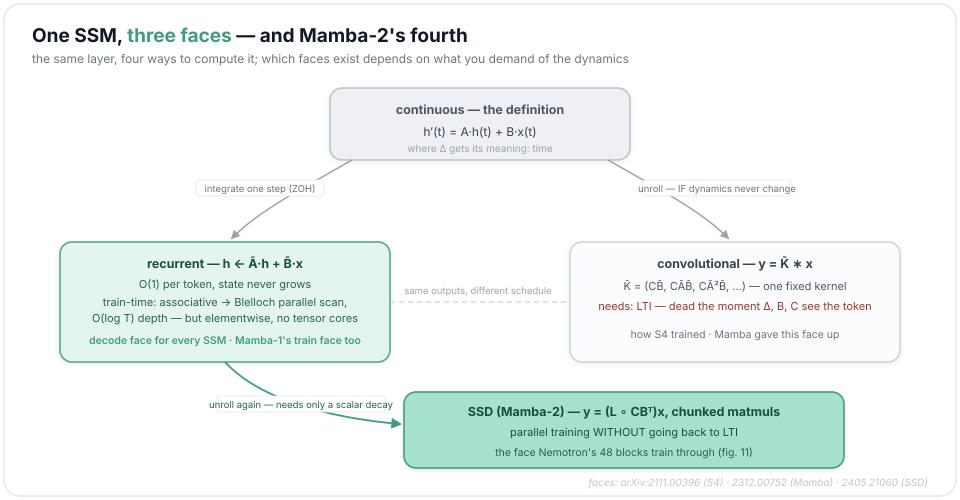

Mamba breaks that bargain to get selection; breaking it creates a training problem, and Mamba-2 is the fix for that. Nemotron's 48 SSM blocks inherit both decisions.

### Mamba: the dynamics come from the token

The move is small to state: make $\Delta_t, B_t, C_t$ functions of the current token $x_t$, while the decay base $A$ stays learned-but-fixed. Everything follows from where $\Delta_t$ sits — inside both the decay $e^{\Delta_t A}$ and the write $\bar B_t = \Delta_t B_t$. A large $\Delta_t$ says "a lot of time passes": $e^{\Delta_t A}$ collapses toward zero, the old state washes out, the token writes in strongly. A tiny $\Delta_t$ says "barely a moment": the state persists and the token barely registers. One learned scalar per channel decides *keep*, *overwrite*, or *ignore* — that is the selection mechanism.

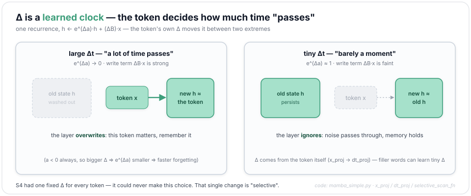

In the released code, selection is two small projections:

```python
# state-spaces/mamba · mamba_ssm/modules/mamba_simple.py (Mamba-1, init)
# shape examples: the released mamba-2.8b (d_model 2560 → d_inner 5120, d_state 16, dt_rank 160)
self.x_proj = nn.Linear(
    self.d_inner, self.dt_rank + self.d_state * 2, bias=False, **factory_kwargs
)                                    # reads the token, emits (Δ, B, C): 5120 → 160 + 32 = 192
self.dt_proj = nn.Linear(self.dt_rank, self.d_inner, bias=True, **factory_kwargs)
                                     # Δ is low-rank: 160 → 5120 (dt_rank = ceil(d_model / 16))
…
A = repeat(
    torch.arange(1, self.d_state + 1, dtype=torch.float32, device=device),
    "n -> d n",
    d=self.d_inner,
).contiguous()
A_log = torch.log(A)  # Keep A_log in fp32   ← A: a (5120 × 16) grid, never per-token
self.A_log = nn.Parameter(A_log)
```

and in the forward, three lines Nemotron's mixer still echoes (§3):

```python
# state-spaces/mamba · mamba_ssm/modules/mamba_simple.py (Mamba-1, forward)
x_dbl = self.x_proj(rearrange(x, "b d l -> (b l) d"))         # (B·T, 192)
dt, B, C = torch.split(x_dbl, [self.dt_rank, self.d_state, self.d_state], dim=-1)
                                                              # (B·T, 160) · (B·T, 16) · (B·T, 16)
dt = self.dt_proj.weight @ dt.t()                             # Δ back up: (5120, B·T)
…
y = selective_scan_fn(x, dt, A, B, C, self.D.float(), z=z,   # z: a gate branch that skips the SSM
                      delta_bias=self.dt_proj.bias.float(), delta_softplus=True, …)
```

The price is that last line. Selection breaks LTI: the coefficient on "$k$ steps ago" now depends on $t$, the single kernel $\bar{K}$ no longer exists, and the convolution face dies with it. What saves training from becoming sequential again is a property the recurrence kept: write one step as $h_t = a_t h_{t-1} + b_t$ (with $b_t \equiv \bar B_t x_t$) and chain two of them,

$$h_t = a_t (a_{t-1} h_{t-2} + b_{t-1}) + b_t = (a_t a_{t-1}) h_{t-2} + (a_t b_{t-1} + b_t)$$

Two steps collapse into one step of the same shape — still a decay and a write. That closure is the trick. Define the composition on the pairs,

$$(a_1, b_1) \bullet (a_2, b_2) = (a_2 a_1,\ a_2 b_1 + b_2)$$

and check that bracketing doesn't matter: composing three steps either way gives $(a_3 a_2 a_1,\ a_3 a_2 b_1 + a_3 b_2 + b_3)$. The operator is **associative** — and anything associative can be combined as a *tree* instead of a chain. That's Blelloch's parallel prefix scan: an up-sweep pairs neighbors level by level ($\log_2 T$ levels), a down-sweep distributes the partial products back, and every prefix $h_1 \dots h_T$ comes out after $O(\log T)$ sequential steps of $O(T)$ total work. The chain didn't get shorter; it got *wider*.

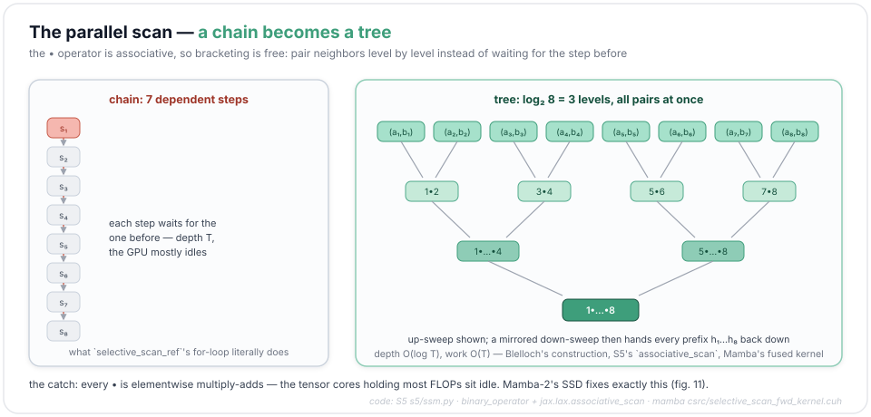

S5 — the successor SSM built around exactly this scan — ships it as four lines of JAX, handing the operator straight to the scan primitive:

```python
# lindermanlab/S5 · s5/ssm.py · binary_operator — the • above, verbatim
@jax.vmap
def binary_operator(q_i, q_j):
    A_i, b_i = q_i
    A_j, b_j = q_j
    return A_j * A_i, A_j * b_i + b_j
…
_, xs = jax.lax.associative_scan(binary_operator, (Lambda_elements, Bu_elements))
```

Mamba ships the same scan as a hand-fused CUDA kernel — `csrc/selective_scan/selective_scan_fwd_kernel.cuh` in the same repo — block-level scans with the expanded $(B, 5120, T, 16)$ states living in registers and SRAM instead of slow HBM, recomputed rather than stored for the backward pass (named rather than quoted — it's raw CUDA, not reading material). The step-by-step `for` loop in `selective_scan_ref` above is the readable twin, not the fast path.

One problem survives all of this. A scan — tree or chain — is elementwise multiply-adds. It parallelizes the *depth* and never touches the matrix-multiply units where a modern accelerator keeps nearly all of its FLOPs. The Mamba-2 paper puts a number on that gap: its restricted form of the same recurrence, computed as matmuls, runs 2–8× faster than Mamba's fused scan, with the spread depending on state size ([arXiv:2405.21060](https://arxiv.org/abs/2405.21060)).

### Mamba-2: a scalar decay buys back the matmul

Mamba-2 keeps the selection and attacks the hardware fit — the scan's tensor-core blindness. The lever is $A$, and $A$ had been shrinking for years before Nemotron picked it up. S4's was a full $N \times N$ matrix, initialized from HiPPO memory theory ([arXiv:2008.07669](https://arxiv.org/abs/2008.07669)) and kept trainable only by rewriting it as diagonal-plus-low-rank — the "structured" in the name. S4D ([arXiv:2206.11893](https://arxiv.org/abs/2206.11893)) then showed the diagonal alone performs just as well, and that is the form Mamba learns: the `(5120, 16)` grid from the card above, each channel with its own sixteen decay rates. Mamba-2 keeps only **one scalar per head**. In Nemotron's file, $A$'s whole life is four lines:

```python
# src/transformers/models/nemotron_h/modeling_nemotron_h.py · NemotronHMamba2Mixer
A = torch.arange(1, self.num_heads + 1)   # __init__: (256,) in Ultra
self.A_log = nn.Parameter(torch.log(A))   # the learned parameter is log A
...
A = -torch.exp(self.A_log.float())        # forward: undo the log, flip the sign
…
dA = torch.exp(dt[..., None] * A)         # a_t = e^{Δ_t A}, safely inside (0, 1)
```

The `arange` is only a starting point — the spread from 1 to 256 staggers the heads' initial timescales, and training moves them from there. What matters is the round-trip: the learned value is $\log A$, so it can't leave positive territory, so $A$ comes out of the sign flip negative and every step *shrinks* the state rather than amplifying it. The forward pass then broadcasts that one scalar across the head's entire $64 \times 128$ state block. The per-step transition matrix is $a_t I$ — a matrix with one degree of freedom (fig. 14).

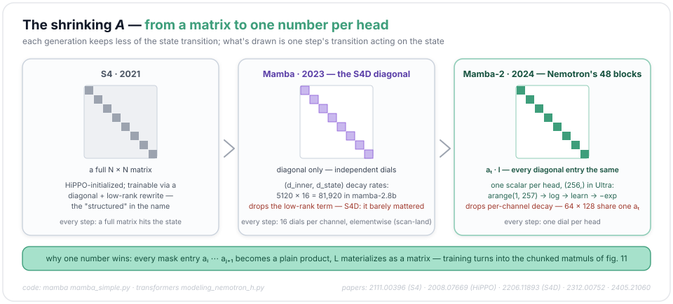

What the sacrifice buys is the *state-space duality* (SSD) — a fourth face that does what S4's convolution did, turn training into dense parallel compute, **without going back to LTI**. With a scalar decay $a_t = e^{\Delta_t A}$ the recurrence unrolls into a closed form for every output at once:

$$h_t = a_t h_{t-1} + \bar B_t x_t \quad\Longrightarrow\quad y_i = \sum_{j \le i} (a_i a_{i-1} \cdots a_{j+1}) C_i^{\top} \bar B_j x_j$$

which is exactly a masked matrix multiply (absorbing the bar into $B$ from here on),

$$y = (L \circ C B^{\top}) x, \qquad L_{ij} = a_i a_{i-1} \cdots a_{j+1}$$

Squint and it's attention with the softmax swapped for a decay mask — $B$ playing keys, $C$ playing queries, $x$ playing values. The scalar constraint is load-bearing: it makes every entry of $L$ a plain number, one shared mask per head. With Mamba-1's diagonal $A$, each of the head's channels would need its own mask, and there would be nothing worth materializing.

Selection itself survives the redesign — $\Delta_t, B_t, C_t$ are still read off the token — but the plumbing moves. Mamba-1 derived them from a second projection (`x_proj` above) applied after the block's short depthwise convolution, a kernel-4 causal conv that smears each channel over the last few tokens (§3 shows it in Nemotron's mixer); Mamba-2 emits everything from the single up-front projection, and $B, C$ then ride through that same conv along with $x$:

```python
# src/transformers/models/nemotron_h/modeling_nemotron_h.py · NemotronHMamba2Mixer
projection_size = self.intermediate_size + self.conv_dim + self.num_heads
self.in_proj = nn.Linear(self.hidden_size, projection_size, bias=config.use_bias)
# one matmul emits gate ‖ (x‖B‖C) ‖ Δ — §3 walks the split and the shared conv
# Ultra widths: 16384 + 18432 + 256 = 35072 out, from 8192 in
```

One projection instead of a chain — the shape tensor cores want — and Mamba-2 also adds a gated RMSNorm before the output projection that Mamba-1 never had (§3's `Zamba2RMSNormGated`).

That's not an analogy; it's the shipped algorithm. Split the sequence into chunks of 128: inside a chunk, compute the masked matmul directly (attention mode); between chunks, hand one state forward (recurrence mode). Both halves are visible in Nemotron's reference path:

```python
# src/transformers/models/nemotron_h/modeling_nemotron_h.py
# · NemotronHMamba2Mixer.torch_forward — the chunked SSD path (prefill; trimmed)
# intra-chunk half: the masked matmul, computed directly
L = torch.exp(segment_sum(A))                # (B,256,c,128,128), c=T/128; A here = Δt·A, scaled upstream
G_intermediate = C[:, :, :, None, :, :] * B[:, :, None, :, : ,:]   # C·Bᵀ for every (i, j)
G = G_intermediate.sum(dim=-1)                               # (B, c, 128, 128, 256)
M_intermediate = G[..., None] * L.permute(0, 2, 3, 4, 1)[..., None]
M = M_intermediate.sum(dim=-1)                               # M = L ∘ (C Bᵀ): a 128×128
                                                             #   mask per chunk, per head
Y_diag = (M[..., None] * hidden_states[:, :, None]).sum(3)   # attention half: (B, c, 128, 256, 64)
# inter-chunk half: summarize each chunk into one state, decay it forward
decay_states = torch.exp(A_cumsum[:, :, :, -1:] - A_cumsum)
…                                                            # (chunk summaries: one (64, 128)
                                                             #  state per chunk, per head)
decay_chunk = torch.exp(segment_sum(nn.functional.pad(A_cumsum[:, :, :, -1], (1, 0))))
…
Y_off = (C_times_states.sum(-1) * state_decay_out_permuted[..., None])  # recurrence-mode half
y = Y_diag + Y_off                                           # add the two halves
```

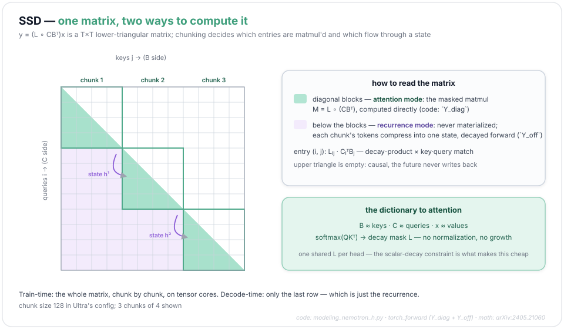

Chunked this way, the same layer that decodes as an RNN pre-trains on 20T tokens at GPU efficiency close to attention's. The head structure came along for the ride: Mamba-2 organizes its channels into heads and lets groups of heads share $(B, C)$, the same sharing trick grouped-query attention plays on keys and values (§4).

| | S4 | Mamba | Mamba-2 (shipped here) |
|---|---|---|---|
| dynamics | fixed after training (linear time-invariant, LTI) | $\Delta_t, B_t, C_t$ from the token | $\Delta_t, B_t, C_t$ from the token |
| the $A$ matrix | structured (HiPPO init) | diagonal, `d_inner × d_state` | **one scalar per head** |
| trains as | convolution | recurrent scan kernel | chunked matmuls (SSD) |
| Δ, B, C produced by | — (constants) | a 2nd projection on the conv output (`x_proj`) | the one up-front `in_proj`; B, C share x's conv |
| output norm | — | — | gated RMSNorm before `out_proj` |
| heads | — | — | 256 heads, 8 shared $(B,C)$ groups |

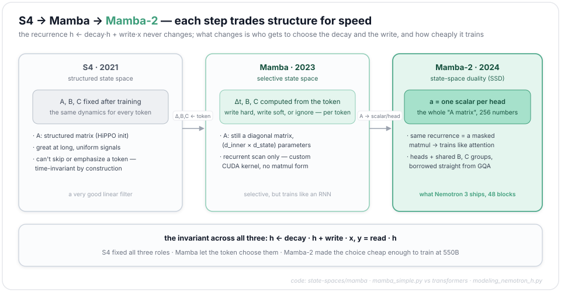

*References: S4 — [arXiv:2111.00396](https://arxiv.org/abs/2111.00396) · Mamba — [arXiv:2312.00752](https://arxiv.org/abs/2312.00752) · Mamba-2 (SSD) — [arXiv:2405.21060](https://arxiv.org/abs/2405.21060) · S5 (associative scan for SSMs) — [arXiv:2208.04933](https://arxiv.org/abs/2208.04933) · parallel prefix: Blelloch, "Prefix Sums and Their Applications" (CMU-CS-90-190).*

---

## 3 · Mamba-2 — the workhorse that never grows

Forty-eight of the sixty sequence-mixing blocks summarize the past instead of storing it. A Mamba-2 layer carries a fixed-size state (per head, a 64×128 matrix) and folds each new token into it. Whether the conversation is 1k or 1M tokens deep, decoding the next token costs this layer exactly the same: one state read, one multiply-add, one write back. For an agent that re-enters the model thousands of times against an ever-longer context, that confines the growing part of the per-step bill to the 12 attention blocks — a ~9× haircut on it, priced in §4 — while these 48 pay a flat rate.

The recurrence, in the code's own convention. One shift from §2: the state was a vector there, but each of a head's $P = 64$ channels keeps its own $N$-number summary, so a head's state $h_t$ here is a $P \times N$ matrix with $N = 128$:

$$h_t = e^{\Delta_t a} h_{t-1} + (\Delta_t x_t) B_t^{\top},\qquad y_t = h_t C_t + D x_t$$

where $x_t \in \mathbb{R}^{P}$ is the token's input to this head, $B_t, C_t \in \mathbb{R}^{N}$ are input-dependent write and read vectors, $a = -e^{A_{\log}}$ is a **negative scalar** learned per head (§2's runtime $A$, in this code path's lowercase), $\Delta_t = \mathrm{softplus}(\delta_t + b_\Delta) > 0$ is an input-dependent step size, floored at $10^{-3}$ (`dt` and `dt_bias` in the code), and $D$ is a per-head skip gain. Because $a < 0$ and $\Delta_t > 0$, the factor $e^{\Delta_t a} \in (0,1)$: each step the state decays a little, then a rank-one update $(\Delta_t x_t) B_t^\top$ writes the new token in. Selectivity lives in $\Delta_t, B_t, C_t$: token by token, the model sets how hard to write and where to read.

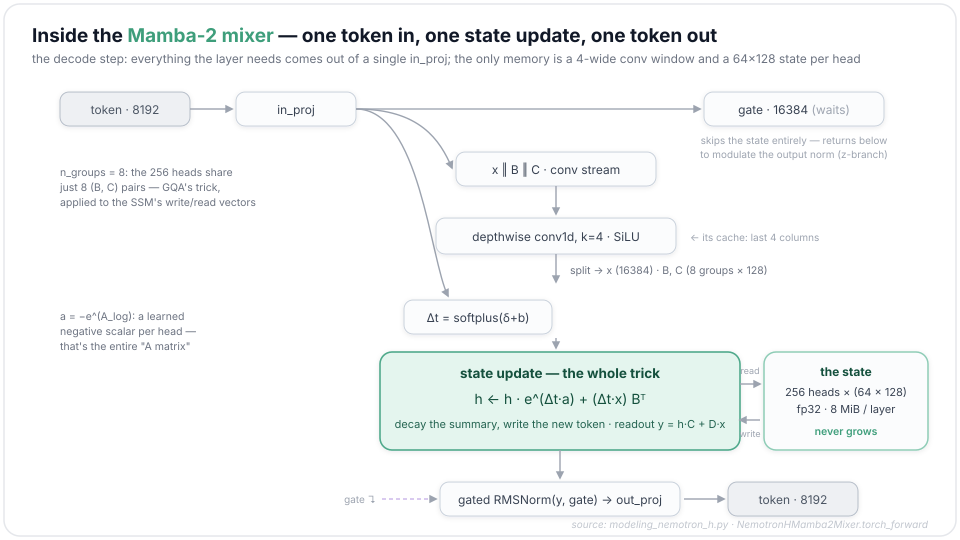

The module in full — first the parts it owns:

```python
# src/transformers/models/nemotron_h/modeling_nemotron_h.py
# · NemotronHMamba2Mixer (init)
self.intermediate_size = config.mamba_num_heads * config.mamba_head_dim       # 256 × 64 = 16384
self.conv_dim = self.intermediate_size + 2 * self.n_groups * self.ssm_state_size
                                                     # 16384 + 2·8·128 = 18432
self.conv1d = nn.Conv1d(in_channels=self.conv_dim, out_channels=self.conv_dim,
                        bias=config.use_conv_bias, kernel_size=self.conv_kernel_size,   # 4
                        groups=self.conv_dim, padding=self.conv_kernel_size - 1)        # depthwise
projection_size = self.intermediate_size + self.conv_dim + self.num_heads
self.in_proj = nn.Linear(self.hidden_size, projection_size, bias=config.use_bias)
                                                     # one big proj: 8192 → 35072
self.dt_bias = nn.Parameter(torch.ones(self.num_heads))
A = torch.arange(1, self.num_heads + 1)              # S4D-real init: a scalar per head
self.A_log = nn.Parameter(torch.log(A))
self.norm = Zamba2RMSNormGated(self.intermediate_size,
                               group_size=self.intermediate_size // self.n_groups,
                               eps=config.layer_norm_epsilon)
self.D = nn.Parameter(torch.ones(self.num_heads))
self.out_proj = nn.Linear(self.intermediate_size, self.hidden_size, bias=config.use_bias)
                                                     # back down: 16384 → 8192
```

And the one-token decode step, from the reference path (`torch_forward`; the CUDA fast path fuses the same operations — reshape plumbing elided):

```python
# src/transformers/models/nemotron_h/modeling_nemotron_h.py
# · NemotronHMamba2Mixer.torch_forward
# one projection produces everything: a gate, the conv stream (x‖B‖C), and the step sizes dt
_, _, gate, hidden_states, dt = projected_states.split(
        [d_mlp, d_mlp, self.intermediate_size, self.conv_dim, self.num_heads], dim=-1)
# per token: gate (B, 16384) · conv stream x‖B‖C (B, 18432) · Δ (B, 256)
# (d_mlp = 0 on Ultra — the first two split slots are empty)

# a depthwise causal conv mixes the last 4 positions (its window is the conv cache)
conv_states = cache_params.update_conv_state(hidden_states, self.layer_idx)  # (B, 18432, 4)
hidden_states = torch.sum(conv_states * self.conv1d.weight[:, 0, :], dim=-1)
if self.use_conv_bias:                                                    # true on Ultra
    hidden_states += self.conv1d.bias
hidden_states = self.act(hidden_states)                                   # SiLU

hidden_states, B, C = torch.split(
    hidden_states, [self.intermediate_size,
                    self.n_groups * self.ssm_state_size,
                    self.n_groups * self.ssm_state_size], dim=-1)
# x (B, 16384) · B, C (B, 1024 = 8 groups × 128) each

A = -torch.exp(self.A_log.float())                                        # a < 0, one per head
dt = torch.nn.functional.softplus(dt + dt_bias.to(dt.dtype))              # Δt > 0
dt = torch.clamp(dt, self.time_step_min)                                  # floor: 0.001
dA = torch.exp(dt[..., None] * A)                                         # decay ∈ (0,1)
dB = dt[..., None] * B[..., None, :]
dBx = dB * hidden_states[..., None]                                       # rank-one write (Δt·x)Bᵀ

ssm_states = cache_params.layers[self.layer_idx].recurrent_states.clone()   # (B, 256, 64, 128)
ssm_states = ssm_states * dA + dBx                                        # THE recurrence
ssm_states = cache_params.update_recurrent_state(ssm_states, self.layer_idx)

y = torch.bmm(ssm_states_reshaped, C_reshaped)                            # y = h·C: (B, 256, 64)
y = (y + hidden_states * D).to(y.dtype)                                   # skip path

scan_output = self.norm(y, gate)                                          # gated RMSNorm
contextualized_states = self.out_proj(scan_output.to(dtype))
```

A few details in that code. First, `n_groups = 8`: the 256 heads share only 8 sets of $(B, C)$ vectors — the exact same trick as grouped-query attention, applied to the SSM's write/read vectors. Second, the depthwise `conv1d` with kernel 4 is the only place tokens mix *locally*; the SSM handles everything long-range. Its cache is 4 columns wide. Third, the gated `Zamba2RMSNormGated` at the exit (the HF port borrows Zamba2's gated-norm module, name and all): the `gate` split off from `in_proj` never went through the state at all — it modulates the output the way the `z` branch does in the original Mamba block (§2's `z=z` argument).

At prefill time, running this recurrence token-by-token would waste the GPU, so training and prompt processing run §2's chunked SSD form instead — fused kernels (`mamba_split_conv1d_scan_combined` in training, `mamba_chunk_scan_combined` at prefill); their readable fp32 twin is the `torch_forward` branch quoted in §2. Same layer, two gears: trains like attention, decodes like an RNN.

Against attention, the trade is exact recall for constant cost — attention keeps every token addressable forever and pays $O(T)$ per decoded token for the privilege; Mamba-2 pays $O(1)$ and accepts that the past is lossy-compressed into 8 MiB of state per layer (batch 1, fp32). Against Mamba-1, the difference is §2's scalar decay — less expressive per parameter, far faster to train. Nemotron 3's bet, inherited from Nemotron-H and now run at 550B: keep 20% of the sequence mixers as real attention (§4), and the lossy summary in the other 80% has held up on NVIDIA's own evals — §4 carries the long-context number.

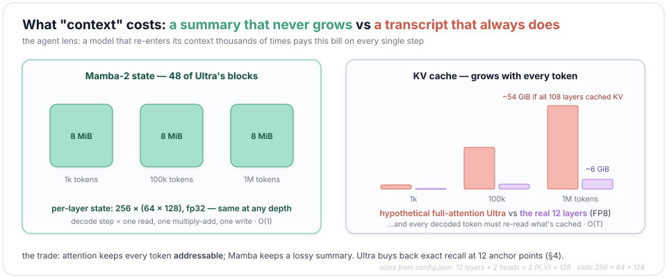

*References: Mamba-2 (SSD) — [arXiv:2405.21060](https://arxiv.org/abs/2405.21060) · Mamba — [arXiv:2312.00752](https://arxiv.org/abs/2312.00752) · Nemotron-H — [arXiv:2504.03624](https://arxiv.org/abs/2504.03624).*

---

## 4 · Attention — twelve anchors, and nobody tells them where they are

The 12 attention blocks are the model's random-access memory: the only places where token 900,000 can directly retrieve token 17. They survive because §3's trade cuts both ways — a summary, however selective, is still lossy, and exact retrieval is precisely what a summary cannot promise. They are standard grouped-query attention (GQA) — with one omission.

$$\mathrm{Attn}(Q,K,V)=\mathrm{softmax}\left(\frac{QK^{\top}}{\sqrt{d}} + M\right)V,\qquad d = 128$$

with 64 query heads sharing 2 KV heads ($M$ is the causal mask; the $\sqrt{d}$ is real here — `self.scaling = self.head_dim**-0.5`). The omission: **there is no positional encoding.** No RoPE — rotary position embedding, the de-facto standard that rotates each query and key by a position-dependent angle at a spectrum of frequencies ([arXiv:2104.09864](https://arxiv.org/abs/2104.09864)) — and no learned positions either. The file defines an `apply_rotary_pos_emb` helper, but the forward never calls it, and vLLM's separate implementation of the same architecture (`vllm/model_executor/models/nemotron_h.py`) contains no rotary code at all:

```python
# src/transformers/models/nemotron_h/modeling_nemotron_h.py
# · NemotronHAttention
self.head_dim = getattr(config, "head_dim", config.hidden_size // config.num_attention_heads)  # 128
self.num_key_value_groups = config.num_attention_heads // config.num_key_value_heads  # 64 // 2 = 32
self.scaling = self.head_dim**-0.5
self.q_proj = nn.Linear(config.hidden_size, config.num_attention_heads * self.head_dim, bias=False)
self.k_proj = nn.Linear(config.hidden_size, config.num_key_value_heads * self.head_dim, bias=False)
self.v_proj = nn.Linear(config.hidden_size, config.num_key_value_heads * self.head_dim, bias=False)
self.o_proj = nn.Linear(config.num_attention_heads * self.head_dim, config.hidden_size, bias=False)

def forward(self, hidden_states, attention_mask=None, past_key_values=None, **kwargs):
    input_shape = hidden_states.shape[:-1]
    hidden_shape = (*input_shape, -1, self.head_dim)
    query_states = self.q_proj(hidden_states).view(hidden_shape).transpose(1, 2)
    key_states = self.k_proj(hidden_states).view(hidden_shape).transpose(1, 2)
    value_states = self.v_proj(hidden_states).view(hidden_shape).transpose(1, 2)
    # q: (B, 64, T, 128) · k, v: (B, 2, T, 128) — 32 query heads share each KV head
    if past_key_values is not None:
        key_states, value_states = past_key_values.update(key_states, value_states, self.layer_idx)
    # … (attention_interface dispatch elided: picks sdpa / flash / eager per config)
    attn_output, attn_weights = attention_interface(self, query_states, key_states, value_states,
                                                    attention_mask,
                                                    dropout=0.0 if not self.training else self.attention_dropout,
                                                    scaling=self.scaling, **kwargs)
    attn_output = attn_output.reshape(*input_shape, -1).contiguous()   # (B, T, 8192)
    attn_output = self.o_proj(attn_output)
    return attn_output, attn_weights
    # …and that is the whole forward: q, k, v, cache, softmax — no positions anywhere
```

It works because these blocks never see raw embeddings. The first attention block is the eighth in the stack; every one sits above at least four Mamba-2 blocks (§1). And a causal recurrence is position-aware by construction: "how long ago" is encoded in how much a memory has decayed. So the attention layers can inherit position from the representation itself — the Nemotron-H paper's explanation for why the hybrid needs no positional encoding, and the design Ultra carries over. It has a practical payoff: with no RoPE frequencies to stretch, there's nothing to re-scale when the context grows. The config's `max_position_embeddings: 262144` is a serving default, not an architectural wall — NVIDIA ran the long-context phase at 1,048,576 tokens, and on the RULER long-context benchmark reports 94.7 at 1M for the released model — its own eval, from the technical report.

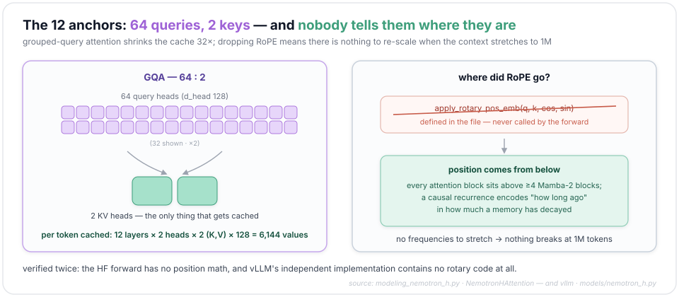

The KV cache is where those numbers turn into bytes. A 108-layer model with full attention at Ultra's dims would cache $108 \times 2 \times 2 \times 128 = 55{,}296$ values per token (layers × K-and-V × KV heads × head dim — a hypothetical stack that keeps Ultra's aggressive 2-KV-head GQA). This model caches KV in 12 layers only: $12 \times 2 \times 2 \times 128 = 6{,}144$ values per token — exactly 9× less. Stored in FP8, as serving stacks commonly do, a million-token context is ~6 GiB of cache instead of ~54. The recurrent side isn't free, though: §3's 8 MiB-per-layer state is a flat $48 \times 8 = 384$ MiB per request, paid from token one — what stops is the *growth*, not the memory. Ultra's own 12-layer KV only passes that figure around the 64K-token mark.

Attention is where Ultra departs furthest from [DiffusionGemma](https://www.drshy.xyz/notes/diffusiongemma/), the first model this series took apart. Its Gemma-4 backbone kept attention in *every* layer but made 25 of 30 local (sliding windows), and dropped the $1/\sqrt{d}$ entirely in favor of QK-norm — RMS-normalizing queries and keys before the dot product. Ultra flips every one of those choices:

| | every layer + RoPE (Llama-style) | Gemma-4 (DiffusionGemma) | 12 anchors, no positions (Ultra) |
|---|---|---|---|
| where attention lives | every layer, all global | every layer — 25 of 30 local, 5 global | 12 of 108 blocks, all global |
| positions | RoPE | RoPE | none |
| logit scaling | $1/\sqrt{d}$ | none — QK-norm instead | $1/\sqrt{d}$ (`head_dim**-0.5`) |
| long-range recall | exact, everywhere | exact in-window + at global layers | exact at 12 anchor layers |
| KV cache | grows × all layers | window-bounded (local) + growing (global) | grows × 12 layers only |
| length extrapolation | RoPE must be rescaled | RoPE must be rescaled | nothing to rescale |

*References: GQA — [arXiv:2305.13245](https://arxiv.org/abs/2305.13245) · RoPE — [arXiv:2104.09864](https://arxiv.org/abs/2104.09864) · RULER — [arXiv:2404.06654](https://arxiv.org/abs/2404.06654) · Nemotron-H (attention placement, no positional embeddings) — [arXiv:2504.03624](https://arxiv.org/abs/2504.03624) · long-context numbers: the [Ultra technical report](https://research.nvidia.com/labs/nemotron/files/NVIDIA-Nemotron-3-Ultra-Technical-Report.pdf).*

---

## 5 · LatentMoE — the experts moved into a smaller room

Every FFN slot in this model is a Mixture-of-Experts — the standard trick for growing parameters without growing per-token compute, since only the routed few fire — and every fact about Ultra's MoE follows from one decision: **the routed experts don't work at model width.** A token's 8192-dim activation is routed first, *then* projected down to 2048 dims; the chosen experts do all their work in that latent space; a second projection brings the result back. The arithmetic on the tensor shapes makes the point: an expert's up-projection is $5120 \times 2048$ instead of $5120 \times 8192$ — 4× cheaper in FLOPs and bytes than the same expert at model width, so a fixed budget affords roughly 4× the experts. That's the lever behind Ultra's odd-looking numbers. Against DeepSeek-V3's 256 experts with top-8, Ultra runs 512 with **top-22** — twice the pool, nearly three times the active count — with each expert about half the parameters of a DeepSeek-V3 expert (three SwiGLU matrices at width 7168); the budget went into headcount, not savings.

$$y = W_{\uparrow} \sum_{i \in \mathrm{Top}_{22}} g_i E_i(W_{\downarrow} x) + E_{\mathrm{shared}}(x),
\qquad
E_i(z) = W_2^{(i)} \mathrm{ReLU}(W_1^{(i)} z)^2$$

Here $W_{\downarrow}$ is the 8192→2048 squeeze and $W_{\uparrow}$ the 2048→8192 return trip, $g_i$ is expert $i$'s routing weight, and each expert $E_i$ is a plain two-matrix MLP living entirely at width 2048. The forward is compact enough to show whole:

```python
# src/transformers/models/nemotron_h/modeling_nemotron_h.py · NemotronHMoE
def __init__(self, config, layer_idx=None):
    self.experts = NemotronHExperts(config)            # 512 non-gated experts, living at width 2048
    self.gate = NemotronHTopkRouter(config)            # routes at FULL width 8192 (see below)
    self.shared_experts = NemotronHMLP(config=config,
                                       intermediate_size=config.moe_shared_expert_intermediate_size)
    if config.moe_latent_size is not None:             # 2048 on Ultra, 1024 on Super, None on Nano
        self.fc1_latent_proj = nn.Linear(config.hidden_size, config.moe_latent_size,
                                         bias=config.mlp_bias)
        self.fc2_latent_proj = nn.Linear(config.moe_latent_size, config.hidden_size,
                                         bias=config.mlp_bias)
    else:
        self.fc1_latent_proj = nn.Identity()
        self.fc2_latent_proj = nn.Identity()

def forward(self, hidden_states):
    residuals = hidden_states
    orig_shape = hidden_states.shape
    _, topk_weights, topk_indices = self.gate(hidden_states)   # ① route at 8192 … both (B·T, 22)
    hidden_states = hidden_states.view(-1, hidden_states.shape[-1])
    hidden_states = self.fc1_latent_proj(hidden_states)        # ② squeeze: (B·T, 8192) → (B·T, 2048)
    hidden_states = self.experts(hidden_states, topk_indices, topk_weights)   # ③ stays (B·T, 2048)
    hidden_states = self.fc2_latent_proj(hidden_states)        # ④ back: (B·T, 2048) → (B·T, 8192)
    hidden_states = hidden_states.view(*orig_shape)
    hidden_states = hidden_states + self.shared_experts(residuals)
    # ⑤ shared expert at full width, always on — unflattened: (B, T, 8192) → (B, T, 10240) → (B, T, 8192)
    return hidden_states
```

In ①–②, **routing happens at model width, before the squeeze.** Many summaries describe LatentMoE as routing "in the latent space"; the shipped code disagrees — the router's weight matrix is `(512, 8192)`, reading the full activation. Only the expert computation is latent.

If you read the [DiffusionGemma teardown](https://www.drshy.xyz/notes/diffusiongemma/), you've already seen the plain shape: it routed at model width and ran its experts at model width — the only knobs were how many experts and how wide. Everything the router does is untouched here; the difference is two rectangular matrices wrapped around the expert bank:

| | plain MoE (DiffusionGemma · Mixtral · DeepSeek-V3) | LatentMoE (Super, Ultra) |
|---|---|---|
| router reads | model width 8192 | model width 8192 — unchanged |
| experts compute at | 8192 | 2048 (= 8192 ÷ 4) |
| new pieces | — | `fc1/fc2_latent_proj`, paid once per token |
| the freed budget | — | ~4× the experts at the same serving cost |

The router itself is DeepSeek-V3's recipe — in fact `modular_nemotron_h.py` declares the inheritance literally, `class NemotronHTopkRouter(DeepseekV3TopkRouter)`:

```python
# src/transformers/models/nemotron_h/modeling_nemotron_h.py
# · NemotronHTopkRouter.forward
router_logits = F.linear(hidden_states.type(torch.float32), self.weight.type(torch.float32))
                                                             # (B·T, 512), fp32
scores = router_logits.sigmoid()                             # sigmoid affinities, not softmax
scores_for_choice = scores + self.e_score_correction_bias    # aux-loss-free load balancing
…                                                  # (group top-k: a no-op on Ultra, n_group=1)
topk_indices = torch.topk(scores_for_choice, k=self.top_k,
                          dim=-1, sorted=False)[1]        # top-22 of 512
topk_weights = scores.gather(1, topk_indices)
if self.norm_topk_prob:
    denominator = topk_weights.sum(dim=-1, keepdim=True) + 1e-20
    topk_weights /= denominator
topk_weights = topk_weights * self.routed_scaling_factor     # × 5.0
```

The `e_score_correction_bias` is the aux-loss-free balancing trick: a per-expert bias, adjusted during training outside the gradient, that nudges selection toward underused experts — it biases *who gets picked* but never the weights applied (`topk_weights` gathers the raw sigmoid scores). The bias is even pinned to fp32 in the checkpoint loading rules (`_keep_in_fp32_modules_strict`). The trailing ×5.0 (`routed_scaling_factor`) is part of the inherited recipe — DeepSeek-V3 ships the same knob (theirs is 2.5) to set the routed branch's overall gain after the top-k weights are normalized.

The experts themselves break with everything post-Llama. No SwiGLU, no gate branch — a plain two-matrix MLP with a **squared ReLU**, the activation Primer's architecture search surfaced for exactly this ungated two-matrix shape:

```python
# src/transformers/models/nemotron_h/modeling_nemotron_h.py
# · NemotronHExperts (essentials)
input_dim = config.moe_latent_size if config.moe_latent_size is not None else config.hidden_size
self.up_proj = nn.Parameter(torch.empty(self.num_experts, self.intermediate_dim, input_dim))
                                                             # (experts 512, expert-FFN 5120, latent 2048)
self.down_proj = nn.Parameter(torch.empty(self.num_experts, input_dim, self.intermediate_dim))
                                                             # (512, latent 2048, expert-FFN 5120)
# per selected expert:  down_proj( relu(up_proj(z))² ) — two matrices, not Mixtral's three
current_hidden_states = torch.nn.functional.linear(current_state, self.up_proj[expert_idx])
current_hidden_states = self.act_fn(current_hidden_states)          # relu2
current_hidden_states = torch.nn.functional.linear(current_hidden_states,
                                                   self.down_proj[expert_idx])
```

Two matrices instead of three means ~33% fewer expert parameters at the same intermediate width (in practice SwiGLU models shrink the width by a third to compensate, so the realized saving against shipped baselines is smaller — the cleaner win is the simpler kernel). Meanwhile the **shared expert** (one per layer, always on) runs at full 8192 width with intermediate 10240: wide for the always-on generalist path, narrow and numerous for the specialists.

Why go latent at all? Two costs in a big MoE scale with expert width: the all-to-all communication that scatters tokens to experts across GPUs, and the weight bytes each GPU must read per step. Shrinking expert width 4× shrinks both 4×, and the LatentMoE paper's design study concludes you should spend the savings on more experts rather than wider ones — more accuracy per FLOP *and* per parameter.

| | Mixtral 8×22B | DeepSeek-V3 671B | Nemotron 3 Ultra 550B |
|---|---|---|---|
| experts (routed / active) | 8 / 2 | 256 / 8 (+1 shared) | 512 / 22 (+1 shared) |
| expert lives at width | 6144 (= model) | 7168 (= model) | **2048 (= model ÷ 4)** |
| expert shape | SwiGLU, 3 matrices | SwiGLU, 3 matrices | ReLU², 2 matrices |
| router | softmax top-2 | sigmoid + bias correction | sigmoid + bias correction, ×5.0 |

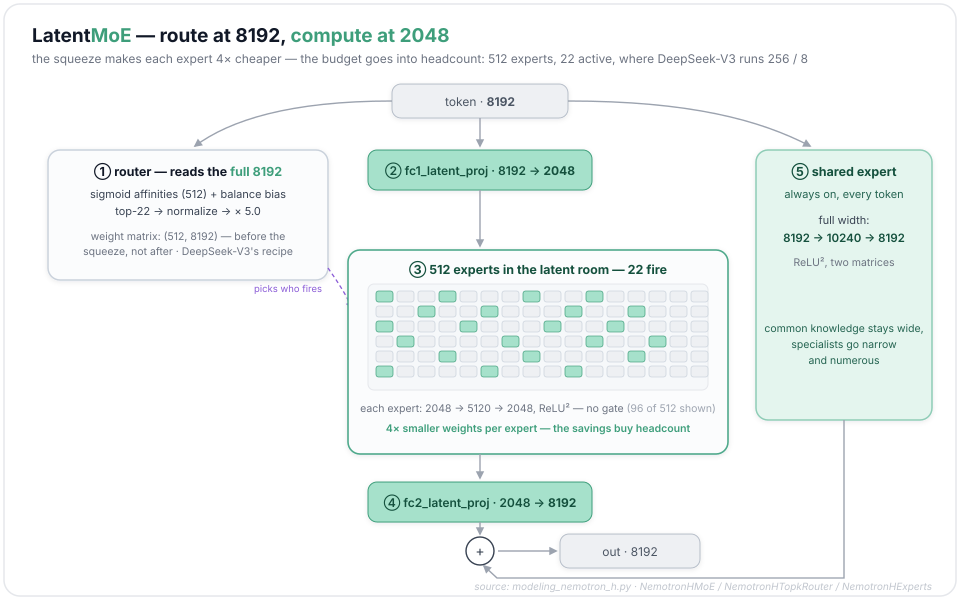

*References: LatentMoE — [arXiv:2601.18089](https://arxiv.org/abs/2601.18089) · DeepSeek-V3 — [arXiv:2412.19437](https://arxiv.org/abs/2412.19437) · DeepSeekMoE — [arXiv:2401.06066](https://arxiv.org/abs/2401.06066) · Mixtral — [arXiv:2401.04088](https://arxiv.org/abs/2401.04088) · SwiGLU — [arXiv:2002.05202](https://arxiv.org/abs/2002.05202) · squared ReLU (Primer) — [arXiv:2109.08668](https://arxiv.org/abs/2109.08668).*

---

## 6 · The MTP head — a drafter living in the checkpoint

The safetensors index holds two models. 51,023 tensors, most prefixed `backbone.*` — and 1,040 prefixed `mtp.*`: an embedded mini-model with one attention block and one MoE block (512 experts of its own). Hugging Face `transformers` throws these away at load time, in one line:

```python
# src/transformers/models/nemotron_h/modeling_nemotron_h.py
# · NemotronHPreTrainedModel
_keys_to_ignore_on_load_unexpected = [r"mtp.*"]
```

That's because the MTP head belongs to the serving side of the house as much as to the model. Multi-Token Prediction gives the model a second output that guesses token $t{+}2$ (not just $t{+}1$). At training time it's an auxiliary loss that improves the backbone's representations. At inference time it becomes a built-in speculative-decoding drafter: the tiny head proposes $k$ tokens autoregressively, and the 108-block backbone verifies all $k$ in a single forward pass, keeping the ones that match. The implementation lives where inference lives — vLLM:

```python
# vllm/model_executor/models/nemotron_h_mtp.py
# · NemotronHMTPAttentionDecoderLayer.forward   (vLLM is token-major: T = all tokens, no batch dim)
if self.has_start_projections:
    assert inputs_embeds is not None
    inputs_embeds_normed = self.enorm(inputs_embeds)          # newest token's embedding: (T, 8192)
    previous_hidden_states_normed = self.hnorm(hidden_states)     # backbone's last hidden state
    fused = torch.cat([inputs_embeds_normed, previous_hidden_states_normed], dim=-1)   # (T, 16384)
    hidden_states, _ = self.eh_proj(fused)                        # 2·8192 → 8192
hidden_states, residual = super().forward(positions=positions,
                                          hidden_states=hidden_states,
                                          residual=residual)   # then a normal attention block
```

```python
# vllm/model_executor/models/nemotron_h_mtp.py
# · NemotronHMultiTokenPredictor (structure)
self.pattern_str = config.mtp_hybrid_override_pattern    # "*E" — one attention, one MoE
…
for i in range(self.pattern_len):                        # the whole drafter: two blocks deep
    hidden_states, residual = self.layers[str(i)](inputs_embeds=inputs_embeds, positions=positions,
                                                  hidden_states=hidden_states, residual=residual)
```

The fusion is DeepSeek-V3's MTP recipe: RMS-norm the newest token's embedding and the backbone's hidden state separately, concatenate, project back to model width — then run a miniature Nemotron block over it. Embeddings and the output head are shared with the backbone; the drafter's own cost is two blocks against the backbone's 108.

Two details are distinctly Nemotron. First, the head is **recursive by design**: Ultra trains *two* MTP steps with a single shared-weight head (the report's "MTP layers (shared weight): 2", each contributing 0.05 to the loss), so the same head can be re-applied at serve time for drafts far deeper than two. On SPEED-Bench, NVIDIA's speculative-decoding suite, the boosted head's *acceptance length* — drafted tokens kept per verify pass — averages ≈4.6 of 7 proposed; the serving sweep peaks at draft length 6, worth 2.89× single-user decode throughput over the same model with MTP off (the report's Figure 16: 10K-in/16K-out, one GB200 node). That gain belongs to the low-latency regime: at large batches verification overhead eats it, and the report notes that shorter drafts, or disabling MTP outright, often win there — draft length ships as a deployment knob. After post-training, NVIDIA re-tunes the head alone ("MTP boosting"): freeze the backbone, generate on-policy rollouts, and distill the backbone's own distribution into the head with a temperature-scaled forward KL,

$$\mathcal{L}_{\mathrm{MTP}}(\theta) = \frac{\tau^2}{N_{\mathrm{mtp}} |\mathcal{A}|}
\sum_{k=1}^{N_{\mathrm{mtp}}} \sum_{t \in \mathcal{A}}
D_{\mathrm{KL}}\left(\sigma(z_{t+k}/\tau) \Vert \sigma(z_{t+k}^{(k)}/\tau)\right)$$

Here $\mathcal{A}$ is the set of assistant-token positions in the rollout, $\sigma$ the softmax, $z_{t+k}$ the backbone's logits at position $t+k$, and $z_{t+k}^{(k)}$ the head's logits for that position at draft step $k$ (the report writes it `z^{mtp_k}`); the distillation temperature is $\tau = 2$ over $N_{\mathrm{mtp}} = 7$ draft steps (the report writes the temperature $T$; it's renamed here because $T$ already counts tokens in this post). The training feeds the head its *own* sampled hidden states so it learns to draft under the noise it will actually see — teacher-forced MTP training otherwise degrades at the deep draft positions you want. The head wasn't free at training time either: in the first of the run's two loss divergences, the second MTP step's loss spiked before anything else, and the culprit was gradient-reduction precision on the output layer the drafter shares with the backbone.

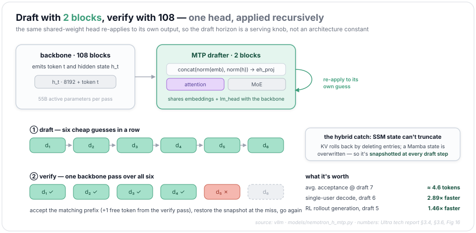

Second, speculation is awkward for a hybrid. When a draft token is rejected, attention rolls back by truncating the KV cache — per-token, trivial. But a Mamba state is a single fixed-size matrix *overwritten* at every token; there is no "entry" to delete. The serving stack's fix, described in the technical report: snapshot the SSM state at every draft step and restore on rejection. The snapshots aren't free — each is a copy of per-request state a KV cache never has to make, one more reason draft length ships as a knob. The same snapshotting, run at a coarser cadence, is also what gives a Mamba model prefix caching — reusing a shared prompt's computed state across requests — at all.

How the neighbors draft. *Bolt-on* means the drafter is trained onto a finished model — pretraining never knew a drafter was coming. **Medusa** bolts $k$ extra heads onto the backbone's last hidden state, each a small MLP guessing the token $i$ positions ahead; all $k$ guesses come out of one forward pass in parallel, so head 3 can't condition on what head 2 guessed, and the candidates are verified as a tree. **EAGLE** drafts sequentially instead, but at the *feature* level: one transformer layer autoregresses over hidden features — previous feature in, plus the just-sampled token's embedding — and the backbone's own frozen LM head turns each predicted feature into logits. **DeepSeek-V3** moved the drafter into pretraining: MTP as an auxiliary loss, one full transformer block per draft step, trained at depth 1, so the backbone's representations are shaped from day one by next-next-token prediction. Nemotron's head is that recipe with the sharing turned up — one attention-plus-MoE block pair, weights shared across steps, trained recursively for two and served for about six, then re-tuned by the boosting pass above.

| | Medusa | EAGLE | DeepSeek-V3 MTP | Nemotron 3 Ultra MTP |
|---|---|---|---|---|
| drafter | k parallel heads | 1-layer feature AR | 1 transformer block / step | 1 attention + 1 MoE block, shared across steps |
| trained | bolt-on | bolt-on | with the model | with the model + boosted after |
| draft depth | fixed k | tree | trained depth 1 | trained 2, served ~6 (recursive) |

*References: MTP — [arXiv:2404.19737](https://arxiv.org/abs/2404.19737) · DeepSeek-V3 — [arXiv:2412.19437](https://arxiv.org/abs/2412.19437) · EAGLE — [arXiv:2401.15077](https://arxiv.org/abs/2401.15077) · Medusa — [arXiv:2401.10774](https://arxiv.org/abs/2401.10774) · speculative decoding — [arXiv:2211.17192](https://arxiv.org/abs/2211.17192) · boosting recipe, SPEED-Bench numbers, snapshot mechanism: the [Ultra technical report](https://research.nvidia.com/labs/nemotron/files/NVIDIA-Nemotron-3-Ultra-Technical-Report.pdf).*

---

## 7 · Putting it together

One decode step, end to end (flattened from `NemotronHForCausalLM.forward` and `NemotronHModel.forward`; invented glue verbs are lowercase):

```python
# flattened from NemotronHForCausalLM.forward → NemotronHModel.forward
# (the HF generate path)
hidden = model.embeddings(input_ids)                       # → (B, T, 8192); head untied
masks = {"full_attention": create_causal_mask(**mask_kwargs),        # for 12 attention blocks
         "linear_attention": create_recurrent_attention_mask(**mask_kwargs)}  # padding, Mamba
for mixer_block in model.layers:                           # 108 × NemotronHBlock            (§1)
    hidden = mixer_block(hidden,                           #   Mamba-2: state ← state·dA+dBx (§3)
        attention_mask=masks.get(mixer_block.block_type),  #   attention: GQA over cached KV (§4)
        past_key_values=cache, use_cache=True)             #   LatentMoE: route→squeeze→experts (§5)
hidden = model.norm_f(hidden)
logits = model.lm_head(hidden[:, -1:, :]).float()          # (B, 1, 131072); logits_to_keep = 1
# serving wraps this in the drafter loop: MTP proposes ~6 tokens, one backbone pass verifies (§6)
```

After this loop, the cache holds three different things: for 48 blocks, a fixed 4-column conv window plus a fixed 256×64×128 state; for 12 blocks, a growing KV list; for 48 blocks, nothing. That heterogeneous bundle is what a "context" physically is in this model. (One more habit of big models absent here: the embedding table is not reused as the output head — `tie_word_embeddings: false` — so the 131,072-row `lm_head` carries its own 1.07 billion parameters.)

And the two-sided economics of the design become measurable. **Prefill** is compute-bound: cost tracks *active* parameters, where Ultra's 55B is a 3.2× FLOPs handicap against Qwen-3.5's 17B active (counting the always-on paths; the gap narrows on very long inputs, where attention FLOPs — of which Ultra has few — start to dominate) — and on the report's prefill-heavy setting Ultra indeed trails it. **Decode at scale** is memory-bound: cost tracks *total* weight bytes read per step, where 550B vs 397B is only 1.39×, the Mamba blocks' constant-time steps take over, and Ultra leads — on the technical report's own measurements, 5.9×, 4.8×, 1.6× over GLM-5.1-754B-A40B, Kimi-K2.6-1T-A32B and Qwen-3.5-397B-17B on an 8K-input/64K-output long-generation workload (NVFP4 on GB200; best config per model — Ultra served on NVIDIA's own TensorRT-LLM, the others on vLLM; speculative decoding on where it helps). Which half an agent lives on depends on its shape: one swallowing a repository or a day of tool logs is prefill-heavy; a reasoning loop running long chains over a warm context is decode-heavy. This model is built for the second kind, and the report is candid about trailing on the first. Two caveats belong next to all of these numbers: they are NVIDIA measuring NVIDIA on NVIDIA hardware, and quality parity with the models in that list is the report's claim — a month after release, third-party numbers don't exist yet.

The released checkpoint completes the story. It is a single NVFP4 file of ~330 GiB; per the report, NVIDIA also weighed an FP8 build for Hopper (~540 GiB) and decided not to ship it. The 4-bit file runs native FP4 math on Blackwell, and W4A16 (4-bit weights, 16-bit activations) on Hopper; at that size, checkpoint plus MTP drafter fit comfortably on one 8-GPU node. Pre-training itself ran in NVFP4 for the 20T tokens, a horizon cut short of the original plan after the second of the run's two loss divergences, with the sensitive pieces (QKV and attention projections, Mamba output projections, the MoE latent projections, MTP layers, embeddings, and the final 16 of 108 layers) kept in higher precision. The report calls it, "to our knowledge," the largest-scale demonstration of stable, accurate NVFP4 training to date, within 0.4% relative train loss of BF16. The strongest point in FP4's defense is an experiment: NVIDIA rewound and retrained segments in full BF16, and the divergence pattern didn't change — whatever the instability is, on the retested segments it wasn't the number format.

*References: Ultra technical report — [research.nvidia.com](https://research.nvidia.com/labs/nemotron/files/NVIDIA-Nemotron-3-Ultra-Technical-Report.pdf) · Nemotron 3 white paper — [arXiv:2512.20856](https://arxiv.org/abs/2512.20856).*

---

## Appendix — the family, and two siblings

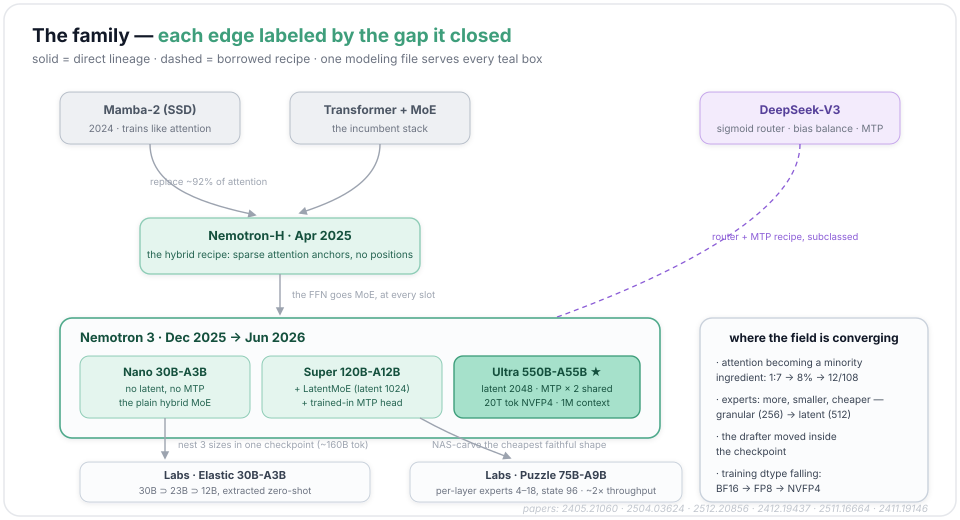

The lineage runs: Mamba-2 (mid-2024, the SSD algorithm) → **Nemotron-H** (April 2025: the hybrid recipe — replace ~92% of attention with Mamba-2, drop positional encodings) → **Nemotron 3** (December 2025: the hybrid goes MoE — Nano 30B-A3B and Super 120B-A12B, the latter adding LatentMoE-1024 and a trained-in MTP head) → **Ultra** (June 2026: same file, latent 2048, two shared-weight MTP steps, 20T NVFP4 tokens, 1M-token long-context phase). Around the main line, NVIDIA's Labs releases explore the same inference-first philosophy with different levers:

**Nemotron Labs 3 Elastic 30B-A3B** — one checkpoint, three models. Instead of training Nano-class models at several sizes, Elastic post-trains the parent so that 23B and 12B models are *nested inside* the 30B weights — rank components by importance, define submodels as contiguous salient subsets, then distill with a learnable selection router (not §5's expert router — this one decides which components each nested size keeps) over a two-stage curriculum, 8K then 49K context. All three share one parameter space; the smaller two are extracted zero-shot, no retraining. Cost: ~160B post-training tokens, versus pre-training each size from scratch. The lever is *deployment flexibility*: same architecture as Nano, but one artifact serves three latency budgets. *Method: [arXiv:2511.16664](https://arxiv.org/abs/2511.16664) · numbers from the [model card](https://huggingface.co/nvidia/NVIDIA-Nemotron-Labs-3-Elastic-30B-A3B-BF16)*

**Nemotron Labs 3 Puzzle 75B-A9B** — NAS (neural architecture search) as a compressor. Puzzle starts from Super 120B-A12B and searches, layer by layer, for the cheapest architecture that preserves it: routed-expert intermediate widths pruned non-uniformly (2688 → as low as 1280, per layer), active experts cut from 22 to as few as 4 where the layer tolerates it, Mamba state trimmed 128 → 96. The result is deliberately *heterogeneous* — no two layers need match — 75B total, 9.3B active, ~2× the parent's throughput on an 8×B200 node. Where Elastic nests sizes inside one training run, Puzzle carves a new shape out of a finished one. *Method: [arXiv:2411.19146](https://arxiv.org/abs/2411.19146) · this model's report: [arXiv:2607.04371](https://arxiv.org/abs/2607.04371) · [model card](https://huggingface.co/nvidia/NVIDIA-Nemotron-Labs-3-Puzzle-75B-A9B-BF16)*

**The choices at a glance** — one row per component, the design in one table:

| component | Nemotron 3 Ultra | the common alternative | the trade NVIDIA cites |
|---|---|---|---|
| sequence mixing | Mamba-2 in 48/60 mixer blocks | attention everywhere | decode cost constant in context length |
| global recall | 12 GQA blocks (64Q:2KV) | 100% attention layers | 9× smaller KV cache, recall preserved at anchors |
| positions | none | RoPE | recurrence encodes order; nothing to rescale at 1M |
| FFN | LatentMoE: 512 experts at width 2048, top-22 | ~256 SwiGLU experts at model width, top-8 | 4× cheaper experts → 4× more of them |
| router | sigmoid + bias correction (DeepSeek-V3 recipe), ×5.0 | softmax + aux load-balancing loss | balance without an interfering loss term |
| expert MLP | 2-matrix ReLU² | 3-matrix SwiGLU | ~33% fewer parameters per expert |
| always-on path | 1 shared expert at full width (10240) | none, or several small | common knowledge stays wide |
| decoding | trained-in recursive MTP drafter | bolt-on EAGLE/Medusa head | drafter co-trained through every stage |
| precision | mostly-NVFP4 pre-training, single FP4 checkpoint | BF16 train, post-hoc quant | 20T tokens at 4-bit, ~330 GiB to serve |

None of these choices makes the model *smarter*; most give up a sliver of quality per FLOP (the latent squeeze, by its own paper's account, is the one that claims to win it back). What they buy is a lower cost of staying up. Mamba cuts the price of every decoded token, and MTP cuts it again in the low-latency regime (§6); the 12-layer KV cache and the missing RoPE make a long context cheaper to hold; latent experts, two-matrix MLPs and FP4 shrink the weights themselves. The design treats "frontier" as a rate to sustain rather than a peak score, and bets on the decode-heavy half of the agent workload.

The field is converging on the same choices. Attention is down to a minority share, roughly a tenth of the stack (Jamba 1 in 8, Nemotron-H 8%, Ultra 12 of 108); MoE keeps moving toward more-but-smaller (DeepSeek's 256 granular → Ultra's 512 latent); the speculative drafter has moved inside the checkpoint; and the training dtype is falling — FP8 at DeepSeek-V3, FP4 here. The open edges are visible in this very release: Ultra's own report documents two loss divergences it could only partly explain; the Mamba state still makes prefix caching and rollback clumsy compared to a KV cache (§6); and prefill remains the workload where active-parameter count bites.

That's the machine: a config that names each block, a dispatch dict that builds them, a recurrence in twelve lines, a router in ten, a drafter in two blocks. Everything above reassembles from those pieces.

---

## Wrapping up

That's Nemotron 3 Ultra end to end, from the layer map to the drafter riding in its checkpoint. I hope it made the machine click.

If you spot an error or think I've misread something, corrections are more than welcome — I'd rather fix it than leave it wrong. And if a part didn't land, or there's another model you'd like to see taken apart like this, I'd love to hear it. Thanks for reading.

*Code: [`huggingface/transformers`](https://github.com/huggingface/transformers) — `src/transformers/models/nemotron_h/` · [`vllm-project/vllm`](https://github.com/vllm-project/vllm) — `vllm/model_executor/models/nemotron_h_mtp.py` · [`state-spaces/mamba`](https://github.com/state-spaces/mamba) — `mamba_ssm/modules/mamba_simple.py` (§2's ancestor code).*


## Citation

If you'd like to cite this post:

> Shen, Hongyu. "Learning with Code: Nemotron 3". *Agent Learning Notes*, Jul 2026.
> https://github.com/drshy-org/agent-learning-notes/tree/main/learning-with-code/nemotron3

```bibtex
@article{shen2026nemotron3,
  title   = {Learning with Code: Nemotron 3},
  author  = {Shen, Hongyu},
  journal = {Agent Learning Notes},
  year    = {2026},
  month   = {Jul},
  url     = {https://github.com/drshy-org/agent-learning-notes/tree/main/learning-with-code/nemotron3}
}
```

---

*© 2026 Hongyu Shen — original writing and figures, all rights reserved. Code snippets are from [`huggingface/transformers`](https://github.com/huggingface/transformers), [`vllm-project/vllm`](https://github.com/vllm-project/vllm) and [`state-spaces/mamba`](https://github.com/state-spaces/mamba), all under the Apache 2.0 License; Nemotron 3 and its architecture are © NVIDIA.*
