# Nobody Hands Out the Roles

> *Multi-agent reinforcement learning spent five years learning that division of labor cannot be written by hand. Then the LLM-agent world spent three years learning it again. This post maps the question both fields keep answering — where do roles come from when nobody assigns them? — through the papers, the math, and the people who moved on before the answer arrived.*

Every multi-agent framework ships with an org chart. MetaGPT — one of the most-cited agent systems of the LLM era, an ICLR 2024 oral — is explicit about it: the system "utilizes an assembly line paradigm to assign diverse roles to various agents," encoding Standardized Operating Procedures into prompt sequences so that a Product Manager hands off to an Architect who hands off to an Engineer. Someone sat down and wrote that chart, the way someone once wrote job descriptions for a real company.

Then, in 2025, a Berkeley team read the transcripts. MAST — the first serious failure taxonomy for LLM multi-agent systems — annotated 1,642 execution traces across seven frameworks and found failure rates between 41% and 86.7%. Here is the detail that stuck with me: of the fourteen failure modes they catalog, the one actually named after roles — *disobey role specification* — accounts for 1.5% of failures, the second-rarest in the whole taxonomy (v3 numbers; the shares move between paper versions, the rank does not). The agents follow the org chart. The systems fail anyway — they repeat steps (15.7%), lose track of termination (12.4%), violate task specs (11.8%). The single largest failure *category* is system design itself, at 44.2%.

Obedience is not the bottleneck. The chart is.

<div style="display:flex;flex-wrap:wrap;gap:10px;margin:1.3em 0 .4em"><div style="flex:1 1 150px;min-width:150px;background:#F5F5F7;border:1px solid #E2E2E7;border-radius:14px;padding:12px 14px;text-align:center"><div style="font-size:23px;font-weight:800;color:#1D1D1F;line-height:1.1">1,642</div><div style="font-size:11px;color:#6E6E73;margin-top:5px;line-height:1.4">execution traces annotated</div></div><div style="flex:1 1 150px;min-width:150px;background:#F5F5F7;border:1px solid #E2E2E7;border-radius:14px;padding:12px 14px;text-align:center"><div style="font-size:23px;font-weight:800;color:#1D1D1F;line-height:1.1">41–86.7%</div><div style="font-size:11px;color:#6E6E73;margin-top:5px;line-height:1.4">failure rates across seven frameworks</div></div><div style="flex:1 1 150px;min-width:150px;background:#F5F5F7;border:1px solid #E2E2E7;border-radius:14px;padding:12px 14px;text-align:center"><div style="font-size:23px;font-weight:800;color:#D70015;line-height:1.1">44.2%</div><div style="font-size:11px;color:#6E6E73;margin-top:5px;line-height:1.4">largest failure category: system design</div></div><div style="flex:1 1 150px;min-width:150px;background:#F5F5F7;border:1px solid #E2E2E7;border-radius:14px;padding:12px 14px;text-align:center"><div style="font-size:23px;font-weight:800;color:#1D1D1F;line-height:1.1">15.7%</div><div style="font-size:11px;color:#6E6E73;margin-top:5px;line-height:1.4">top single mode: step repetition</div></div><div style="flex:1 1 150px;min-width:150px;background:#F5F5F7;border:1px solid #E2E2E7;border-radius:14px;padding:12px 14px;text-align:center"><div style="font-size:23px;font-weight:800;color:#1F7A42;line-height:1.1">1.5%</div><div style="font-size:11px;color:#6E6E73;margin-top:5px;line-height:1.4">disobey role spec — 2nd-rarest of 14</div></div></div>
<div style="font-size:11.5px;color:#86868B;margin:0 2px 1em">MAST, NeurIPS 2025 D&amp;B (v3 numbers)</div>


There is a research community that would not have been surprised by this. Starting in 2019, multi-agent reinforcement learning (MARL) ran a sustained research program on this question — under the name *role discovery* or *skill discovery* — and its central finding was that the org chart works best when nobody writes it: when roles are latent variables, learned end-to-end from the team's objective, emerging as structure in the joint policy rather than entering as input. That line later thinned, its three founding figures moved on, and the word "role" was quietly taken over by the LLM-agent world, where it came to mean a persona in a system prompt.

Then the LLM-agent community re-derived the MARL conclusion, step by step, in public, in about three years: hand-written roles, then generated roles, then searched-for team structures, then finally roles trained with reinforcement learning against the team's reward — a ladder assembled here in hindsight, not a program anyone announced. The vocabulary changed more than the question did.

So this post is a map of one question asked twice: **where does division of labor come from when no one hands out the roles?** The route: the consensus both eras started from, the formalism the question lives in, the lineage — three stages in MARL, two in LLM land, one branch MARL never grew — then the steelman for the org chart, and what would settle it.

---

## 1 · The consensus: someone writes the org chart

The default position is rarely argued for, because it is rarely stated. In both eras it is the same position: **decomposition is the designer's job.**

Pre-2020 cooperative MARL mostly inherited it silently. If a StarCraft micro-battle needed a scout, a tank, and a healer, you either shaped rewards per unit type, hard-wired a hierarchical controller, or trained homogeneous agents and hoped. The role structure — who specializes in what — was an *input*: fixed before learning started, tuned when it failed.

The LLM era rebuilt the same position with better ergonomics. CAMEL (NeurIPS 2023) showed two LLMs could sustain a division of labor through "inception prompting" — a user agent and an assistant agent, roles written into the system prompts. MetaGPT scaled the idea into the SOP assembly line, and its framing is worth quoting because it states the consensus as a virtue: SOPs encoded into prompts give "agents with human-like domain expertise" the ability to verify intermediate results, taming the "cascading hallucinations caused by naively chaining LLMs." The industry pattern — one orchestrator, several workers, roles in the system prompts — is this same chart, shipped.

Formally, the consensus is a restriction on the joint policy. Write $\sigma$ for the assignment of agents to roles, chosen by the designer before any learning happens, and $\pi_{\sigma(i)}$ for the behavior script of agent $i$'s assigned role:

$$
\pi(a \mid \tau) = \prod_{i=1}^{n} \pi_{\sigma(i)}(a_i \mid \tau_i), \qquad \sigma: \{1, \dots, n\} \to \{1, \dots, K\} \ \text{fixed in advance}
$$

Here $a = (a_1, \dots, a_n)$ is the team's joint action and $\tau_i$ is what agent $i$ has seen so far. Whatever learning happens, happens *inside* the $K$ role scripts; the structure — how many roles, who fills them, what each is for — never touches the objective. MetaGPT is exactly this equation with $\pi_{\sigma(i)}$ implemented as a role-prompted LLM and $K$ = the length of the SOP.

The attraction is real: a hand-written $\sigma$ is legible, debuggable, and cheap. The cost is the one every org designer knows — the chart encodes the designer's guess about the task, and the task does not read the chart. Change the map, the team size, the opponent, the codebase, and the guess is stale. Both eras paid that cost for years before anyone measured it.

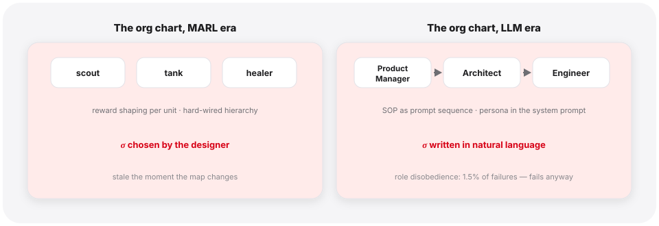

---

## 2 · The question, formally

One formal object underlies both eras: the **Dec-POMDP** (decentralized partially observable Markov decision process), the standard formalization of a cooperative team under partial observability:

$$
\mathcal{M} = \langle \mathcal{I}, \mathcal{S}, \{\mathcal{A}_i\}, P, r, \{\Omega_i\}, O, \gamma \rangle
$$

$\mathcal{I}$ is the set of $n$ agents; $\mathcal{S}$ the environment state; $\mathcal{A_i}$ agent $i$'s actions; $P$ the transition dynamics; $r$ a **single team reward** shared by everyone; $\Omega_i$ and $O$ govern what each agent privately observes; $\gamma$ discounts the future. Each agent acts from its own action-observation history $\tau_i$ — nobody sees the whole board. The team's only compass is the joint return $J = \mathbb{E}\left[\sum_t \gamma^t r_t\right]$. One shared $r$ is also the root of the genre's hardest problem — **credit assignment**: deciding which agent's action earned a reward everyone receives.

<details class="tw"><summary>🔍 Symbol guide — the Dec-POMDP tuple in plain words</summary>

- **$\mathcal{I}$, $n$** — the roster: which agents exist; $n$ of them.
- **$\mathcal{S}$** — the true state of the world (nobody gets to see all of it).
- **$\mathcal{A_i}$** — what agent $i$ can do at each step.
- **$P$** — physics: how state + joint action produce the next state.
- **$r$** — **one** reward for the whole team, no per-agent scores; this single number is the root of credit assignment.
- **$\Omega_i$, $O$** — the peephole: which private observation each agent receives, and with what odds.
- **$\gamma$** — the discount: how much tomorrow's reward is worth today (between 0 and 1).
- **$\tau_i$** — agent $i$'s own action-observation history; the only thing it can act on.
- **$J$** — expected discounted sum of team rewards: the one number everything is trained to raise.

</details>

Division of labor, in this language, is *structure in the joint policy*: agents behaving systematically differently, in complementary ways, without the difference being written in. The whole research program fits in one template — condition each agent's policy on a **role variable** and ask where that variable comes from:

$$
\pi(a \mid \tau) = \prod_{i=1}^{n} \pi_i(a_i \mid \tau_i, \rho_i), \qquad \rho_i \sim p_{\theta}(\rho_i \mid \cdot)
$$

Every system in this post is a choice of two things: **the sampler** $p_{\theta}$ (what generates $\rho_i$ — a designer's table, a Gaussian encoder, a k-means clustering, an LLM writing a persona paragraph, an RL-trained orchestrator) and **the coupling** (whether anything connects $p_{\theta}$ back to the team objective $J$). The consensus of the opening section is the degenerate case: $\rho_i = \sigma(i)$, a constant, coupled to nothing.

Three claims the rest of the post can be scored against:

- **T1 (emergence wins).** On matched tasks and budgets, systems whose role structure is *learned against the team objective* outperform systems whose role structure is fixed by hand at comparable complexity — comparable meaning the same budget (tokens in the LLM era, samples and tuning in the MARL era) and a similar amount of scaffolding — in both eras.
- **T2 (representation beats label).** The productive form of *within-team role assignment* is a continuous representation coupled to credit assignment, not a discrete label. Each era's strongest systems drifted from labels toward representations. (One deliberate exclusion: the skill-library branch, where a skill is a named, readable piece of code — exactly a discrete label, and thriving. The skills-as-assets section argues that branch sits on a different axis — what the team gets to keep, not who does what — so it bounds this claim rather than refuting it.)
- **T3 (declaration is not the mechanism).** Declaring roles in natural language produces role-*conformant* behavior, but not performant coordination — co-training does that — and it does not prevent the failures that matter: systems obey their declarations and fail anyway.

Each is falsifiable: T1 dies if tuned fixed pipelines keep beating trained orchestrators at equal token budgets; T2 dies if discrete role labels return to the frontier of role assignment; T3 fails if role-prompt engineering alone closes the failure gap MAST measures.

<table>
<thead><tr><th>Claim</th><th>The bet, in one line</th><th>Evidence anchor, both eras</th><th>What kills it</th></tr></thead>
<tbody>
<tr><td><strong style="color:#1F7A42">T1 · emergence wins</strong></td><td>Role structure <strong>learned against the team objective</strong> beats hand-fixed systems of comparable complexity (same token budget, similar scaffolding)</td><td>MARL: ROMA/RODE vs unit-typing · LLM: trained orchestration vs prompt pipelines</td><td>Tuned fixed pipelines keep beating trained orchestrators at equal token budgets</td></tr>
<tr><td><strong style="color:#0B5CAD">T2 · representation beats label</strong></td><td>Productive within-team role assignment = a <strong>continuous representation coupled to credit</strong>, not a discrete label (skill-library branch deliberately scoped out — the skills-as-assets section)</td><td>RODE's discrete menus → ACORM's contrastive embeddings · persona paragraphs → trained latents</td><td>Discrete role labels return to the frontier of role assignment</td></tr>
<tr><td><strong style="color:#B36200">T3 · declaration is not the mechanism</strong></td><td>Declared roles buy <strong>conformant</strong> behavior, not <strong>performant</strong> coordination — co-training does</td><td>MAST: role-disobedience 1.5% yet systems fail anyway · MAPoRL: training one LLM alone is insufficient</td><td>Role-prompt engineering alone closing the gap MAST measures</td></tr>
</tbody></table>


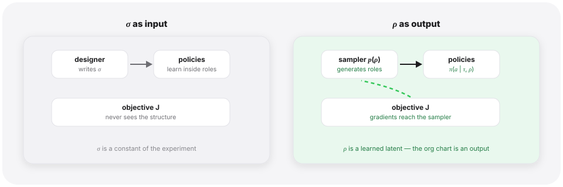

---

<details class="tw big"><summary>🔍 Glossary — recurring terms in this post</summary>

- **Dec-POMDP** — the formal object for a cooperative team under partial observability; the tuple in the formal section above.
- **CTDE** — centralized training, decentralized execution: learn with global information, act on local histories.
- **Value decomposition** — per-agent utilities $Q_i$ combined by a mixing network into a team value $Q_{\mathrm{tot}}$.
- **QMIX** — the standard mixing network, constrained monotone in each $Q_i$.
- **TD loss** — temporal-difference training: regress value toward reward-plus-next-value.
- **Credit assignment** — deciding which agent's action earned the shared reward.
- **IGM** — individual-global-max: local argmaxes assemble into the team argmax (the steelman section).
- **SMAC / SMACv2** — StarCraft micro-battle benchmark; v2 adds the stochasticity v1 lacked.
- **Latent variable** — an unobserved, learned quantity; here the role $\rho_i$.
- **Hypernetwork** — a network whose output is another network's weights.
- **Mutual information $I(X;Y)$** — how much knowing one variable reduces uncertainty about the other.
- **Variational surrogate** — a trainable bound standing in for an intractable MI term.
- **InfoNCE / contrastive** — shape embeddings by classifying positives against negatives.
- **Options / HRL** — temporally extended sub-policies; skills that live in weights.
- **DIAYN** — the single-agent skill-discovery classic every MI-based role method descends from (Stage III).
- **Intrinsic reward** — a self-generated bonus added to the environment's reward.
- **Dynamics / world model** — a learned predictor of what happens next; R3DM's tool for tying roles to the future.
- **Zero-shot coordination** — cooperating with partners never met in training (CORD's target).
- **SOP / persona / role prompt** — a hand-written role, encoded in an LLM's system prompt (MetaGPT, CAMEL).
- **Orchestrator** — the controller that decides which agent acts next (Puppeteer trains it with RL).
- **REINFORCE** — the score-function policy gradient; GPTSwarm's optimizer over graph edges.
- **MCTS** — Monte-Carlo tree search; AFlow's search operator over workflows.
- **GRPO / advantage / baseline** — group-relative advantage: score minus the group mean (the grouping card in Stage V).
- **Verifier** — a scoring model whose judgment serves as the RL reward (MAPoRL, MALT) — and a Goodhart surface.
- **Goodhart** — optimize the proxy hard enough and it stops tracking the goal.
- **Skill library** — behaviors stored as retrievable, executable code; the asset of the skills-as-assets section.

</details>

## 3 · Stage I — Roles as latent variables (ROMA, 2020)

**The problem.** By 2019 cooperative MARL had a working chassis: **value decomposition**. Each agent learns a local utility $Q_i(\tau_i, a_i)$ — a score for each of its actions given what it has seen — and a small **mixing network** combines these into a joint team value $Q_{\mathrm{tot}}$, trained by temporal difference on the shared reward, with a monotonicity constraint so that each agent maximizing its own $Q_i$ also maximizes the team's $Q_{\mathrm{tot}}$ (the QMIX recipe; training is centralized, execution decentralized — CTDE). It worked, on the era's standard testbed of StarCraft micro-battles (SMAC, the StarCraft Multi-Agent Challenge). But its agents were interchangeable: shared networks, shared conditioning, no mechanism for stable specialization. Hand-writing roles was known to be brittle. Could the roles *emerge*?

<details class="tw"><summary>🔍 QMIX unpacked — the mixing network, and what monotonicity buys</summary><div><ul><li><strong>The parts</strong> — one small Q-net per agent, Q<sub>i</sub>(τ<sub>i</sub>, a<sub>i</sub>), seeing only its own history; plus the <em>mixing network</em>: a tiny net whose inputs are the n numbers Q<sub>1</sub>…Q<sub>n</sub> (each agent's score for its chosen action) and whose output is the single team value Q<sub>tot</sub>. Its weights are not fixed — a helper net generates them from the <em>global state</em>, so how the scores combine can change with the battle.</li><li><strong>The one constraint</strong> — all mixing weights are forced non-negative, so ∂Q<sub>tot</sub>/∂Q<sub>i</sub> ≥ 0: raising any agent's local score never lowers the team score. That guarantees the joint action assembled from each agent's own argmax is also the argmax of Q<sub>tot</sub> — the IGM property the steelman section returns to.</li><li><strong>What that buys</strong> — training can be centralized (the mixer sees global state; the TD loss lives on Q<sub>tot</sub>) while execution is fully decentralized (each agent argmaxes its own Q<sub>i</sub>, no communication) — that is all CTDE means.</li><li><strong>Where credit assignment happens</strong> — one loss, the TD on Q<sub>tot</sub>; its gradient flows back through the mixer into every Q<sub>i</sub>, scaled by how much the mixer currently thinks that agent's score moves the team's. That scaling <em>is</em> the credit split.</li><li><strong>The cost</strong> — monotonicity buys factorizability but excludes teamwork where one agent's score must drop for the team's to rise; that boundary is the IGM decision card later.</li></ul></div></details>


**The move.** ROMA (Wang, Dong, Lesser & Zhang, ICML 2020) made the role a **stochastic latent variable** generated from each agent's own observation. A role encoder $f$ maps the observation to a Gaussian, and the sampled role is decoded — by a hypernetwork — into the parameters of that agent's policy:

$$
(\mu_{\rho_i}, \sigma_{\rho_i}) = f(o_i; \theta_{\rho}), \qquad \rho_i \sim \mathcal{N}(\mu_{\rho_i}, \sigma_{\rho_i})
$$

($\mu$ and $\sigma$ here are the Gaussian's mean and spread — no relation to the opening section's assignment map $\sigma$.) Sampling alone buys nothing — an unconstrained latent can be noise. ROMA's contribution is the pair of information-theoretic regularizers that force the latent to *mean* something:

*Identifiability.* A role should be recoverable from how its agent has actually behaved. Maximize the conditional mutual information $I(\rho_i^t; \tau_i^{t-1} \mid o_i^t)$ between the role and the agent's own trajectory; the variational surrogate is a KL loss tying the role prior to a posterior $q_{\xi}$ that reads the trajectory:

$$
\mathcal{L}_{I} = \mathbb{E}\left[ D_{\mathrm{KL}}\left( p(\rho_i^t \mid o_i^t) \parallel q_{\xi}(\rho_i^t \mid \tau_i^{t-1}, o_i^t) \right) \right]
$$

*Specialization.* Different agents should get *usefully different* roles. ROMA trains a dissimilarity model $d_{\phi}$ over trajectory pairs and pushes every pair of agents to be either mutually predictable (same role, in effect) or behaviorally far apart — capped by a constant $U$ so nobody has to be infinitely different:

$$
\min \ \lVert D_{\phi}^t \rVert_F - \sum_{i \neq j} \min\left\{ I(\rho_i^t; \tau_j^{t-1} \mid o_j^t) + d_{\phi}(\tau_i^{t-1}, \tau_j^{t-1}),\ U \right\}
$$

($D_{\phi}^t$ is the matrix of all pairwise distances at step $t$ — entry $(i,j)$ is $d_{\phi}(\tau_i, \tau_j)$. The objective pulls in two directions on purpose: the Frobenius-norm term keeps every distance small by default, while the second term pays for predictability-or-difference only up to the cap $U$ — so agents end up different where it matters, not everywhere. Its variational relaxation is the $\mathcal{L_D}$ term of the total loss below; the full form lives in ROMA's appendix.) Everything trains jointly with the ordinary value-decomposition TD loss — the chassis's own training signal: nudge $Q_{\mathrm{tot}}$, the team value the mixing network assembles from the local $Q_i$, toward the one-step target $r + \gamma Q_{\mathrm{tot}}'$ — the team reward just received, plus the discounted best next-step value from the lagged target copy (written out in full in RODE's loss pair, next stage):

$$
\mathcal{L}(\theta) = \mathcal{L}_{\mathrm{TD}}(\theta) + \lambda_I \mathcal{L}_I + \lambda_D \mathcal{L}_D
$$
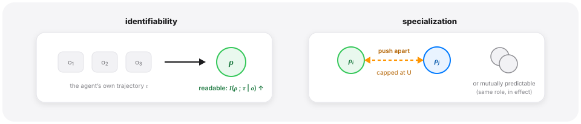

<details class="tw"><summary>🔍 ROMA's two regularizers, symbol by symbol</summary>

- **$(\mu_{\rho_i}, \sigma_{\rho_i})$** — mean and spread of the Gaussian the role is sampled from, produced by the encoder $f$ from the current observation.
- **$I(\cdot\ ;\ \cdot \mid \cdot)$** — conditional mutual information: how much the first thing tells you about the second, once the third is known. Identifiability asks the role to be readable from the agent's own past.
- **$q_{\xi}$** — a helper \"posterior\" network that reads the trajectory and guesses the role; the KL between the role prior and this guess is the trainable stand-in for the MI (the variational surrogate).
- **$d_{\phi}$** — a learned dissimilarity score between two agents' trajectories; $D_{\phi}^t$ stacks all pairs into a matrix (the Frobenius-norm term $\lVert D_{\phi}^t \rVert_F$ keeps it from inflating).
- **$U$** — the cap: two agents only need to be *this* different, not infinitely different.
- **$\lambda_I$, $\lambda_D$** — dials for how loudly each regularizer speaks next to the ordinary TD loss.

</details>

<details class="tw"><summary>🔍 RL from zero — what the objective is, and why the loss looks like that</summary><div><ul><li><strong>The objective</strong> — supervised learning fits labels someone provides; RL has none. The one number being maximized is the expected discounted return J = E[Σ γ<sup>t</sup> r<sub>t</sub>] — all future reward, tomorrow's worth γ &lt; 1 times today's (keeps the sum finite, and encodes that winning sooner beats winning later).</li><li><strong>Q</strong> — Q(s, a) = "if I take action a now and play well from here on, how much return is left?" With an accurate Q, acting is trivial: pick the argmax each step. "Learn to play" becomes "get Q right."</li><li><strong>The TD trick</strong> — the true Q is self-consistent (Bellman): Q(s, a) = r + γ max Q(s′, a′) — this step's value equals the reward just received plus the discounted best of the next step. Training forces the network to obey that: after each real step, regress its prediction toward r + γ max Q(s′, a′). Supervised in shape — but the label is assembled from real reward plus the network's <em>own</em> estimate of the future (bootstrapping). The gap is the temporal difference.</li><li><strong>Why it converges on something</strong> — every update pulls the estimate toward one containing one more step of real reward; information seeps backward from the end of the episode toward the start.</li><li><strong>Two engineering pieces</strong> — ε-greedy exploration (pure greed never tries unseen moves) and the replay buffer (reuse experience, decorrelate batches).</li><li><strong>The multi-agent layer</strong> — each agent a small Q<sub>i</sub> on its own observation, one shared r; the mixing network assembles Q<sub>tot</sub> so one TD signal trains everyone, and monotonicity keeps local argmax = team argmax (the IGM condition of the steelman section). ROMA's role machinery hangs off this same loss.</li><li><strong>Contrast with the LLM world</strong> — pretraining = supervision with real labels; RLHF/GRPO are the <em>policy-gradient</em> family (push the policy directly toward high reward); this chassis is the <em>value-function</em> family (estimate value, then act greedily) — RL's two classic legs.</li></ul></div></details>

<details class="tw"><summary>🔍 How does this actually train? (these are not LLMs)</summary><div><ul><li><strong>What the networks are</strong> — each agent is a small recurrent Q-network (GRU-scale, roughly 10⁴–10⁵ weights), randomly initialized; no pretraining, no text. Input: the agent's local observation vector (positions, health, shields of units in view). Output: one score per discrete action — a dozen-odd moves and attack targets. ROMA adds two small nets on top: the role encoder (outputs the Gaussian's μ, σ) and the hypernetwork (turns the sampled ρ into the policy's weights).</li><li><strong>Where the data comes from</strong> — the current policy plays episode after episode in the StarCraft simulator, with ε-greedy exploration; every step's (observation, actions, team reward, next observation) goes into a replay buffer.</li><li><strong>One training step</strong> — sample a batch from the buffer; each agent's net scores its chosen action (Q<sub>i</sub>); the mixing network assembles them into Q<sub>tot</sub>; the TD loss is the squared gap to r + γQ<sub>tot</sub>′; add the two MI regularizers; one backprop updates everything at once — agent nets, mixing net, role encoder, hypernetwork. (In practice the TD label is produced by a lagged "target network" copy, so the regression is not chasing a goalpost that moves with every step.)</li><li><strong>Scale, and the contrast</strong> — millions of simulator steps, a single GPU, hours to days. The whole difference from an LLM: no pretrained knowledge to start from — the only teacher is the team reward the simulator pays out.</li></ul></div></details>


**What it showed.** On SMAC, role embeddings clustered by function without any function being named — units drifted into stable, complementary behavioral niches, and the roles adapted as the battle turned. The paper's clearest picture: as units take damage their role latents migrate, and dead agents' latents gather in a cluster of their own — *wounded* and *gone* emerging as roles nobody named. The org chart, for the first time, was an output.

**What it left open.** Two things, and both matter later. The roles condition on the *present* observation and are regularized against the *past* trajectory — nothing forces a role to constrain what the agent will do *next* (R3DM's exact complaint, five years early — Stage III). And every agent still chooses from the same action menu; the latent shades behavior but does not carve the task — that is what RODE adds next.

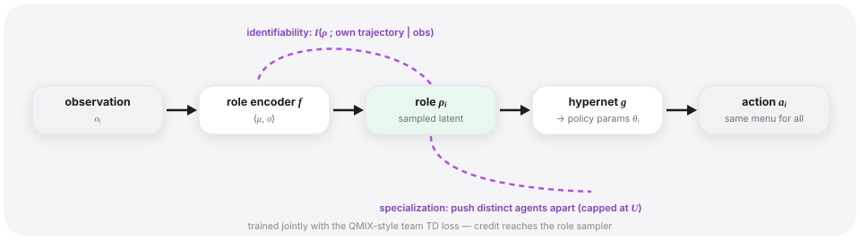

---

## 4 · Stage II — Roles that carve the task (RODE, 2021)

**The problem.** ROMA's roles shade behavior; they do not reduce anybody's job. A role in the everyday sense *restricts* what you deal with — the healer does not consider tank actions. Restriction is also a computational gift: smaller action spaces, easier exploration. Can roles carve the action space itself?

**The move.** RODE (Wang, Gupta, Mahajan, Peng, Whiteson & Zhang, ICLR 2021) splits the problem in two: first understand what actions *do*, then bundle them into roles. An action encoder learns a representation $z_a$ for every action by forcing it to predict the action's *effects* — next observation and reward:

$$
\mathcal{L}_e = \mathbb{E}\left[ \sum_i \lVert p_o(z_{a_i}, o_i, a_{-i}) - o_i' \rVert_2^2 + \lambda_e \sum_i \left( p_r(z_{a_i}, o_i, a_{-i}) - r \right)^2 \right]
$$

($p_o$ and $p_r$ are the two predictor heads — next observation and reward; $a_{-i}$ is everyone else's action — an action's effect depends on context.) Actions are then k-means clustered *in effect space*; each cluster $A_j \subset A$ becomes the restricted action space of role $j$, and the role itself gets a representation by averaging its members:

$$
z_{\rho_j} = \frac{1}{\lvert A_j \rvert} \sum_{a_k \in A_j} z_{a_k}
$$

(Note what got clustered: actions, not agents. The clustering only defines what the roles *are* — which slice of the action space each role commands. Which agent plays which role is decided separately, at run time, by the selector below — re-chosen every $c$ steps, and nothing stops several agents from occupying the same role at once. One more decoupling worth saying out loud: the encoder's training data does come from episodes the agents played — early, near-random exploration — but what it fits is the game engine's response to actions; the clusters capture what actions *do*, not what agents *like doing*. And once frozen, later policy learning cannot leak back into them.)

On top sits a **bi-level policy** running on two clocks. Every $c$ steps, a role selector scores roles by a dot product between the agent's trajectory embedding and the role representation; within the window, a role policy picks actions the same way, but only from the restricted menu:

$$
Q_i^{\beta}(\tau_i, \rho_j) = z_{\tau_i}^{\top} z_{\rho_j} \qquad \text{(coarse clock: pick a role every } c \text{ steps)}
$$

$$
Q_i(\tau_i, a_k) = z_{\tau_i}^{\top} z_{a_k}, \quad a_k \in A_j \qquad \text{(fine clock: act inside the role)}
$$

Both levels train through their own QMIX-style mixers against the team reward. Concretely: every $c$ steps, each agent's chosen role-score $Q_i^{\beta}$ is mixed into a team-level role value and regressed against the reward accumulated over the window — that trains *which lineup to field*; within the window, the per-step action scores are mixed by a second mixer and regressed step by step — that trains *how each role plays*. The role structure and the role behaviors are both outputs of the same team signal. A subtler split sits underneath. The action encoder trains only on its own predictive loss and is settled early — with the clusters, it freezes into a fixed coordinate system (the lamination below). What each agent learns, throughout, is the *trajectory encoder* (one shared per level): both levels score by the dot product "my history embedding · a menu item's embedding," so the menu side is anchored while the agent side moves — an agent learns where to stand in that coordinate system. And the QMIX-style mixers are not a learner replacing the agents; they are the credit's routing: the TD loss lives on $Q_{\mathrm{tot}}$, and its gradient flows back through the mixer into every agent's trajectory encoder.

Written out, the pair is:

$$
\begin{gathered}
\mathcal{L}_{\beta} = \mathbb{E}\left[\left(\sum_{t'=0}^{c-1} r_{t+t'} + \gamma \max_{\rho'} \bar{Q}^{\beta}_{\mathrm{tot}}(s_{t+c}, \rho') - Q^{\beta}_{\mathrm{tot}}(s_t, \rho_t)\right)^{2}\right] \\[6pt]
\mathcal{L}_{\rho} = \mathbb{E}\left[\left(r + \gamma \max_{a'} \bar{Q}_{\mathrm{tot}}(s', a') - Q_{\mathrm{tot}}(s, a)\right)^{2}\right]
\end{gathered}
$$

($s$ is the global state the training-time mixers condition on; $\rho_t$ and $a$ are the *joint* role assignment and joint action across the team; the barred $\bar{Q}$'s are target networks — lagged copies of the whole $Q_{\mathrm{tot}}$ machinery that exist to hold the goalpost still: the TD label contains the network's own estimate, so if predictor and label moved together, every gradient step would shift the target it is regressing toward; the copy is updated only every so often, giving the online network a stationary label between refreshes. And note what is *not* here: a single summed objective. $\mathcal{L_e}$ is settled first and frozen; then these two run concurrently, each on its own clock. RODE's "combined loss" is really three losses, two phases, two clocks.)

<details class="tw"><summary>🔍 RODE's machinery, symbol by symbol</summary>

- **$z_a$** — an action's representation, learned by forcing it to predict the action's *effects* (next observation and reward); actions that do similar things land near each other.
- **$a_{-i}$** — everyone else's actions, inside the predictors because an action's effect depends on context.
- **$A_j$** — one k-means cluster in effect space = one role's restricted menu; $z_{\rho_j}$ is the cluster average, standing in for the role itself.
- **$c$** — the coarse clock: a role is re-chosen every $c$ environment steps; inside the window, the fine clock picks actions from the restricted menu only.
- **$z_{\tau_i}^{\top} z$ dot products** — both levels score options by similarity between \"where I've been\" and the option's embedding; that shared geometry is what buys transfer to new units.
- Both levels train through their own QMIX-style mixer on the **team reward** — structure and behavior are both in the loss.

</details>

**What it showed.** State-of-the-art on the hardest StarCraft maps of the day, where flat methods stalled — restricted menus made hard exploration tractable. And the dot-product trick bought transfer: new units whose actions embed near old ones inherit sensible roles for the price of re-fitting the action encoder.

**What it left open.** The clusters freeze early (after ~50K samples, against 2M training steps) — the org chart is learned, then laminated. The role count is a hyperparameter. And the whole construction lives on one benchmark family, which turned out to matter more than anyone said at the time.

The SMAC evidence aged badly, in two steps. Step one, the **tuning confound**. "RODE beats the baselines" only supports "emergent roles work" if both sides received comparable tuning effort — and they had not. Within months, plain PPO with "minimal hyperparameter tuning" proved "comparable or superior to RODE's in 10 of 14 maps while using the same number of training samples" (MAPPO, NeurIPS 2022 D&B) — with no role machinery anywhere in it. And when someone gave the plain chassis the same care the variants had received — a vanilla QMIX finetuned per map — it posted 93–100% win rates on the super-hard maps where role methods' published numbers sat far lower; the authors' conclusion was that most of the variants' reported gains came from code-level optimizations rather than the ideas being tested (ICLR Blog Track 2023). Step two, the **benchmark confound**. SMACv2's authors — Whiteson among them — showed SMACv1 "lacks the stochasticity and partial observability to require complex closed-loop policies." Their test makes the point vivid: an *open-loop* policy — a blind script that never looks at an observation, just replays actions keyed to the timestep — gets non-trivial win rates on many maps (NeurIPS 2023 D&B). A benchmark a blind script can partly solve cannot certify that a method learned observation-dependent coordination. None of this shows emergent roles don't help. It shows era-one's evidence could not separate "roles were the active ingredient" from "a well-implemented agent on a partly memorizable benchmark" — an asterisk on T1 — emergence wins — call it the era-one correction — that will matter again when the LLM era starts reporting its own in-house numbers.

It was also, in hindsight, a farewell: within two years its first author, Tonghan Wang, had left for a Harvard PhD in mechanism design; the senior authors, on their own clocks, left the line entirely. Stage III happened while all three were elsewhere.

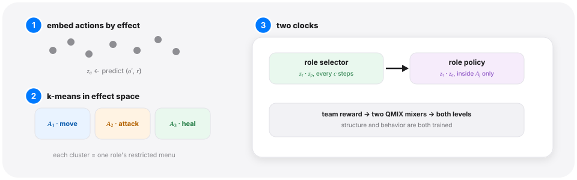

---

## 5 · Stage III — "Role" dissolves into representation and skill (2023–2025)

**The problem.** ROMA and RODE proved emergence works, on one benchmark family, with discrete-ish machinery. Then the founders left — and the interesting thing is what the question did next without them: it split into three, and stopped calling itself "role."

**The 2023 burst.** The year the line looked healthiest: four top-venue papers, each attacking a different wall. SIRD (AAAI 2023, Beihang) recast role discovery as structural-information-theoretic clustering over actions — hierarchical, and free of the role-count hyperparameter RODE was stuck with. HMASD (NeurIPS 2023, USTC) learned **team skills and individual skills simultaneously** — a transformer high-level policy assigns skill latents down the roster, built for sparse rewards. GoMARL (NeurIPS 2023) dropped "role" for "group": dynamic agent grouping with group-wise value factorization — same question, sibling vocabulary. And ODIS (ICLR 2023, Nanjing) moved the whole question **offline**: extract task-invariant coordination skills from logged multi-task data, deploy them zero-shot on unseen tasks.

**The move that stuck — roles become representations.** The modern anchor is ACORM (ICLR 2024, Nanjing — the group that carries the line now). No restricted action spaces, no hypernetworks: the role is a learned embedding, and what makes it a *role* is contrastive structure. Agents are periodically clustered by their trajectory embeddings; agents in your cluster are positives, everyone else negatives, and an InfoNCE loss pulls role representations together within a cluster and apart across clusters:

$$
\mathcal{L}_K = -\log \frac{\sum_{i' \in C_j} \exp\left(z_i^{\top} W z_{i'}\right)}{\sum_{i' \in C_j} \exp\left(z_i^{\top} W z_{i'}\right) + \sum_{i^{*} \notin C_j} \exp\left(z_i^{\top} W z_{i^{*}}\right)}
$$

($z_i$ is agent $i$'s role representation, $C_j$ its current cluster — one of $K$, which names the loss; $K{=}3$ in all reported domains, an ablation over $K{=}2$–$5$ finding performance largely insensitive — and $W$ a learned bilinear score.) What is being learned, and by which losses: three components, two losses, two clocks. The components: a shared individual Q-network (what picks actions), a GRU encoder that compresses each agent's trajectory into an agent embedding $e_i$, and a role encoder that compresses $e_i$ further into the role representation $z_i$. The losses: the TD loss runs at every Q-update — each agent scores actions with $Q_i(e_i, a)$, the mixing network assembles $Q_{\mathrm{tot}}$ and regresses it toward $r + \gamma Q_{\mathrm{tot}}'$, training the Q-nets, the GRU, and the mixer; the InfoNCE loss cuts in once every 100 Q-updates and trains only the role encoder (the periodic clustering just manufactures its positives and negatives — no classifier exists at execution time). And $z_i$ appears at exactly one place in the dataflow: the mixer's multi-head attention, where the global state attends over the team's role representations to decide how credit is split. Execution is fully decentralized — each agent uses only $Q_i(e_i, a)$; the mixer, and $z$ with it, exist on the training side alone. Role discovery has become representation learning for credit assignment. That drift is T2 — representation beating label.

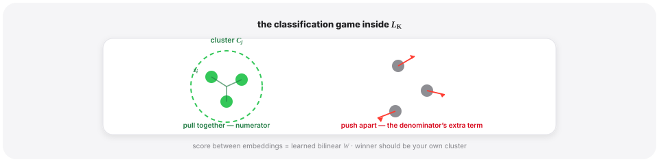

<details class="tw"><summary>🔍 Reading the InfoNCE loss — and R3DM's future-MI bound</summary>

- **InfoNCE in one sentence** — a classification game: among all agents, pick out your own cluster-mates by role embedding alone; the loss is low when cluster-mates score high (numerator) and everyone else scores low (the extra denominator term).
- **$z_i$** — agent $i$'s role representation; **$C_j$** — its current cluster (one of $K$, refreshed periodically from trajectory embeddings); **$W$** — a learned bilinear compatibility score.
- **R3DM's three letters** — $m_i^t$ the discrete role, $z_i^t$ its embedding, $e_i^t$ the history embedding; the bound splits \"role $\leftrightarrow$ future trajectory\" information into a past-conditioned term (handled ACORM-style) plus a future term.
- **Where the future term goes** — it becomes intrinsic reward: the agent is paid when holding its role visibly changes what it does next (a KL between role-conditioned and role-averaged action distributions, plus the likelihood gap between a role-conditioned and a role-agnostic world model).

</details>

**The critique from inside.** R3DM (ICML 2025, UT Austin + Honda — the lone top-venue paper of its year still carrying *role* in its title) put its finger on the inherited flaw: every method so far learns roles that *summarize the past*. A role you can only verify retrospectively is a label, not a commitment. R3DM's objective ties the role to the **future**:

$$
I\left(\tau_i^{t+k}; m_i^t \mid \tau_i^t\right) \ \geq\ \mathbb{E}\left[\log \frac{p(z_i^t \mid e_i^t)}{p(z_i^t)}\right] + I\left(\tau_i^{t+1:t+k}; z_i^t \mid \tau_i^t\right)
$$

— in R3DM's notation, $m_i^t$ is the discrete role (our $\rho_i$), $z_i^t$ its learned embedding, and $e_i^t$ the embedding of the history $\tau_i^t$. The objective is the mutual information between the role and the next $k$ steps of trajectory, decomposed (their Theorem 4.1) into a past-conditioned embedding term (handled ACORM-style) plus a future term that becomes **intrinsic reward**: the agent is paid the KL divergence between its role-conditioned action distribution and its role-averaged one, plus the log-likelihood gap between a role-conditioned world model and a role-agnostic one. A role now *costs* something to hold: it must make your future behavior more predictable-given-role than it would be without. Reported gains: win rates up to 20% higher than strong baselines — including ACORM, the method it builds on — across SMAC and SMACv2, with the largest gaps on SMAC's hardest maps.

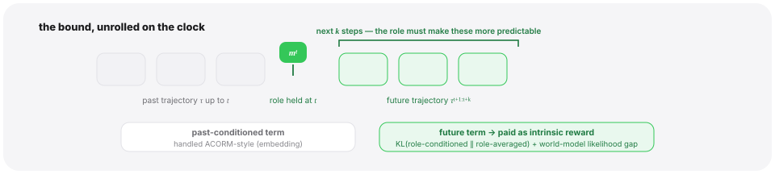


**The single-agent ancestor.** The "pay the agent for information between latent and behavior" pattern has a name and a birthplace: DIAYN — Diversity Is All You Need (ICLR 2019), the skill-discovery classic, whose objective every multi-agent variant descends from. Its setting is starker than anything above: one agent, and *no task reward at all*. The question: can an agent grow a repertoire of distinguishable behaviors before anyone tells it what the job is? The construction is a two-player loop. At the start of each episode a skill code $z$ is drawn from a fixed prior and the policy runs conditioned on it; a *discriminator* $q_{\phi}(z \mid s)$ watches only the states visited and tries to guess which skill is running; and the agent's entire reward is being guessable — the $r_z$ below, paid step by step. (Note the reward reads only the state, never the action: a reward need not be $r(s,a)$ — $r(s)$ is just as legal, with the action's credit arriving through the states it causes; and *why* the action is deliberately locked out of the reward is exactly the third term's job, below.) Why does this reward force the behaviors *apart*? Because the discriminator sees only states: if two skills visit the same states, the discriminator can only guess blindly between them, and neither scores. The only route to being guessable is for each $z$ to claim its own patch of the state space — to get paid, you must get out of the others' way. So policy and discriminator improve together: skills drift toward parts of the state space where they are easy to tell apart, and the discriminator sharpens the boundaries. The full objective:

$$
\mathcal{F}(\theta) = I(S; Z) + \mathcal{H}[A \mid S] - I(A; Z \mid S), \qquad r_z(s, a) = \log q_{\phi}(z \mid s) - \log p(z)
$$

— each term does one job (single-agent notation: $S$ states, $A$ actions, $Z$ the skill). $I(S;Z)$ is pushed *up*: the skill must be readable from where you end up. $\mathcal{H}[A \mid S]$ is pushed *up*: within a skill, stay as random as possible, so a skill is a family of behaviors rather than one memorized trajectory. $I(A;Z \mid S)$ is pushed *down*: the skill must *not* be readable from the action taken in a given state — closing the cheap exit of skills that "differ" only by twitching differently while going nowhere new. Run it on a simulated robot — where the cheapest way to keep your distance in state space is to move, and to move differently — and the $z$'s come out as gaits — walking, hopping, flipping — a labeled palette of behaviors grown from no task reward, ready for a downstream task to pick up. MARL's role line is this trick extended to teams: swap "one skill per episode" for "one role per agent," and demand the latent be readable not just from states but from *who does what* — ROMA's identifiability regularizer is that demand, written for a roster.

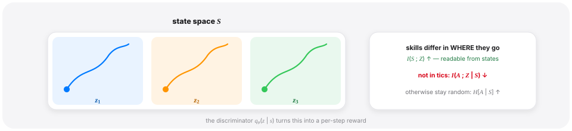


**Where the energy actually went.** Count top-venue papers and the drift is unmistakable: the word "role" is fading, "skill" and transfer are rising. ODIS → VO-MASD (IJCAI 2025: auto-encoders capturing subgroup *and* temporal abstraction from offline data) → HiSSD (2025: shared cooperative skills plus task-specific ones, learned hierarchically from multi-task logs). The question mutated from "what roles emerge in this task?" to "**what coordination skills survive leaving it?**" — welding the role line to offline RL and transfer learning. A smaller branch repurposed roles for zero-shot coordination with strangers (CORD, 2025: role entropy maximization under constraints, aimed at unseen partners). Meanwhile all three founders were elsewhere: Wang in mechanism design (returning to Tsinghua's College of AI as faculty, 2026 — different field), Chongjie Zhang at WashU, mostly single-agent and offline RL these days, Whiteson at Waymo. The question outlived its founders' interest. Read the exits either way — the line hit a wall on its benchmark, or the question was never only about StarCraft; the rest of the post argues both are true.

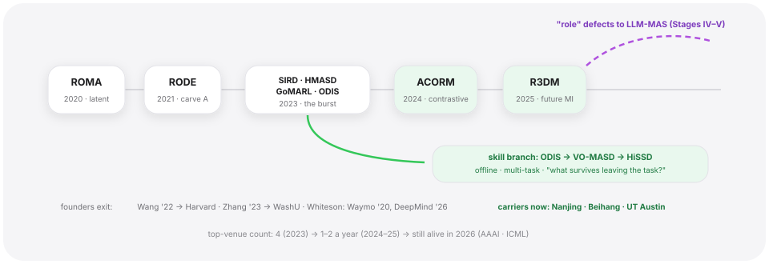

<table>
<thead><tr><th></th><th>The problem</th><th>The move</th><th>What it showed</th><th>What it left open</th></tr></thead>
<tbody>
<tr><td><strong>ROMA</strong><br><span style="color:#6E6E73;font-size:.85em">ICML 2020</span></td><td>Value-decomposition agents were interchangeable — no mechanism for stable specialization</td><td>Role = stochastic latent from own observation; two MI regularizers make it identifiable &amp; specialized</td><td>Roles clustered by function on SMAC, adapted as the battle turned</td><td>Roles summarize the past, don't constrain the future; everyone keeps the full action menu</td></tr>
<tr><td><strong>RODE</strong><br><span style="color:#6E6E73;font-size:.85em">ICLR 2021</span></td><td>Latent roles shade behavior but don't reduce anyone's job</td><td>Embed actions by their effects, k-means into restricted role menus, bi-level selector + role policy</td><td>SOTA on the hardest SMAC maps of the day; dot-product transfer to new units</td><td>Clusters freeze early; role count is a hyperparameter; the benchmark evidence later confounded (the era-one correction)</td></tr>
<tr><td><strong>ACORM</strong><br><span style="color:#6E6E73;font-size:.85em">ICLR 2024</span></td><td>Discrete role machinery aging; the word itself dissolving</td><td>Role = contrastive representation (InfoNCE over trajectory clusters); attention feeds it into credit assignment</td><td>The de facto baseline later work compares against</td><td>Roles still only verified retrospectively</td></tr>
<tr><td><strong>R3DM</strong><br><span style="color:#6E6E73;font-size:.85em">ICML 2025</span></td><td>A role you can only verify after the fact is a label, not a commitment</td><td>Tie the role to the future: dynamics-model mutual information becomes intrinsic reward</td><td>Win rates up to +20% over SOTA incl. ACORM, on SMAC/SMACv2</td><td>The lone top-venue "role" paper of its year — the line is thin</td></tr>
</tbody></table>


---

## 6 · Stage IV — New bodies, old question: LLM teams get personas (2023–2024)

**The problem.** In 2023 a new kind of team appeared: several LLM instances collaborating through text. Divisions of labor were needed immediately — and the community mostly started where MARL had started: write the roles by hand (the opening consensus). (Mostly: trained language-agent lines existed, FAIR's RL-trained negotiators of 2017 among them, but they were not where the 2023 wave began.) The first innovation beyond hand-writing was exactly ROMA's move, re-invented in a different substrate: *generate* the roles.

**The move.** AgentVerse (ICLR 2024, Tsinghua) put a recruiter LLM in the loop: propose a team composition, run a round, observe, re-recruit — the team roster becomes dynamic. AutoAgents (IJCAI 2024) went further: given a task, a planner LLM *drafts the entire org chart* — role prompts, descriptions, toolsets — and an observer refines it. Hold this against Stage I and the correspondence is close: the role is sampled from a conditional distribution,

$$
\rho_i \sim \mathrm{LLM}(\rho \mid \text{task}), \qquad \pi_i(a_i \mid \tau_i, \rho_i) = \text{a frozen LLM prompted with } \rho_i
$$

— ROMA's Gaussian encoder swapped for a language model, the latent $\rho$ now a persona paragraph. (Neither paper writes this equation; it is what the recruiter loop samples from, written down — and the stretch is worth naming: ROMA's $\rho$ is a per-timestep latent that parameterizes policy weights, while a persona is a task-level instruction living in context. The template captures the *slot* — a sampled variable that differentiates behavior — not the machinery.) The same year, DyLAN scored agents by an unsupervised "importance" metric from trial runs and pruned the roster — the first whiff of credit assignment in the new world.

**What it showed.** Generated org charts beat static ones on the era's benchmarks — the papers' own, with no budget matching; the asterisk every rung's debut numbers deserve — and AgentVerse documented emergent social behaviors in the transcripts — volunteering, conformity, even destructive coordination. The persona, as an interface, is expressive in a way a Gaussian latent never was: it can encode "you are a skeptical security reviewer" in nine words.

**What it left open — the load-bearing gap.** Look at the equation again: nothing couples the sampler to the outcome. The persona is written *once*, by a frozen model, upstream of the episode; when the team fails, no gradient, no update, no selection pressure reaches $\rho$. ROMA's dashed arrow — credit flowing back into the role sampler — is missing. Generation without coupling is still an org chart; it is just an org chart written very fast, by a planner that never hears how the project went.

MAST measured what that gap looks like at scale: 1,642 traces across seven frameworks — MetaGPT and ChatDev's assembly lines, AG2's conversations, the orchestrator-led HyperAgent, AppWorld, Magentic-One, and OpenManus, spanning the ladder's first two rungs — 41–86.7% failure rates — while *disobey role specification* sits at 1.5%, thirteenth of fourteen failure modes, and the dominant category (44.2%) is system design itself. Two caveats before the conclusion. Declared personas do produce division of labor in the behavioral sense — MetaGPT's PM and Engineer act differently and complementarily; what declaration fails to buy is *performant* coordination, the property T3 — declaration is not the mechanism — actually stakes. And several of the biggest failure modes (step repetition, termination-blindness) are model-capability failures that would hit a learned structure built on the same models just as hard. What remains, and is the point: nothing in the Stage-IV pipeline can learn to rewrite the script it is handed.

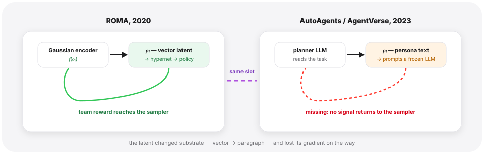

---

## 7 · Stage V — Search, then gradients: the new field re-derives emergence (2024–2026)

**The problem.** By 2024 the gap was being felt as engineering pain: generated team structures were better than static ones but arbitrarily so — nobody could say *why* this roster, and nothing improved between tasks. The field's response recapitulated MARL's, in two moves that arrived almost on top of each other.

**Move one — make the structure searchable.** If the org chart is an artifact, optimize the artifact. GPTSwarm (ICML 2024) is the cleanest statement: the multi-agent system is a graph — nodes are agent operations, edges are who-talks-to-whom — and the edge set is a *parameterized distribution*, tuned by REINFORCE against task utility:

$$
\theta^{*} = \arg\max_{\theta \in \Theta}\ \mathbb{E}_{G \sim D_{\theta}}\left[ u_{\tau}(G) \right]
$$

$$
\nabla_{\theta} \mathbb{E}_{G \sim D_{\theta}}\left[ u_{\tau}(G) \right] \approx \frac{1}{M} \sum_{i=1}^{M} \hat{u}_{\tau}(G_i) \nabla_{\theta} \log p_{\theta}(G_i)
$$

— the letters, one at a time: $G$ is a candidate communication graph; $\theta$ is the vector that samples it — one number in $[0,1]$ per potential edge, that edge's probability of existing, with $\Theta$ the space those vectors live in; $D_{\theta}$ is the distribution over graphs those edge-probabilities define, and $p_{\theta}(G_i)$ is the same distribution written as a probability — the chance of drawing the particular graph $G_i$; $u_{\tau}(G)$ is the graph's measured utility on task $\tau$ (GPTSwarm's task index — no relation to the trajectories $\tau_i$ elsewhere in this post), $\hat{u_\tau}$ its finite-sample estimate — and this $p_{\theta}$ is the formal section's role sampler, now sampling structure instead of roles; $M$ is how many graphs are drawn per round. The loop is three beats: draw $M$ graphs, score each, weight each graph's $\nabla\log p_{\theta}$ by its score — probability mass flows toward the graphs that worked. Communication topology, which is to say the *shape* of the division of labor, becomes a trained quantity. The same season produced ADAS (ICLR 2025: a meta-agent that writes new agent systems as code, archive-driven), AFlow (ICLR 2025: MCTS over code-represented workflows), and their descendants (MaAS's query-conditioned "agentic supernet," MAS-GPT generating a bespoke system per query). Different search operators, one thesis: **the org chart is an output.** We have been here — it is RODE's thesis: roles were not hand-listed, they were carved out of the action space by clustering; what changed is only the raw material the structure gets carved from — action clusters then, code now.

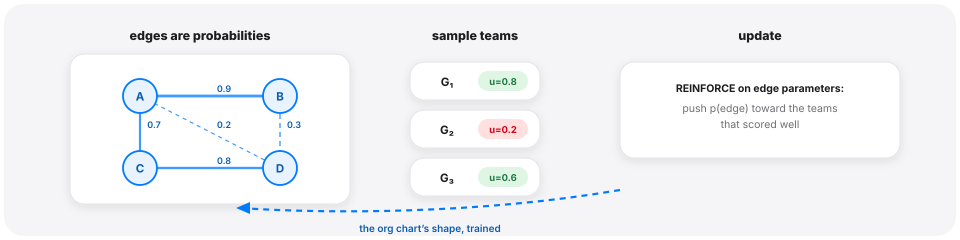


**Move two — put the roles in the loss.** Search optimizes the structure between frozen agents; the final step trains the agents *in their roles* against team outcome — multi-agent RL, now with LLMs inside. Three results carry the argument:

*MAPoRL (ACL 2025)* co-trains multiple LLMs in debate with a verifier-shaped reward, and its influence-aware reward is credit assignment stated plainly — an agent earns its own verifier score plus the discounted verifier scores its message induces downstream:

$$
R(q, s_{ta}) = \mathbb{E}\left[ \frac{1}{\sum_{t' = t}^{T} \gamma^{t'-t}} \left( V(q, s_{ta}) + \sum_{t'=t+1}^{T} \sum_{j=1}^{A} \frac{\gamma^{t'-t}}{A} V(q, s_{t'j}) \right) \right]
$$

($q$ the query, $s_{ta}$ agent $a$'s message at turn $t$, $V$ the verifier's score — the paper writes it out as "Verifier"; the verifier itself is a token-level correctness classifier pre-trained on the base model's own labeled solutions, held fixed during PPO — $A$ the number of agents, $T$ the number of turns; this $A$ counts agents, no relation to the action space $A$ of the MARL stages.) Its headline negative result is the sharp edge of T3, declaration-is-not-the-mechanism: prompting off-the-shelf models to collaborate often fails to help, and *training one model alone does not induce collaboration* — only co-training does.

*Puppeteer (NeurIPS 2025, Tsinghua)* trains the **orchestrator** itself with RL: a policy that, at each step, selects which agent acts next — concretely a reward-model-variant LLM scoring the candidates, updated by REINFORCE — optimized against task reward with a cost regularizer. That is RODE's role selector, reborn at the team level — and the paper's emergent finding echoes 2021 uncannily: the trained orchestrator discovers compact, cyclic collaboration structures nobody designed.

*AT-GRPO (2025, UCSD + Intel)* fixes the optimizer itself. GRPO's advantage baseline assumes a *group* of rollouts answering the same prompt; in a multi-agent system, each agent at each turn sees a different role- and history-dependent prompt, so the global group collapses — rollouts answering different prompts are not exchangeable, and a shared baseline compares apples to oranges. The repair is to group **per agent, per turn**:

$$
A_g\left(a_t^{(c)}\right) = \frac{R\left(a_t^{(c)}\right) - \mathrm{mean}\left(\{ R(a_t^{(c)}) \}_{c=1}^{K}\right)}{F_{\mathrm{norm}}\left(\{ R(a_t^{(c)}) \}_{c=1}^{K}\right)}, \qquad g = (\text{env instance},\ \text{agent},\ \text{turn})
$$

with rewards decomposed into team plus local terms ($r_{t,i} = \alpha r_t^{\mathrm{team}} + r_{t,i}^{\mathrm{loc}}$). ($K$ candidate actions per group, indexed by $c$ — a sample count, not the role/cluster count $K$ of the opening formula and ACORM's $\mathcal{L_K}$; and this $(c)$ has no relation to RODE's role clock $c$. $F_{\mathrm{norm}}$ is the group's normalizer, e.g. its standard deviation. Concretely, in a coder–tester loop: the coder's turn-2 patch is baselined only against the other $K-1$ coder-turn-2 patches, never against tester critiques answering a different prompt. A local reward, concretely: the coder's own pass rate on golden unit tests; the tester's, whether a golden reference implementation passes the tests it wrote.) Baselines computed within a role, credit split between team and individual — a cooperative-MARL paper in everything but the venue, reporting long-horizon planning accuracy rising from a 14–47% single-agent-RL baseline to 96%+, with a similar gap over untrained role-prompted teams (16% → 98% on its Sokoban benchmark). MALT (COLM 2025) rounds out the picture: fixed generator–verifier–refiner roles, but each role's model *trained* on credit propagated backward through the pipeline — value iteration over a sampled search tree, graded final answers flowing back to each role's model — specialization by training data, not by prompt. The formal signature of the convergence is that several of these papers now open with Markov-game formulations — the cooperative tuple of the formal section, mutated to per-agent rewards, full observability, and a turn budget; when an LLM-agents paper opens with such an object, the two literatures have effectively merged.

<details class="tw"><summary>🔍 Why GRPO's baseline breaks in a team — the exchangeability step</summary>

- **What GRPO assumes** — a \"group\" is $K$ rollouts answering the **same prompt**; their mean reward is a fair zero-point, and advantage = how far above or below that mean you land.
- **What a MAS violates** — each agent at each turn sees a different, role- and history-dependent prompt; rollouts answering different prompts are not exchangeable, so one shared mean ends up comparing a coder's patch to a tester's critique.
- **The repair** — group key $g = (\text{env instance}, \text{agent}, \text{turn})$: baselines only ever average over the $K$ candidates for the same seat at the same move.
- **$F_{\mathrm{norm}}$** — the group's own scale (e.g. its standard deviation), so advantages are comparable across groups; **$\alpha$** splits reward into a shared team part and a local per-agent part.

</details>

**The rhyme.** Hand-written → generated → searched → trained: 2023 to 2026. MARL's own walk — hand-crafted prehistory, then latent (ROMA), carved (RODE), representation-plus-credit (ACORM/R3DM) — ran 2020 to 2025 on thinner budgets. *Same endpoint, different middle.* MARL never had an uncoupled-generation rung: ROMA was wired to the team objective from day one, while the LLM world spent two years generating structure no gradient could touch. To me that makes the convergence stronger evidence, precisely because the middles differ — two fields starting from hand-written charts, taking different wrong turns, arriving at the same place: division of labor as a trained latent structure, coupled to team credit. And the second lap was faster not, I think, because the answer key sat next door — few of the papers cite it. Until the RL-finetuning stacks matured in 2024–25, there was no way to couple a persona to a team reward through a frozen API model, however much MARL anyone had read. The lap was infrastructure-limited.

What the trained chart costs — the sources keep their own ledger. MAPoRL's and MALT's rewards are verifier scores, and a trained team will Goodhart a gameable verifier as surely as any RL agent ever gamed a reward. Puppeteer's cost regularizer exists because an unregularized trained orchestrator learns to over-invoke agents — the disease is named in the cure. AT-GRPO's numbers are trained and evaluated on its authors' own environments; the matched-budget control T1 (emergence wins) demands — a hand pipeline given equivalent task-specific tuning — has not been run — the same control era one skipped, and the reason its evidence fell. And the opening section's staleness argument now cuts both ways: when the toolset changes, rewriting a prompt costs minutes; retraining an orchestrator costs GPU-hours. The trained chart has failure modes too. They are newer, not fewer. And the rung's hardest problems remain untouched: message-level credit assignment, and the decision to *stop* — a 2026 survey combed an 84-paper orchestration-RL corpus and found no explicit RL treatment of the stopping decision.

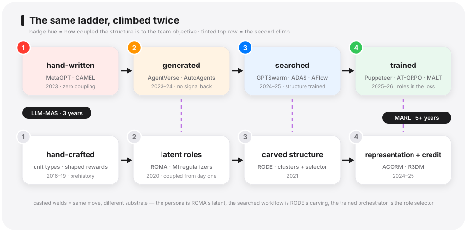

---

## 8 · The branch MARL never grew: skills as assets (2023–2026)

**The problem.** One thread of the LLM story has no MARL twin, and it may be the more consequential one. In MARL, a discovered skill lives in weights — DIAYN's $z$ indexes a sub-policy you cannot open, inspect, or hand to someone else. LLM agents write code. What if a skill were an *artifact*?

**The move.** Voyager (2023, NVIDIA/Caltech — TMLR) built the pattern in Minecraft with three named components: an *automatic curriculum* that keeps proposing frontier tasks, an *iterative prompting mechanism* that writes and debugs behavior as executable code against environment feedback and self-verification, and — the piece that matters here — "an ever-growing **skill library** of executable code for storing and retrieving complex behaviors," each skill indexed by the embedding of its description. Retrieval is nearest-neighbor in description space — Voyager states the rule in prose; boiled down:

$$
k^{*} = \arg\max_{k}\ \cos\left( E(d_k),\ E(\text{task}) \right)
$$

($d_k$ the stored skill's description, $E$ the embedding model.) A skill here is *compositional* (code calls code), *inspectable* (you can read it), and — this is the new property — **transferable**: the library is a file, not a brain.

**What it became.** The pattern generalized fast: Cradle (ICML 2025) carried skill curation to general computer control — the same loop learning to drive commercial software from pixels; Agent Workflow Memory (ICML 2025) induces reusable workflows from web-agent trajectories; SkillWeaver (2025) has web agents *discover* candidate skills, practice them, and distill APIs — and demonstrates the punchline of the asset framing: a library built by a strong agent, handed to a weaker one, lifts the weak agent substantially. ASI (2025) ran the controlled comparison the thread needed: skills induced *as programs* beat the same skills kept as text guidance by 11.3% success rate on WebArena — the code substrate is doing the work. A 2026 control tempers the celebration: across an 87-task benchmark, human-curated skill libraries lifted agents by double digits while agent-self-authored skills landed *below* the no-skill baseline — the library is real leverage; writing it, for now, remains a human job.

**The population echo.** Specialization also arrives without any library, purely through training divergence: Multiagent Finetuning (ICLR 2025, MIT) starts $N$ copies of one base model, lets them interact, then finetunes each copy *only on its own interaction data* — the paper says it in prose; in symbols:

$$
\theta_i^{\prime} = \arg\max_{\theta}\ \mathbb{E}_{(x, y) \sim D_i}\left[ \log p_{\theta}(y \mid x) \right], \qquad D_i = \text{agent } i\text{'s own interactions}
$$

— with a filter the display omits: each copy keeps only the exchanges whose final answer won the debate's majority vote. The copies drift into complementary specialists, sustaining more rounds of self-improvement than a single model finetuned on the same generated data, which saturates after one round — at $N$ times the finetuning and serving footprint; the comparison is per-datum, not per-FLOP. Division of labor as an *equilibrium of diverging training data* — no roles declared anywhere. At the wilder end, Project Sid (Altera, 2024) reports Minecraft societies of hundreds of agents — 500 in the analyzed run, 1,000+ attempted — developing farmers, miners, guards, and blacksmiths unprompted; reading it, I wanted it to be the field's Tasmania moment — the demonstration that how much division of labor a society can hold scales with its population, as the Tasmanian archaeological case argued for human toolkits — but it is an arXiv preprint with self-reported metrics and no peer-reviewed successor yet — enough to point a direction, not enough to hold up a conclusion.

**Why MARL never grew this.** Not for lack of imagination — *options* (Sutton's framework for temporally extended sub-policies) and DIAYN are exactly "reusable sub-behaviors." The missing ingredient was a substrate in which behavior is *legible*: gradient-shaped policies do not compose by concatenation, do not survive transplantation across architectures, and cannot be read. Code can. The one new thing the LLM era added to the division-of-labor question is that **a skill can be property** — accumulated, audited, transferred, sold. This branch also complicates my own T2 — representation beats label: skills-as-code are discrete, *named* artifacts, and this frontier runs on labels you can read. T2 survives as scoped in the formal section — about who plays which role inside a team; the asset branch is a different axis, not who does what but what the team gets to keep. MARL asked where roles come from; the skill-library line added a second question — who gets to keep them.

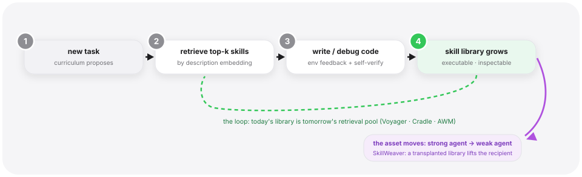

---

## 9 · The steelman: maybe the org chart is fine

The strongest case against everything above was made in public, over four days in June 2025, by people who ship agents for a living.

**June 12 — Cognition, "Don't Build Multi-Agents" (Walden Yan).** The argument is architectural, not empirical: agents act on context; parallel agents fragment context; "actions carry implicit decisions, and conflicting decisions carry bad results." Their conclusion is blunt — "running multiple agents in collaboration only results in fragile systems" — and their prescription is a single-threaded agent with engineered context. On this view the division-of-labor question is a category error: don't divide the labor.

**June 13 — Anthropic, "How we built our multi-agent research system."** The counter-case, with numbers: an orchestrator-plus-subagents system "outperformed single-agent Claude Opus 4 by 90.2%" on their internal research eval. But the honesty of the post is in its cost accounting: agents use ~4× the tokens of chat, multi-agent systems ~15×, and in their analysis "token usage by itself explains 80% of the variance" in performance. Multi-agent works, where it works, substantially *because* it spends more.

**June 16 — LangChain, "How and when to build multi-agent systems" (Harrison Chase).** The synthesis: "read actions are inherently more parallelizable than write actions." Multi-agent pays off on breadth-first read-heavy work (research, search) and hurts where agents must share evolving context or write into the same artifact.

Underneath, the June argument is about **factorizability** — and here I will make a translation all three authors might refuse, because cooperative MARL spent years formalizing a boundary of just this shape. A concrete pair first: two agents searching disjoint sources factorize; two agents editing the same file do not. Value decomposition is sound when the team's optimal joint action factorizes into per-agent optima — the IGM (individual-global-max) condition:

$$
\arg\max_{a}\ Q_{\mathrm{tot}}(\tau, a) = \left( \arg\max_{a_1} Q_1(\tau_1, a_1),\ \dots,\ \arg\max_{a_n} Q_n(\tau_n, a_n) \right)
$$

When IGM holds, decompose — divide the labor. When it fails (tight coupling, shared artifacts, conflicting writes), decomposition is the *wrong prior*, and no amount of role learning rescues it. LangChain's read/write rule is IGM in prose — though the prose is mine: IGM formalizes something narrower than any of the June arguments (Cognition's case is really about information loss across natural-language interfaces, which no factorization condition captures; single-agent work isn't even in IGM's frame), so the equation is a bridge I am building. But the shape survives the translation: decompose exactly when the optimum factorizes — a shape MARL had written down by 2021 (QMIX 2018, QTRAN 2019, QPLEX 2021).

<details class="tw"><summary>🔍 IGM in plain words — when is splitting the work safe?</summary>

- **Left side** — the joint action the *team's* value function $Q_{\mathrm{tot}}$ would pick if one central brain searched all combinations at once.
- **Right side** — the stack of what each agent would pick *alone*, each maximizing its own $Q_i$ on its own history.
- **IGM holds** — the two coincide: greedy-local equals optimal-joint, so decentralized execution loses nothing; the labor factorizes.
- **How QMIX buys it** — monotonicity ($\partial Q_{\mathrm{tot}}/\partial Q_i \ge 0$) is a *sufficient* condition: if raising any agent's local score never hurts the team score, local argmaxes assemble into the team argmax.
- **When it fails** — tight coupling: my best move depends on which move you actually took (shared file, conflicting writes). No role learning fixes a broken factorization — the prior itself is wrong.

</details>

<div style="display:flex;flex-wrap:wrap;gap:12px;margin:1.3em 0 .4em"><div style="flex:1 1 300px;border:1px solid #E2E2E7;border-left:5px solid #34C759;border-radius:12px;padding:12px 16px;background:#FBFFFC"><div style="font-weight:800;color:#1F7A42;font-size:14px">IGM holds → decompose</div><div style="font-size:13px;color:#3A3A3C;margin-top:6px;line-height:1.55">Loose coupling: agents read from disjoint sources, write to separate artifacts. Greedy-local equals optimal-joint — decentralized execution loses nothing. Divide the labor.</div></div><div style="flex:1 1 300px;border:1px solid #E2E2E7;border-left:5px solid #FF3B30;border-radius:12px;padding:12px 16px;background:#FFFBFB"><div style="font-weight:800;color:#D70015;font-size:14px">IGM fails → don't</div><div style="font-size:13px;color:#3A3A3C;margin-top:6px;line-height:1.55">Tight coupling: my best move depends on the move you actually took — shared file, conflicting writes. Decomposition is the wrong prior; no amount of role learning rescues it.</div></div></div>
<div style="font-size:12px;color:#86868B;margin:0 2px 1em">LangChain's read/write rule is this condition in prose.</div>


The rest of the steelman deck: multi-agent *debate*, as currently proposed, does not reliably beat single-model self-consistency or ensembling, costs more calls, and is acutely hyperparameter-sensitive — though the same paper shows tuned debate variants can close the gap (ICML 2024's "Should we be going MAD?"). Adding agents is **non-monotone** — Stanford/Berkeley showed Vote/Filter-Vote systems — majority voting over repeated calls, with or without an LLM filter — get *worse* with more calls on hard queries even as they improve on easy ones; read that against the "More Agents Is All You Need" scaling result and the conflict dissolves into a mixture effect, monotone gains living on the easy half — though the two papers never cite each other, and the reconciliation is my own. Self-evolving skill libraries carry a documented safety tax: benign experience accumulation erodes refusal behavior (Findings of ACL 2026). Two 2026 results sharpen the deck further: LLM teams routinely fail to match their own strongest member — up to 41.1% short, on ML benchmarks, of an expert they were explicitly told about, consensus averaging the expert away (ICML 2026); and the single-agent side now has numbers of its own — a multi-turn single agent reusing its own context matches homogeneous multi-agent workflows at lower cost (2026), leaving truly heterogeneous teams — different base models, which one context cannot simulate — as the surviving case.

There is also a colder reading of this whole post. Every field's publication sequence drifts hand-designed → generated → searched → trained, because each rung is the only publishable next step — you cannot publish "we hand-wrote the roles again and it works fine," but you can ship it, and production teams do, daily. On that reading the twice-climbed ladder is not two confirmations of a truth about division of labor; it is two prints of the same academic incentive gradient, with the deployment world — the only place with stakes — still voting for rung one. I cannot fully dismiss this, and it is why signal 2 below is the one I watch most. And beneath all of it sits a legibility argument that I think is the deepest card: a hand-written org chart can be audited, assigned blame, and fixed on Monday; a learned latent role structure is as opaque as the rest of the model. MAST's top failure category was *system design* — it is not obvious you want the system design to become unreadable too. The strongest answer the learned side has is sitting in the skills-as-assets section: the skill-asset line is an existence proof that learned and legible are not enemies — a skill library is trained *and* readable, versioned, transferable. Nothing like it exists yet for orchestration policies; a trained router whose learned routing compiled to an inspectable protocol would answer the card; until something does, it stands.

What would actually settle it — four observable signals:

1. **Equal-budget victory.** A Puppeteer-class trained orchestrator beating tuned hand-designed pipelines on GAIA-class benchmarks *at matched token budgets*, replicated outside the originating lab. (T1's clean test — emergence wins at matched budget; the 15× confound removed.)
2. **Production adoption.** A major agent platform shipping *learned* role assignment — a router or recruiter trained on outcome signal, not templates. The frameworks will show it before the papers do. (This one arguably had a first firing, on the vendor's own account: in early 2026 Kimi's K2.5 technical report describes PARL — parallel-agent reinforcement learning, an orchestrator trained into the model's weights over frozen workers. Two caveats keep the signal open: this is a model lab absorbing orchestration into a single model, a datum the single-agent camp can claim with equal right; and no matched-budget or third-party evaluation exists, so signals 1 and 2 both stay live.)
3. **The DeepMind signal.** The first public artifact of the multi-agent learning team Shimon Whiteson — RODE's co-author — is building at Google DeepMind: self-play training producing emergent division of labor at scale, or a pivot to single-agent tooling. (He left Waymo in May 2026; the team's focus, as the fireside billing put it, is agents that "learn, coordinate, and adapt together," self-play RL included.) A frontier lab's agenda tells you where the most-informed money points, not what is true; I read it as a prior.
4. **The audit rerun.** A MAST-style taxonomy, one year on, comparing declared-structure and learned-structure systems at matched model capability — scored on *end-to-end failure rate*, not category composition, since "system design" failures partly dissolve by definition once nobody designed the system. If end-to-end failure drops where structure is learned, the chart was the problem; if it merely relabels, the steelman was right.

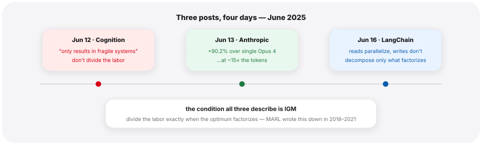

---

## Closing — the org chart nobody writes

Back to the chart we opened with. In 2020, a role was a Gaussian latent, sampled per timestep, paid for in mutual information. In 2024 it was a persona paragraph, written by a planner model that would never learn how the story ended. In 2026 it is, increasingly, whatever an RL-trained orchestrator's policy implies when it decides who speaks next — an org chart that exists only as a marginal of a trained distribution, never drawn, never declared, obeyed by construction because it *is* the behavior rather than an instruction about it. That is the steelman's warning as much as the thesis fulfilled: a chart no one can read.

One line shrank until its founders left; the other has been arriving, year by year, at results the first had already reached. The popular narrative is *displacement* — that LLMs simply ended fifteen years of MARL; the published article closest to this post's territory argues a version of it without ever mentioning ROMA or RODE — and it deserves three sentences: the MARL line really did stall on its benchmark; language priors deliver out of the box much of what MI regularizers struggled to learn, and a persona is a very good role *initializer*; founder exit reads as "the line hit a wall" at least as naturally as "the question transcends." What displacement cannot explain is why the displacing field then spent three years rebuilding the displaced field's machinery.

As far as I can find, the rhyme this post maps is unclaimed in writing — which means either it is wrong, or the connection simply has not been drawn yet; either way I expect the record to correct.

If the rhyme in this post is right, the question was never "MARL or LLMs." It is whether a system's division of labor is an input or an output — and what I owe here is a bet: the steelman's four signals are unresolved, the clean matched-budget test has never been run, and production still votes for the hand-written chart every day.

Scored as of this writing: T1 — emergence wins — is unsettled for exactly that reason. T2 — representation beats label — holds where it was formulated, in the MARL line and with Stage II's asterisk attached; era two's trained systems mostly kept discrete seats, so its LLM-era half is thinner than the ladder suggests. T3 — declaration is not the mechanism — splits in two: its negative half, obey-and-fail-anyway, is the best-supported claim in this post; its affirmative half, that co-training is the mechanism, carries the same in-house asterisk as T1. My bet: the chart wants to be an output, and the four signals are how I will find out I was wrong. The learned chart that wins will have to be a legible one — the asset branch's libraries, not an unreadable marginal; that much the steelman has already earned.

The man who co-wrote RODE in 2021 — and then the correction that humbled it — is now building a multi-agent learning team at DeepMind. The experiment is about to be rerun at scale, by one of the people who wrote the answer key. I intend to watch.

---

## References & further reading

**The MARL role/skill line:**
- Wang, Dong, Lesser, Zhang — *ROMA: Multi-Agent Reinforcement Learning with Emergent Roles*, ICML 2020 — [arxiv.org/abs/2003.08039](https://arxiv.org/abs/2003.08039)
- Wang, Gupta, Mahajan, Peng, Whiteson, Zhang — *RODE: Learning Roles to Decompose Multi-Agent Tasks*, ICLR 2021 — [arxiv.org/abs/2010.01523](https://arxiv.org/abs/2010.01523)
- Eysenbach, Gupta, Ibarz, Levine — *Diversity is All You Need*, ICLR 2019 — [arxiv.org/abs/1802.06070](https://arxiv.org/abs/1802.06070)
- Zeng, Peng, Li — *Effective and Stable Role-Based Multi-Agent Collaboration by Structural Information Principles* (SIRD), AAAI 2023 — [arxiv.org/abs/2304.00755](https://arxiv.org/abs/2304.00755)
- Yang et al. — *Hierarchical Multi-Agent Skill Discovery* (HMASD), NeurIPS 2023 — [proceedings page](https://proceedings.neurips.cc/paper_files/paper/2023/hash/c276c3303c0723c83a43b95a44a1fcbf-Abstract-Conference.html) (no arXiv version)
- Zang et al. — *Automatic Grouping for Efficient Cooperative Multi-Agent Reinforcement Learning* (GoMARL), NeurIPS 2023 — [proceedings page](https://proceedings.neurips.cc/paper_files/paper/2023/hash/906c860f1b7515a8ffec02dcdac74048-Abstract-Conference.html) (no arXiv version)
- Zhang et al. — *Discovering Generalizable Multi-agent Coordination Skills from Multi-task Offline Data* (ODIS), ICLR 2023 — [OpenReview](https://openreview.net/forum?id=53FyUAdP7d) (no arXiv version)
- Hu, Zhang, Li, Chen, Ding, Wang — *Attention-Guided Contrastive Role Representations* (ACORM), ICLR 2024 — [arxiv.org/abs/2312.04819](https://arxiv.org/abs/2312.04819)
- Goel, Omama, Chalaki, Tadiparthi, Moradi Pari, Chinchali — *R3DM: Enabling Role Discovery and Diversity Through Dynamics Models*, ICML 2025 — [arxiv.org/abs/2505.24265](https://arxiv.org/abs/2505.24265)
- Chen, Lan, Aggarwal — *Variational Offline Multi-agent Skill Discovery* (VO-MASD), IJCAI 2025 — [arxiv.org/abs/2405.16386](https://arxiv.org/abs/2405.16386)
- Liu, Shu, Guo, Yang — *Learning Generalizable Skills from Offline Multi-Task Data* (HiSSD), 2025 — [arxiv.org/abs/2503.21200](https://arxiv.org/abs/2503.21200)
- Matsuyama, Su, Wang, Ye, Lu — *CORD: Generalizable Cooperation via Role Diversity*, 2025 — [arxiv.org/abs/2501.02221](https://arxiv.org/abs/2501.02221)

**The era-one correction (Stage II's asterisk):**
- Yu et al. — *The Surprising Effectiveness of PPO in Cooperative, Multi-Agent Games* (MAPPO), NeurIPS 2022 D&B — [arxiv.org/abs/2103.01955](https://arxiv.org/abs/2103.01955)
- Hu et al. — *Rethinking the Implementation Tricks and Monotonicity Constraint in Cooperative MARL*, ICLR Blog Track 2023 — [arxiv.org/abs/2102.03479](https://arxiv.org/abs/2102.03479)
- Ellis et al. — *SMACv2: An Improved Benchmark for Cooperative Multi-Agent Reinforcement Learning*, NeurIPS 2023 D&B — [arxiv.org/abs/2212.07489](https://arxiv.org/abs/2212.07489)

**The LLM re-derivation:**
- Li, Hammoud, Itani, Khizbullin, Ghanem — *CAMEL: Communicative Agents for "Mind" Exploration*, NeurIPS 2023 — [arxiv.org/abs/2303.17760](https://arxiv.org/abs/2303.17760)
- Hong et al. — *MetaGPT: Meta Programming for a Multi-Agent Collaborative Framework*, ICLR 2024 oral — [arxiv.org/abs/2308.00352](https://arxiv.org/abs/2308.00352)
- Chen et al. — *AgentVerse: Facilitating Multi-Agent Collaboration and Exploring Emergent Behaviors*, ICLR 2024 — [arxiv.org/abs/2308.10848](https://arxiv.org/abs/2308.10848)
- Chen et al. — *AutoAgents: A Framework for Automatic Agent Generation*, IJCAI 2024 — [arxiv.org/abs/2309.17288](https://arxiv.org/abs/2309.17288)
- Liu, Yang et al. — *A Dynamic LLM-Powered Agent Network* (DyLAN), COLM 2024 — [arxiv.org/abs/2310.02170](https://arxiv.org/abs/2310.02170)
- Zhuge, Wang, Kirsch, Faccio, Khizbullin, Schmidhuber — *Language Agents as Optimizable Graphs* (GPTSwarm), ICML 2024 — [arxiv.org/abs/2402.16823](https://arxiv.org/abs/2402.16823)
- Hu, Lu, Clune — *Automated Design of Agentic Systems* (ADAS), ICLR 2025 — [arxiv.org/abs/2408.08435](https://arxiv.org/abs/2408.08435)
- Zhang et al. — *AFlow: Automating Agentic Workflow Generation*, ICLR 2025 — [arxiv.org/abs/2410.10762](https://arxiv.org/abs/2410.10762)
- Zhang et al. — *Multi-agent Architecture Search via Agentic Supernet* (MaAS), ICML 2025 — [arxiv.org/abs/2502.04180](https://arxiv.org/abs/2502.04180)
- Ye et al. — *MAS-GPT: Training LLMs to Build LLM-based Multi-Agent Systems*, ICML 2025 — [arxiv.org/abs/2503.03686](https://arxiv.org/abs/2503.03686)
- Qian et al. — *Scaling Large Language Model-based Multi-Agent Collaboration* (MacNet), ICLR 2025 — [arxiv.org/abs/2406.07155](https://arxiv.org/abs/2406.07155)
- Dang, Qian et al. — *Multi-Agent Collaboration via Evolving Orchestration* ("Puppeteer"), NeurIPS 2025 — [arxiv.org/abs/2505.19591](https://arxiv.org/abs/2505.19591)
- Motwani et al. — *MALT: Improving Reasoning with Multi-Agent LLM Training*, COLM 2025 — [arxiv.org/abs/2412.01928](https://arxiv.org/abs/2412.01928)
- Park, Han, Ozdaglar, Zhang et al. — *MAPoRL: Multi-Agent Post-Co-Training for Collaborative LLMs*, ACL 2025 — [arxiv.org/abs/2502.18439](https://arxiv.org/abs/2502.18439)
- Zhao et al. — *Stronger-MAS / AT-GRPO: Multi-Agent RL for Collaborative LLMs*, 2025 — [arxiv.org/abs/2510.11062](https://arxiv.org/abs/2510.11062)
- Liao, Zhang, Wang et al. — *MARFT: Multi-Agent Reinforcement Fine-Tuning*, 2025 — [arxiv.org/abs/2504.16129](https://arxiv.org/abs/2504.16129)
- Subramaniam, Du, Tenenbaum, Torralba, Mordatch — *Multiagent Finetuning*, ICLR 2025 — [arxiv.org/abs/2501.05707](https://arxiv.org/abs/2501.05707)
- Kimi Team — *Kimi K2.5: Visual Agentic Intelligence* (PARL), technical report, 2026 — [arxiv.org/abs/2602.02276](https://arxiv.org/abs/2602.02276)

**Skill libraries:**
- Wang et al. — *Voyager: An Open-Ended Embodied Agent with Large Language Models*, TMLR — [arxiv.org/abs/2305.16291](https://arxiv.org/abs/2305.16291)
- Tan et al. — *Cradle: Empowering Foundation Agents Towards General Computer Control*, ICML 2025 — [arxiv.org/abs/2403.03186](https://arxiv.org/abs/2403.03186)
- Wang, Neubig, Fried — *Agent Workflow Memory*, ICML 2025 — [arxiv.org/abs/2409.07429](https://arxiv.org/abs/2409.07429)
- Zheng et al. — *SkillWeaver: Web Agents can Self-Improve by Discovering and Honing Skills*, 2025 — [arxiv.org/abs/2504.07079](https://arxiv.org/abs/2504.07079)
- Wang et al. — *Inducing Programmatic Skills for Agentic Tasks* (ASI), 2025 — [arxiv.org/abs/2504.06821](https://arxiv.org/abs/2504.06821)
- *SkillsBench: Benchmarking How Well Agent Skills Work Across Diverse Tasks*, 2026 — [arxiv.org/abs/2602.12670](https://arxiv.org/abs/2602.12670)
- Altera.AL — *Project Sid: Many-agent simulations toward AI civilization*, 2024 (preprint, self-reported) — [arxiv.org/abs/2411.00114](https://arxiv.org/abs/2411.00114)

**Negative results & the June 2025 argument:**
- Cemri, Pan et al. — *Why Do Multi-Agent LLM Systems Fail?* (MAST), NeurIPS 2025 D&B — [arxiv.org/abs/2503.13657](https://arxiv.org/abs/2503.13657)
- Smit et al. — *Should we be going MAD? A Look at Multi-Agent Debate Strategies*, ICML 2024 — [arxiv.org/abs/2311.17371](https://arxiv.org/abs/2311.17371)
- Chen et al. — *Are More LLM Calls All You Need?*, 2024 — [arxiv.org/abs/2403.02419](https://arxiv.org/abs/2403.02419)
- Li et al. — *More Agents Is All You Need*, TMLR 2024 — [arxiv.org/abs/2402.05120](https://arxiv.org/abs/2402.05120)
- Pappu et al. — *Multi-Agent Teams Hold Experts Back*, ICML 2026 — [arxiv.org/abs/2602.01011](https://arxiv.org/abs/2602.01011)
- *Rethinking the Value of Multi-Agent Workflow: A Strong Single Agent Baseline*, 2026 — [arxiv.org/abs/2601.12307](https://arxiv.org/abs/2601.12307)
- Zhao et al. — *On Safety Risks in Experience-Driven Self-Evolving Agents*, Findings of ACL 2026 — [arxiv.org/abs/2604.16968](https://arxiv.org/abs/2604.16968)
- Zhang — *Reinforcement Learning for LLM-based Multi-Agent Systems through Orchestration Traces* (survey), 2026 — [arxiv.org/abs/2605.02801](https://arxiv.org/abs/2605.02801)
- Walden Yan — *Don't Build Multi-Agents*, Cognition blog, June 12 2025 — [cognition.com/blog/dont-build-multi-agents](https://cognition.com/blog/dont-build-multi-agents)
- Anthropic — *How we built our multi-agent research system*, June 2025 — [anthropic.com/engineering/built-multi-agent-research-system](https://www.anthropic.com/engineering/built-multi-agent-research-system)
- Harrison Chase — *How and when to build multi-agent systems*, LangChain blog, June 16 2025 — [langchain.com/blog/how-and-when-to-build-multi-agent-systems](https://www.langchain.com/blog/how-and-when-to-build-multi-agent-systems)

**Bridges (the weld, crossed in each direction):**
- Li et al. — *Semantically Aligned Task Decomposition in MARL* (SAMA), 2023 — [arxiv.org/abs/2305.10865](https://arxiv.org/abs/2305.10865)
- Wang, Li et al. — *RALLY: Role-Adaptive LLM-Driven Yoked Navigation for Agentic UAV Swarms*, 2025 — [arxiv.org/abs/2507.01378](https://arxiv.org/abs/2507.01378)

---

*Every number, venue, and quote in this post traces to a source. If you find one that's wrong — or a piece of this genealogy I missed — say so in the comments below, or open an issue on the repo. Corrections land in the post, with credit.*

## Citation

If you'd like to cite this post:

> Shen, Hongyu. "Nobody Hands Out the Roles". *Agent Learning Notes*, Jul 2026. <https://github.com/drshy-org/agent-learning-notes/tree/main/learning-with-maps/division-of-labor>

```bibtex
@article{shen2026roles,
  title   = {Nobody Hands Out the Roles},
  author  = {Shen, Hongyu},
  journal = {Agent Learning Notes},
  year    = {2026},
  month   = {July},
  url     = {https://github.com/drshy-org/agent-learning-notes/tree/main/learning-with-maps/division-of-labor}
}
```

---

*© 2026 Hongyu Shen — original writing and figures, all rights reserved. Paper excerpts are quoted with attribution to their authors.*
