# Old Words, New Objects

*A field report from OSDI 2026 — what an entire track of LLM systems papers says about where systems research is going.*

---

I spent July 13–15 in Seattle at OSDI '26, mostly in Grand Ballroom I. That last detail matters more than it sounds. OSDI runs three parallel tracks, one per ballroom, and this year the program committee quietly did something that would have been unthinkable a decade ago: they gave Ballroom I — Track 1, all three days, eleven sessions — to machine learning systems. KV caches, LLM pre-training pipelines, reinforcement-learning post-training, mixture-of-experts serving, silent data corruption in GPU fleets, agentic workflow orchestration. The oldest, most conservative venue in systems research now runs what is, in effect, a co-located MLSys conference.

Sitting in those sessions, though, I kept hearing a completely familiar *vocabulary*. Paging. Ballooning. Time-sharing. Prefetching. Admission control. Priority inversion. Record-and-replay. Pipeline bubbles. Every talk reached for a word that has been in the OS curriculum for forty years, then pointed it at something that did not exist four years ago. The page being swapped is now a KV-cache block. The process being time-shared is a 24 GB local LLM. The job whose length the scheduler cannot know is a GRPO sampling group. The unreliable hardware whose lies must be caught is the GPU's own arithmetic unit.

The grammar of systems research held. The *objects* changed.

<details class="tw"><summary>🔍 The opening eight, one line each (the full glossary is Appendix A)</summary>

- **Paging**: manage memory in fixed-size "pages," evicting them to disk when short and faulting them back on use — the basic mechanism of virtual memory.
- **Ballooning**: the hypervisor makes an idle VM "inflate a balloon" and surrender memory for a busy neighbor — the classic cross-tenant memory grab.
- **Time-sharing**: tasks take turns on the CPU in slices; rotate fast enough and they appear simultaneous — a 1960s mainframe invention.
- **Prefetching**: bet on what data is needed next and move it into the faster tier ahead of time.
- **Admission control**: under overload, reject some requests at the door to protect the service quality of those already inside.
- **Priority inversion**: a low-priority task squats on a resource and stalls a high-priority one — scheduling's classic accident.
- **Record-and-replay**: log every nondeterministic input of an execution so it can be replayed identically — the standard way to reproduce a bug.
- **Pipeline bubble**: a stretch where one pipeline stage has nothing to do and idles — where throughput leaks.

</details>

That observation — old words, new objects — turned out to be a surprisingly sharp lens for the whole conference, and this post walks the entire Track 1 program through it: what each cluster of papers borrowed from the classic playbook, what broke when the object changed, and where the borrowing visibly ran out. It is a map of the track, not a diary; the price of admission is one printed program and 48 papers.

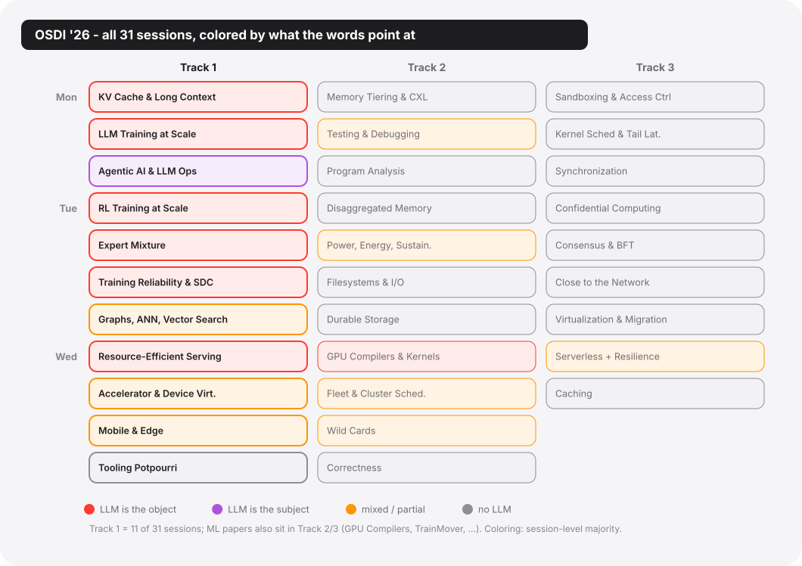

*Figure 1 · The full OSDI '26 program, one cell per session. Track 1 (left column, bold borders) is the ML-systems track. Red: the LLM is the session's workload; purple: the LLM is the tool; orange: mixed; gray: no LLM. The wave crosses track boundaries — and visibly thins out inside Track 1 itself.*

## Three claims before the tour

"There was a lot of ML this year" is the kind of impression anyone carries home from a conference, and it says nothing. The three claims below are more specific: each can be checked against the program and the papers, and each can turn out to be wrong.

**T1 — half the program.** Track 1 is 11 of 31 sessions, 48 of roughly 136 papers. And the ML papers do not stop at the track boundary: Wednesday's *GPU Compilers and Kernels* session (mega-kernel compilation, CUDA-graph enablement, tensor-program dataflow) sat in Track 2. TrainMover, an interruption-resilient ML training runtime from Alibaba and Harvard, presented in a *serverless* session in Track 3. Add energy accounting for large-model training, cluster characterization of production AI fleets, an LLM that reads SMART logs, and a speculative Tree-of-Thought accelerator, and the count of ML/LLM-centric papers lands somewhere around 60 of 136, close to 44% of the oldest systems conference on earth. (Exact tallies, per session, are in the master table at the end.)

**T2 — old words.** Almost none of these 48 papers introduces a new *kind* of system concept; they renovate old ones. The countable version: for the large majority of the 48, the paper's own text names its classical ancestor, and the exceptions I could find (Murakkab's workflow-as-workload, arguably Seer's correlated sampling group) are what "almost" means. Renovation is the substance of the track, and most papers are refreshingly explicit about it: one paper's radix tree is described in its own text as "effectively serving as a page table"; another lifts memory ballooning from the VMware ESX playbook and hands it to serving engines; a third resurrects `delay scheduling` (the Hadoop-era word, unchanged) for pipeline-parallel LLM serving. The interesting content is never the word; it is which assumption behind the word snapped when the object changed — the casualty list, not the vocabulary, is the year's actual news.

**T3 — a gradient, not a takeover.** The honest version of the story includes the sessions where the LLM wave thins out and stops. Track 1's own Wednesday afternoon is the proof: the *Mobile and Edge* session has exactly one LLM paper in four, and that one is about making the LLM *yield* to the foreground app, not run faster. The *Tooling Potpourri* session that closes the track has zero LLM content at all; its objects are eBPF programs (small sandboxed programs running inside the kernel), memory bandwidth, struct fields (the member layout of a C struct), and telemetry pipelines (logs, metrics, traces). Renaming the objects of old words is what this field always does; LLMs are just the largest new object at the moment, not the only one.

The rest of this post is the tour: memory, scheduling, data and storage, reliability, the network layer, and then the inversion — the sessions where the LLM stops being the *object* of the old words and becomes the *subject*. At the end, the control group, the institutional map, and what I will be watching next year.


| **11 / 31** | **48** | **≈ 44%** | **8** |
|---|---|---|---|
| sessions in Track 1 | Track 1 papers | of OSDI touches ML/LLM* | Operational Systems papers in Track 1 |

*48 Track 1 papers plus ≥12 ML papers filed in Tracks 2–3 (GPU compilers, training runtimes, energy, cluster studies), of ~136 total. Counts re-verified against the program before publication.


## The memory chapter: paging's new objects

<details class="tw"><summary>🔍 New terms for this chapter</summary>

- **HBM** (high-bandwidth memory): the fast, small, expensive memory stacked in the same package as the GPU.
- **DRAM / SSD**: host memory / flash storage — one to three orders of magnitude slower than HBM, but big and cheap; together the three form the tiers.
- **PCIe**: the general-purpose bus between CPU, GPU, and SSD; crossing it is the slow path.
- **KV cache**: the attention keys/values saved during autoregressive generation so each new token doesn't recompute the whole context; at long context it can outweigh the model.
- **prefill**: the phase that chews the whole prompt in parallel before token-by-token decode begins — compute-heavy, and the phase most starved by KV loading.
- **MLFQ** (multi-level feedback queue): several priority queues; a task's priority rises or falls with how it behaves — the classic interactive-versus-batch scheduler.
- **working set**: the memory a task actually touches in a window; if it fits in the fast tier, the task runs at speed — here the "task" is a whole model.
- **PagedAttention**: vLLM's page-granular KV cache allocator — the name is borrowed from OS paging.
- **TTFT / SLO**: time-to-first-token / service-level objective, serving's two main report cards.
- **DMA** (direct memory access): the dedicated engine that copies data on the CPU's behalf.
- **Grace-Hopper / GH200**: NVIDIA's superchip packaging a CPU and GPU with the fast NVLink-C2C interconnect; CPU memory becomes almost an extension of HBM.
- **CUDA kernel / thread block**: a GPU program and its thread grouping; two blocks is a very small detachment.
- **UVM** (unified virtual memory): CUDA's page-fault-driven automatic migration between host and GPU.
- **pinned memory**: host memory locked in physical RAM, never swapped; GPU DMA can only touch these pages.
- **SMEM** (shared memory): the tiny on-chip scratchpad inside each GPU compute unit, far faster than HBM.
- **duty cycle**: the fraction of time a device spends doing real work.

</details>

Monday morning, 10:45. The first Track 1 session of the conference is *KV Cache and Long Context*, and it opens with the purest single specimen of the whole thesis: **Strata** (Stanford/NVIDIA), a hierarchical context-caching system for long-context LLM serving, whose metadata structure the paper itself describes as "effectively serving as a page table."

The problem Strata attacks is textbook virtual memory with the labels swapped. Long-context serving overflows GPU HBM, so KV blocks spill to CPU DRAM and SSD — three tiers, exactly like the memory hierarchies of 1985. But the new object fails in two new ways. First, the transfers get shredded: PagedAttention allocates KV in small pages (1–32 tokens each) that are not contiguous in memory, so moving one context back to the GPU becomes a pile of KB-sized copies — and a bus like PCIe only reaches full speed on large contiguous transfers, each small copy paying a fixed overhead. The measured price: at a page size of 32, moving the KV for 8,192 tokens achieves roughly 22% of theoretical PCIe 5.0 bandwidth, as low as 5% on Grace-Hopper. Second, the scheduler doesn't know: it forms batches as if every request's KV were already in HBM, never budgeting for the ones still sitting in CPU memory or on SSD — so the GPU spends long stretches waiting for data. On a long-context benchmark, 74% of prefill time sits blocked on KV transfers, costing up to 4× in throughput.

Strata's two moves are both renovations. On the data plane, it makes the GPU serve as its own DMA engine (direct memory access: the dedicated hardware that moves data so the processor doesn't have to): a CUDA kernel with a couple of thread blocks does the copying, translating layout mid-flight. Two blocks of 1,024 threads sustain 48 GB/s while degrading prefill by less than 5%. The *DMA engine*, the piece of silicon whose whole point was to free the processor from copying, is now emulated by the processor, because the actual copy hardware cannot keep up with the layout gymnastics the new object needs. The old words recurse. On the control plane, Strata teaches the scheduler a word from the networked-cache literature: the *delay hit* — a request that arrives while its cache line is still in flight. In an agent tool-call trace (Mooncake's), 38% of requests share a ≥6k-token prefix with another request arriving within one second; treating those naively means duplicated prefill. End to end: up to 5× over vLLM-LMCache, 3.75× over TensorRT-LLM.

What makes the session remarkable is that its five papers stack into a clean tower, one layer each, with almost no collision:

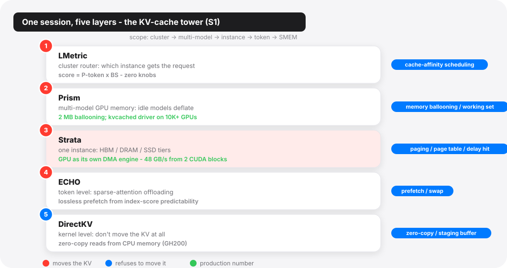

*Figure 2 · The KV-cache session stacks into a five-layer tower with almost no collision: routing (LMetric), cross-model memory (Prism), one instance's tiers (Strata), single tokens (ECHO), and the kernel that refuses to move data at all (DirectKV). Blue pills: the old word each layer renovates.*

At the top, **LMetric** (SJTU/Alibaba) does cluster-level routing with a scheduling score of almost embarrassing simplicity — and that is the point. The score is

$$
\text{score}(r, i) = P_{\text{token}}(r, i) \times BS_i
$$

where $P_{\text{token}}$ is the prefill tokens instance $i$ would still have to compute for request $r$ (cache awareness falls out for free) and $BS_i$ is the instance's batch size (load falls out for free). Its rivals all carry knobs (linear combinations need per-workload weights, filter rules need thresholds, simulators need per-model calibration); the product form has nothing to tune: any shared scale factor cancels the moment instances are compared. It cuts TTFT by up to 92% against vLLM-v1 (39% against the incumbent production scheduler), and it is deployed on hundreds of GPUs behind Alibaba's BAILIAN. Cache-affinity scheduling — the CPU-affinity idea with the cache warmth moved into the score — plus the oldest scheduling moral there is: simple metrics beat elaborate simulators.

One layer down, **Prism** (UCLA/Berkeley and a 13-institution cast) is the most word-for-word transplant in the entire track: *memory ballooning*, from the hypervisor literature, applied across LLMs. Providers host long tails of low-traffic models whose GPU duty cycles commonly fall below 30%; space-sharing fragments memory ("50% of GPU memory occupied but unused" in one trace) and time-sharing swaps too slowly. Prism's balloon driver decouples virtual from physical GPU memory at 2 MB granularity, so an idle model's KV memory can be inflated away and handed to a busy neighbor — working-set theory with models as the working sets (the bill lands on the idle model's next caller, who pays a cold TTFT to reinflate). Up to 3.3× better TTFT SLO attainment; its balloon driver, kvcached, runs in production across a 10K+ GPU fleet.

Below Strata's single-instance tier sit the two contrarians.

**ECHO** (SJTU/Huawei) thinks request-granularity moving is too coarse. It serves native-sparse-attention models (the DeepSeek-V3.2 lineage: for each new token, an indexer scores every past token and only the top scorers enter attention). These models save compute but not memory — which tokens get picked changes every step, so the full KV must stay resident and HBM still caps concurrency. ECHO parks the bulk of the KV in CPU memory and moves it token by token. What to prefetch is decided not by the OS prefetcher's old faith in access-pattern locality but by the indexer's scores themselves, which are numerically predictable — the cut-off score can be predicted from earlier steps, so each token's fate is known the moment its own score lands (clear the predicted bar and its KV is fetched early), and anything missed is fetched afterward by a guaranteed-recall pass. The final result is therefore equivalent to not offloading at all, which is what "lossless prefetch" means (prior schemes approximated from layer-to-layer or step-to-step similarity, and paid in accuracy).

**DirectKV** (UVA) refuses to move the data at all: the KV stays in CPU memory and the attention kernel reads it there, zero-copy. That road used to be closed — compute kernels assume their operands live in HBM, and reading remote memory means re-fetching the same data over and over, 20× slower on PCIe. DirectKV bets on Grace-Hopper-class superchips, whose CPU–GPU interconnect (NVLink-C2C) closes most of the gap to memory speed, and rewrites the kernel to hide the rest: each KV tile is pulled from CPU memory once, into on-chip shared memory, and reused there, shifting the bandwidth pressure from the interconnect to HBM. With nothing being swapped, the swap schemes' GPU-side staging buffers and double transfers disappear entirely — a straight 43% saving in GPU memory.

Between those last two and everything above them runs the session's fault line: *move versus don't-move*. Strata perfects swapping; DirectKV bets the interconnect (NVLink-C2C) will make swapping obsolete. Strata's own evaluation supplies the bet's sharpest piece of evidence: on GH200 hardware with 6× the bandwidth, existing software still underuses it — software, not silicon, is the bottleneck. Both camps agree on the diagnosis and disagree on which layer should absorb it. The 1980s had the same argument about disks.

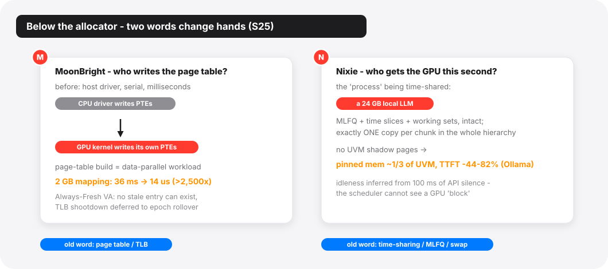

*Figure 3 · Below the allocator, two textbook words change hands: MoonBright reclassifies page-table construction as a data-parallel GPU workload (36 ms → 14 μs for a 2 GB mapping); Nixie time-shares whole ML applications with MLFQ and an exactly-one-copy memory hierarchy.*

Wednesday's virtualization session extends the memory chapter one level deeper, below the allocator. **MoonBright** (ICT, CAS) attacks the fact that GPU page tables are still written by the host driver, serially, at millisecond cost — three orders of magnitude slower than the microsecond kernels they serve. Its move is the most radical re-assignment of the conference: page-table construction is reclassified from an OS control-plane task into a *data-parallel workload*, executed by the GPU itself at memory bandwidth. Mapping a fresh 2 GB region: 36 ms with CUDA VMM, 14 μs with MoonBright: over 2,500×. The companion trick, Always-Fresh VA, hands out only virgin virtual addresses so no stale TLB entry can exist and the shootdown (the classic stop-the-world tax of the mapping business) is deferred to a rare epoch rollover. The page table survives; only its writer changed. (Hold that thought for the reliability chapter, which will convict this same arithmetic as the least trustworthy layer of the stack — the component we no longer trust is now the scribe of the address space.)

And **Nixie** (Duke) is the memory chapter's closing exhibit because its old word is the oldest one in the book: *time-sharing*, with MLFQ, time slices, and working sets intact — except the "process" being scheduled in and out of residence is an entire ML application whose working set nearly fills a consumer GPU. The design inverts UVM's caching worldview: exactly one copy of each chunk exists anywhere in the hierarchy, migrated wholesale at scheduling decisions, never faulted page-by-page. That single decision lets it match UVM on a third to two-fifths of the pinned memory — UVM keeps pinned backups of every GPU-resident page, Nixie's residents have no shadow — and beat it outright on latency: TTFT drops 44–82% on local-LLM (Ollama) workloads, 30–36% on SGLang. Their motivating arithmetic is simple: two 24 GB models alternating tokens on one 32 GB card means ≥16 GB migrated per turn, ~250 ms on PCIe 5.0, for a forward pass that takes 20–75 ms. "Data movement alone induces a 4–12× slowdown." Time-sharing was invented because machines were expensive and users were many; it returns because GPUs are expensive and models are many.

## The scheduling chapter: what the scheduler cannot know

<details class="tw"><summary>🔍 New terms for this chapter</summary>

- **prefill / decode**: inference's two phases — chew the whole prompt in parallel (compute-bound), then generate token by token (bandwidth-bound); their opposite temperaments start half this chapter's papers.
- **goodput**: throughput after discarding late or wasted requests.
- **TP / PP** (tensor / pipeline parallelism): TP slices every layer and communicates heavily; PP splits by layer and only passes activations between stages.
- **InfiniBand / NVLink**: datacenter-grade network / NVIDIA's GPU interconnect — both expensive, both avoided throughout this chapter.
- **FFN** (feed-forward network): the parameter-heavy block in every Transformer layer; sparsely activated, hence movable neuron-by-neuron.
- **W4A8** (quantization): weights in 4 bits, activations in 8 — trading precision for memory and speed.
- **NAT / Slurm / HPC**: machines without public addresses / the supercomputing batch scheduler / clusters built for queued jobs, not always-on services.
- **rollout**: the RL phase where the current model generates a batch of samples; the training phase then updates weights on them.
- **GRPO**: the DeepSeek-lineage RL algorithm sampling a group of responses per prompt (typically 8–16 today), the group serving as its own baseline — that structure is Seer's entire lever.
- **on-policy / synchronous**: samples must come from the latest weights, so rollout and training alternate rather than overlap — ugly utilization, stable training.
- **speculative decoding**: a small draft model guesses tokens, the big model verifies in one pass; drift between draft and target is the classic failure.
- **Mooncake**: Moonshot's open-source KV transfer/storage layer, the substrate under two papers here.
- **H20 / H800**: export-control NVIDIA GPUs — H20 weak on compute, strong on bandwidth (good for rollout); H800 the reverse (good for training); nearly 3× apart in price.
- **NPU / SoC / UMA**: the phone's AI accelerator / system-on-chip / unified memory — CPU, GPU, and NPU share one DRAM bus, which is why bandwidth can be fought over.
- **MPAM**: Arm's hardware interface for memory-bandwidth partitioning — which does not cover the NPU.
- **PI controller**: proportional-integral feedback control, industrial control's basic loop.

</details>

If the memory chapter is about words that transplanted cleanly, the scheduling chapter is about the assumption that did not: *the scheduler's knowledge of its jobs*.

The session that wears its economics on its sleeve is Wednesday's *Resource-Efficient LLM Serving*: five papers with one shared premise (you cannot afford the reference hardware), each naming which line of the bill it attacks. **EcoServe** (Sun Yat-sen, on a commodity cluster provided by WeChat) cannot afford the interconnect: with no NVLink and no InfiniBand, it cannot ship KV caches between disaggregated prefill and decode machines, so it *time-shares the phases within an instance* (long alternating phases, so the KV never leaves the card) and rotates activation across a "macro instance" so someone is always accepting prefills. Goodput 1.96–2.51× over vLLM/DistServe-class baselines on 32 L20 GPUs over Ethernet. **PP-Revisit** (Korea University) cannot afford NVLink either, and rehabilitates pipeline parallelism on PCIe boxes by attacking its bubbles two ways: dynamic chunk sizing against SLO slack, and *delay scheduling*, the Hadoop word, verbatim, now migrating decode requests between microbatches instead of MapReduce tasks between nodes. On a real trace where tensor parallelism attains just 1.9% of SLOs (default-chunk pipeline parallelism does still worse, 1.6%), their dynamic chunked PP recovers to ~94%, matching an offline-tuned static pipeline without needing its per-workload chunk search. **Kairox** (Sun Yat-sen/EPFL) cannot afford the GPU itself: on consumer PCs it pages *FFN neurons* between GPU and CPU, a cache-replacement policy with momentum (TAM) deciding which neurons are persistently hot versus one-hit wonders, and reaches up to 7.57× over llama.cpp. **ADAngel** (SJTU) cannot afford the bit width, and revives ATLAS-style exhaustive offline autotuning to dispatch mixed-precision GEMM kernels from a 256 KB oracle table; its best exhibit is an adversarial one, a bit-disaggregation (1-bit decomposition) baseline whose TTFT balloons to 39.4 minutes on a shape where ADAngel's dispatcher takes 5.27 s. That is a 448× gap between the best and worst kernel choice for the *same* mathematics.

And **OpenTela** (ETH/Cambridge) cannot afford a serving cluster at all — sovereign-AI money bought Slurm-managed HPC machines designed for batch jobs, NAT-ed off the public internet. Its answer is the full 2000s peer-to-peer stack, dusted off and pointed at inference endpoints: libp2p, Kademlia discovery, gossip membership, and cluster state as a CRDT. The lessons-learned section says it plainly: the system became reliable when the authors re-modeled its state "as a conflict-free replicated data type … a monotonic lattice." OpenTela is also an Operational Systems paper with 22 months of production scars: 13 million requests, 15 billion tokens, 142 models. It hands the community a rare gift: a multi-model production trace (most public traces carry one or a handful of models), plus an early factual report of what reasoning models do to a serving fleet. P95 end-to-end latency 5.5× the non-reasoning tail; energy per token up ~56%; and prefix cache reuse above 90% on its flagship Thinking model versus ~15% on the Instruct twin. Next year's serving doctrine will have these numbers to calibrate against.

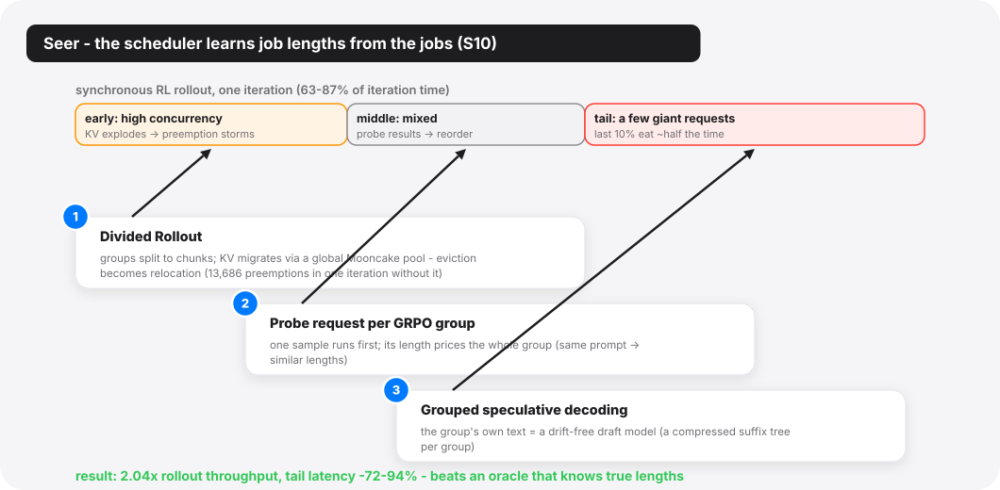

*Figure 4 · Seer's three mechanisms map onto the three phases of a synchronous RL rollout. The scheduler learns job lengths online from GRPO's own group structure — one probe request prices the whole group — and approximates longest-first with 1970s confidence.*

The deepest scheduling paper of the track, though, is in Tuesday's *RL Training at Scale* session, and it goes at the oldest open wound in scheduling theory. Shortest-job-first and longest-first policies are provably good — *if you know job lengths*, which real systems never do. **Seer** (Moonshot/Tsinghua) notices that synchronous RL rollout, public enemy of training-cluster utilization (rollout is 63–87% of iteration time; on memory-hungry workloads the last 10% of requests eat nearly half of it), carries a length oracle nobody was reading: GRPO samples each prompt in *groups* (typically 8–16 responses), and "responses within a group tend to exhibit similar length profiles and recurring local token patterns." So Seer runs one *probe request* per group at high priority, uses its observed length as the group's estimate, and schedules approximately longest-first. The group structure pays twice more: a per-group compressed suffix tree becomes a free, always-in-sync draft model for speculative decoding (no drift problem, because the "draft model" is the group's own text — though acceptance falls as sampling diversity rises, a real tension for exploration-hungry runs), and group-aware chunked migration turns KV-cache preemption from reactive eviction into proactive relocation across a Mooncake-backed global pool. End to end: up to 2.04× rollout throughput, tail latency down 72–94%. In the direct comparison that matters, Seer beats an oracle-fed baseline that *knows* true lengths, because the baseline's scheduling unit (the whole group) is too coarse to act on its knowledge. "Online context learning" here is not the model learning anything; it is the *scheduler* learning the workload — which is exactly what the phrase would have meant in 1974.

Seer is also the session's dissident. Around it, the disaggregation consensus hardens: **Weave** (HKUST/Alibaba) accepts that rollout and training now live on different hardware pools (bandwidth-rich H20s for rollout, compute-rich H800s for training; the cheaper card is *better* at one phase, which is the whole economic argument) and lifts the classic co-scheduling idea to cluster scope, weaving the phases of *different jobs* so one job trains while another rolls out: 1.84× cost efficiency over naive disaggregation with 100% SLO attainment, and a warm-start residency trick that turns cold context switches of up to 135 seconds into host-DRAM reloads. **RollArt** (same HKUST/Alibaba axis) pushes disaggregation *inside* the phase (prefill-heavy rollout to H800, decode-heavy to H20, environments to a CPU cluster, reward models to serverless, with processor-affinity vocabulary doing the assigning) and reports the single most lopsided utilization number of the conference: offloading reward raised reward-GPU utilization from 6% to 88%. It also runs the track's biggest disclosed RL-training deployment: a week of continuous training of a hundreds-of-billions-parameter MoE for the Qoder product on 3,000+ GPUs. **RLinf** and **DynaRL** (a Tsinghua/Peking/Infinigence axis, the second built on the first) refuse the binary: RLinf compiles a logical RL workflow into whichever physical execution mode (colocated, disaggregated, hybrid) profiles best, and its evaluation lands the empirical punchline that there is *no universal winner*: spatial disaggregation wins under PPO and loses badly under GRPO. DynaRL then makes the assignment dynamic mid-training, migrating stateful trainers between GPUs with optimizer state in tow — process migration, with a 200 ms planner and sub-1% overhead.

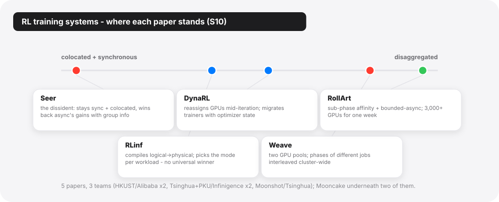

*Figure 5 · Where the five RL-training papers stand on the disaggregation axis. Two commit to separate pools, two refuse to choose statically, and Seer stays colocated-synchronous — and wins back the gains the async camp claimed. Five papers, three teams, all China-affiliated.*

Two more things about this session. First: five papers, three teams, all China-affiliated — HKUST/Alibaba, Tsinghua/Infinigence, Moonshot/Tsinghua. The published RL-infrastructure layer of the field is coming overwhelmingly from one ecosystem right now — whatever US frontier labs build for themselves, they are not publishing. Second: two of the five (Seer, RollArt) independently build on Mooncake for KV or weight distribution — a piece of open infrastructure quietly becoming this generation's shared substrate.

The scheduling chapter has one more scene, and it is the strangest: the scheduler that had to leave the OS entirely. **Sereno** (SJTU IPADS), in Wednesday's mobile session, documents a priority inversion — the textbook word, in a place no textbook put it. Mobile SoCs grant the NPU top-priority memory access because NPUs historically meant cameras and real-time media. A background on-device LLM inherits that privilege: it is "bandwidth-intensive (like video recording) yet semantically best-effort (like background downloading)," and the hardware cannot tell the difference. The foreground jank rate goes up 153% while the LLM itself loses only one to two percent. The harder problem is *where* the fix can live. The NPU is invisible to the OS — excluded from memory-latency monitors and MPAM bandwidth partitioning, and exempted from thermal throttling — so no kernel policy can touch the inversion. Sereno builds the scheduler inside the inference runtime instead. Speculative decoding is repurposed as a bandwidth regulator; draft subgraphs become sub-millisecond preemption points and, doubling as probes, their own execution latency measures contention for a PI controller. Naive throttling turns out to be counterproductive: a 50% bandwidth cap drops throughput 8.4% *below* not speculating at all. The elastic version instead cuts jank 58.5% on average while LLM throughput *rises* 26.4%. When the OS cannot see the resource, the scheduler migrates up the stack — a move that would have fit comfortably in an exokernel paper, except the object is a chatbot.

## The data chapter: the old dog, and the fork in vector search

<details class="tw"><summary>🔍 New terms for this chapter</summary>

- **HDFS**: the Hadoop Distributed File System, the big-data era's storage substrate — this article's old dog.
- **EB** (exabyte): a million terabytes.
- **WAN / RTT**: wide-area network / round-trip time — for small reads the real bottleneck is RTT, not bandwidth.
- **checkpoint**: a snapshot of training state (weights + optimizer); recovery and evaluation both feed on it.
- **embedding**: text or images compressed into high-dimensional vectors, where semantic similarity becomes geometric closeness.
- **ANNS** (approximate nearest neighbor search): finding the most similar vectors among billions, approximately — the substrate of search, recommendation, and RAG.
- **HNSW / SPANN**: the two index lineages — graph-based (step-by-step homing, fast but serial) vs. clustering-based (partition first, then batch-scan; I/O-friendly).
- **RAG** (retrieval-augmented generation): retrieve relevant material into the context before generating.
- **Gen5 SSD / DDR5**: fifth-generation NVMe flash (12 GB/s per drive) / current-generation DRAM — the shift in their price ratio is the material basis of the verdict reversal.

</details>

One of the conference's three Best Paper awards went to Track 1, and to the least glamorous subject on the program: HDFS. **Teaching the Old Dog New Tricks** (ByteDance Seed/USTC) is about feeding exabyte-scale LLM pre-training from a legacy Big Data stack, and its title is the track's thesis stated as policy. Everyone else optimizes the compute plane; this paper noticed the bill migrating to the data plane, measured it on 30,000 production jobs over 90 days, and found three bottlenecks hiding in plain sight.

The numbers are the story. Cross-datacenter evaluation pulls checkpoints over WAN where over 60% of tensors in one multimodal checkpoint are smaller than 16 KB — the reads are RTT-bound, not bandwidth-bound, and across 156 regressions those I/O delays wasted about 2.6 million GPU hours, "offsetting nearly half of the 5.5 million training GPU hours that the evaluation system would otherwise have saved." Restart storms hammer a handful of hot files (the top 5% of files draw 38.8% of the pressure). Multimodal transforms consume 94.4% of data-loading time on the training hosts' CPUs.

The fixes are three old words — replication, prefetching, predicate pushdown — each rearmed with one insight the 1980s storage stack never had available: *the workload is deterministic*. Evaluation schedules are known, so checkpoint shards are replicated ahead of the reads (predictive replication). Hot files are known at submission time, so the training framework *tells* the storage layer, which pre-inflates replication factors from 3 to as much as 128 under a stated production rule, sized by

$$
R_{\text{target}}(f) = \left\lceil \omega_f / C_{\text{load}} \right\rceil
$$

— replicas proportional to declared load over per-replica capacity, with a TTL to deflate. Transform work is pushed down to storage-node CPUs that sit at just 20–30% utilization. Wasted GPU hours per evaluation: 16,800 → 4,000; startup checkpoint loads 40.8% faster; transform stalls down 63.2%. The paper's one-line argument — "storage systems operate *reactively* while training workloads are inherently deterministic" — is the cleanest statement of leverage in the whole proceedings, and its concluding stance is a deliberate provocation to the greenfield crowd: "legacy Big Data systems like HDFS can meet the rigorous demands of exabyte-scale large model training without requiring a complete architectural replacement."

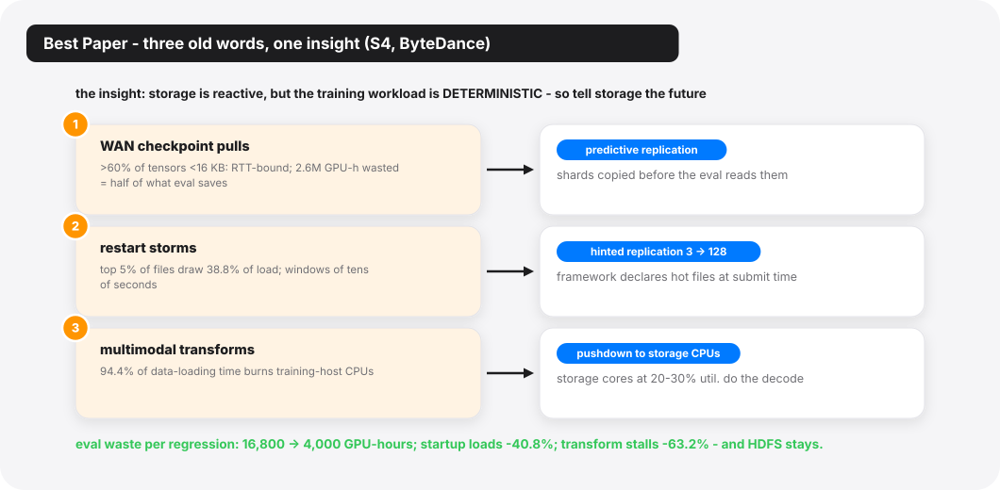

*Figure 6 · The Best Paper in one picture: three measured bottlenecks (orange), three old storage words re-armed with workload determinism (blue). The training job knows its future; the fix is telling the storage layer.*

Why did *this* win Best Paper in a track full of 5× speedups? Because it is the paper an operational-systems track exists to produce. It quantifies three underreported bottlenecks with a production evidence base nobody else has, promises the anonymized traces, and then spends a section explicitly arguing down the three obvious rebuild-it alternatives (P2P distribution, dedicated transform clusters, AI-native storage) on data-gravity and operational-continuity grounds. It is also the perfect mascot for T2, old words: the entire contribution is that the old system, taught three new tricks, suffices.

Tuesday's vector-search session stages the other storage argument of the week, and it is the one genuine *doctrinal fork* I saw at the conference. Both sides serve the same new object — embedding vectors for RAG, search, and recommendation — and both sides name the same enemy: the dependency chain of best-first graph traversal, where every expansion waits on the reads of the last. They split on the medium, and the split is instructive.

**FlowANN** (SJTU IPADS) lives on the GPU side, where the tiers are HBM and host DRAM — microsecond latencies. Its finding: the dependency is an artifact of *step-level* bookkeeping; at node level, 95.6% of expanded nodes have a >5-step window between discovery and expansion, wide enough to prefetch edges asynchronously and keep the graph index. Result: billion-scale search on a single GPU, 4.08–45.7× over prior systems, with the paper planting its flag — on GPUs, graph beats clustering by 5.2–15.1×.

**Helmsman** (Xiaohongshu/RedNote, an Operational Systems paper) lives where the tiers are DRAM and SSD — a 100–1000× latency cliff that no prefetch window can bridge. Its answer is to abandon the graph: clustering-based indexes (the SPANN lineage, "largely dismissed … due to the limited throughput," as the paper itself puts it) issue *batched, dependency-free* I/O, and Gen5 SSDs at 12 GB/s per drive re-price that trade entirely. Production numbers: 40 all-flash machines now carry ANNS workloads that previously took ~35,000 CPU cores and 0.35 PB of DRAM. Helmsman also names its own next wall: with twelve Gen5 drives it can only use ~70% of the array's bandwidth, because the bottleneck has moved to the DDR5 memory channels the data must cross.

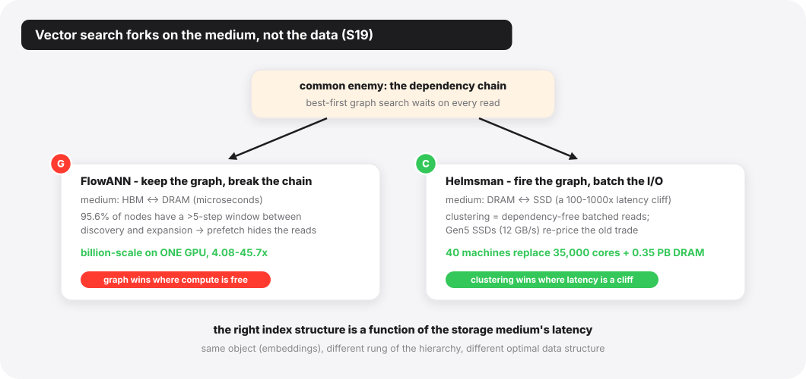

*Figure 7 · The one doctrinal fork of the week. Both vector-search papers name the same enemy — the dependency chain of graph traversal — and give opposite answers because they stand on different rungs of the memory hierarchy.*

Side by side, the two papers reduce to one moral: *the right index structure is a function of the storage medium's latency*, not of the data. Graph wins where compute is free and latency is flat; clustering wins where latency is a cliff and bandwidth is purchasable. The same new object, standing on different rungs of the memory hierarchy, gets different optimal data structures — the words never carried that answer; the hardware ratios did, and those ratios moved.

(The session's other half is classic graph analytics with no LLM in sight — evolving-graph processing on GPUs, and Pluto's assault on the "replicate every remote vertex" dogma of distributed graph engines — the old objects still publishing.)

## The reliability chapter: the trust chain, inverted

<details class="tw"><summary>🔍 New terms for this chapter</summary>

- **ECC** (error-correcting code): memory's built-in correction for single-bit flips — one case in this chapter got past even that.
- **bf16 / fp32**: 16-bit brain float (training's workhorse, coarse) / 32-bit single precision.
- **Tensor Core**: NVIDIA's matrix-multiply unit; bf16 inputs with fp32 accumulation is its native design — AEGIS's entire lever.
- **1F1B**: pipeline parallelism's classic rhythm (one forward, one backward), which naturally leaves bubbles.
- **DP** (data parallelism): replicas running the same model on different slices of data; fed the *same* batch, two replicas must agree bit for bit — the handle replay comparison grips.
- **NaN**: floating point's not-a-number; a NaN loss is training's loudest alarm — and this chapter's point is that most corruption never rings it.
- **NCCL / UCX**: NVIDIA's collective-communication library / a point-to-point communication framework.
- **ETTR** (effective training time ratio): the fraction of wall-clock spent actually training — fault-tolerance's report card.

</details>

The OS curriculum has a quiet axiom: hardware is the trusted base, software is where the bugs live. Tuesday afternoon's *Training Reliability and Silent Errors* session — three ByteDance-ecosystem papers and one counterpart — reads like a formal retraction of that axiom at LLM-training scale.

The scale is what changed the epistemics. Silent data corruption — a GPU arithmetic unit returning a wrong number with no fault, no ECC event, no thermal anomaly — was always statistically present; at 10,000-GPU, months-long training runs it becomes *observable*. **Safeguarding LLM Training at Scale** (Tsinghua/ByteDance) ran its online detector, AEGIS, across 35 million GPU-hours of production training: 18 SDC incidents, 13 distinct faulty GPUs. Of the 18, "only three incidents manifested as observable training failures … the rest were silent." Fifteen corruptions that no loss curve would have confessed to.

The three papers form an explicit pipeline — the smoke alarm, the forensic examiner, and the line-by-line interrogator — and the papers say so themselves, with overlapping author lists to match.

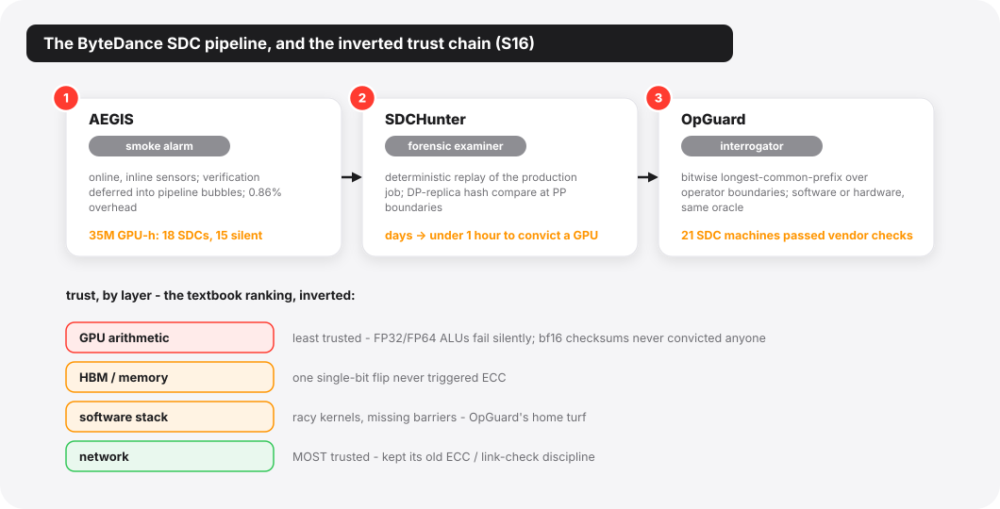

*Figure 8 · Top: the ByteDance SDC pipeline — alarm, examiner, interrogator — three papers, overlapping authors, deployed in cooperation by the papers' own account. Bottom: the trust chain at LLM-training scale, inverted from the textbook ranking.*

**AEGIS** is the alarm, and its two mechanisms are both old words worn openly. The first is the ABFT checksum (algorithm-based fault tolerance, the Huang–Abraham lineage from 1984), which fails outright in bf16: low-precision noise buries the signal, and the paper reports that in production, bf16 checksums *never once* located an SDC. The rescue is a hardware coincidence: Tensor Cores accumulate in fp32, and reading the checksum from that accumulator instead of the bf16 output catches faults about 10⁴× smaller: bf16 checksums need a perturbation roughly ten thousand times larger to reach a comparable detection rate. (One caveat belongs here: the entire approach leans on modern accelerators happening to contain a high-precision accumulator.) The second mechanism is scheduling, and its old word is the interrupt bottom half: a `cSensor` inlines minimal evidence-gathering on the critical path, and a `cVerifier` defers expensive confirmation into the pipeline bubbles that 1F1B scheduling leaves lying around anyway. Total overhead: 0.86% in production. For FlashAttention, the sensor is an algebraic invariant rather than a checksum — softmax rows sum to one, so column sums must be conserved:

$$
\mathbf{1}^{\top} dV = \mathbf{1}^{\top} dO
$$

where $dO$ and $dV$ are the gradients arriving at attention's output and value matrices in the backward pass — a correctness oracle that costs almost nothing precisely because it is mathematics, not redundancy.

**SDCs in the Wild** (SJTU/ByteDance Seed) is the examiner, and its finding cuts against the industry's entire acceptance-testing reflex: synthetic burn-in misses more than 60% of defective GPUs, and only 25% of SDCs surface at pre-deployment — a substantial 40% appear around one year into service. These are aging failures; no entrance exam catches them. The diagnostic that works is *record-and-replay*, scaled up from its single-process origins to a 10,000-GPU training job: make the whole framework deterministic, split the cluster into two logical replicas along the data-parallel axis, feed both the same data, and hash-compare at pipeline boundaries (~3% overhead) until the diverging GPU confesses. Debug time: days to under an hour. In the session's companion study (AEGIS), vendor diagnostics re-identified only 2 of 8 known-bad machines; one case in the same evidence pile involved an HBM single-bit flip that never triggered ECC.

**OpGuard** (UMich/ByteDance Seed) is the interrogator, generalizing the idea past hardware: treat two training runs as sequences of operator-boundary tensors, define correctness as *bitwise-identical longest common prefix*, and read off the first divergence as the debugging pivot. It is delta debugging with the diff taken over executions instead of source code, and it does not care whether the liar is a racy kernel or a decaying ALU: twenty production incidents triaged from multi-day to minutes, and — the number that should worry procurement departments — 21 SDC machines caught to date, *all of which passed vendor health checks*.

The fourth paper, **RobustRL** (Zhejiang), is the control case that sharpens the theme: it handles machines that die honestly (fail-stop), shrinking the blast radius of RL post-training restarts from the whole gang to the failed *role*. Useful, deployed thinking; but the session's center of gravity is the dishonest failures, and the inversion it documents is worth stating plainly: at this scale, the least trustworthy layer of the stack is the hardware arithmetic, and the *most* trustworthy is the network, because communication kept its old-school end-to-end integrity discipline (ECC and link-level checks, in the paper's words) while compute paths never had one. The old reliability words — checksum, replay, replication, bisection — did not just find new objects. They found the one layer the textbooks had exempted from suspicion.

## The network undercurrent: the pendulum swings back to software

<details class="tw"><summary>🔍 New terms for this chapter</summary>

- **RDMA** (remote DMA): reading and writing another machine's memory directly, bypassing its CPU and kernel — the foundation of fast datacenter networking.
- **NIC / doorbell**: the network card / the magic address you write to shout "work's ready."
- **libibverbs**: Linux's RDMA programming library, maintained by the community and NIC vendors — the fulcrum of UEP's portability.
- **EFA**: AWS's homegrown NIC, reliable but unordered — which forces the software re-ordering machinery.
- **SACK / CUBIC**: TCP's selective acknowledgment / mainstream congestion control — exactly what UCCL-Tran relocates into software.
- **incast**: congestion from many senders converging on one receiver; daily life for a popular MoE expert.
- **collective**: communication primitives where every GPU participates — all-reduce, all-to-all.
- **EP / dispatch / combine** (expert parallelism): tokens are routed to the GPUs holding their experts (dispatch) and gathered back after compute (combine).
- **AVX-512 / GEMV**: x86's 512-bit vector instructions / matrix-vector multiply — decode's dominant compute shape.

</details>

Tuesday's *Expert Mixture* session looks, at first, like four MoE papers. It is better read as one argument about where intelligence belongs in the I/O path — and it is the same argument the RDMA decade thought it had settled in hardware's favor.

Two of the four papers are the same project. **UEP** and **UCCL-Tran** (Berkeley and friends; seven shared authors, one repository; UEP literally lives in the UCCL repo's `ep/` subdirectory) split a software networking stack between them. UCCL-Tran rebuilds the *transport layer*: sequence numbers, SACK, selective retransmit, CUBIC, receiver-driven credits — the full TCP lexicon, relocated from NIC firmware back into host software, with the NIC demoted to a dumb data plane. One CPU core drives 400 Gbps; collectives improve up to 4.5×; under loss, selective retransmit degrades ~1% where hardware go-back-N degrades 26–42%. UEP does the same demotion one layer up, for MoE's token-level dispatch/combine: GPU-initiated RDMA (the DeepEP way) welds you to one vendor's GPU–NIC co-design, so UEP has the GPU merely *issue* 128-bit transfer commands into a lock-free FIFO while a CPU proxy *executes* them through libibverbs — and emulates, in software, the delivery-ordering guarantees that fancy NICs provide and commodity ones (EFA) do not. The proxy tax: 3–5 μs against operations that take hundreds. The payoff: integration cost falls from O(m×n) GPU–NIC pairs to O(m); the AMD+EFA port took three person-months; and on EFA it *outperforms* the incumbent by 2.1×.

If that structure sounds familiar, it should: a user process (here, a GPU kernel) that wants to touch hardware directly is made to trap into a privileged, portable intermediary instead. The syscall is back, and its object is an RDMA doorbell. Both papers even justify the CPU's new job with the same statistic — GPU-cluster host CPUs idle at 14.5–45% utilization. The offload pendulum, having swung to hardware for a decade, swings back the moment the workload starts evolving faster than silicon: MoE routing storms, incast from popular experts, schedulers that want to spray packets across 256 paths. Software wins arguments about *change*.

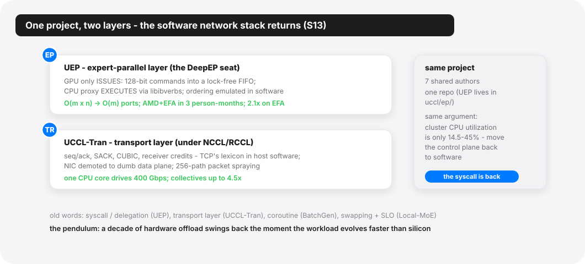

*Figure 9 · UEP and UCCL-Tran are one Berkeley project splitting a software network stack across two layers, justified by the same statistic: cluster CPU utilization sits at just 14.5–45%. The syscall pattern returns — the GPU issues, a privileged portable proxy executes.*

The other two papers complete the spectrum. **BatchGen** (Edinburgh/Tencent) re-runs the Apache-to-NGINX transition with sequences as the connections: inference sequences become event-driven *coroutines* that yield at module boundaries, so the scheduler can combine them into properly fat expert batches, partition stragglers across GPUs, and migrate them across nodes — up to 2.3× faster batch completion on 128 GPUs, and the only system in its evaluation that runs a 1T-parameter model on 8×H20 at all. And the Tsinghua local-MoE paper flips the CPU's role from control plane to *compute* plane: an AVX-512 FP8 GEMV kernel sustaining 947 GB/s of memory bandwidth lets two RTX 5090s on a dual-socket EPYC box (24 DDR5 channels, 1.15 TB of RAM) serve DeepSeek-R1 671B at ~20 tokens/s — cloud-grade SLO vocabulary, applied unapologetically to a machine under a desk.

## The inversion: when the LLM is the subject

<details class="tw"><summary>🔍 New terms for this chapter</summary>

- **MILP** (mixed-integer linear programming): optimization with integer variables, scheduling's standard hammer.
- **DAG** (directed acyclic graph): nodes and one-way edges, no cycles — the standard shape of a workflow.
- **LangGraph**: the mainstream agent-orchestration framework where developers hand-write the graph and its knobs — Murakkab's baseline.
- **monorepo**: the whole company's code in one repository (Google's runs to billions of lines).
- **Clang-Tidy**: a C++ static checker with fixed rules — the foil for ECO's six-for-six.
- **normalized core**: the fleet's accounting unit for compute.
- **GWP** (Google-Wide Profiling): Google's always-on fleet profiler, ECO's navigation.

</details>

Every paper so far treats the LLM as the *object* of an old word — the thing cached, scheduled, checked, shipped. Monday's *Agentic AI and LLM Operations* session is where the grammar flips, and the session is constructed (two papers each way) as if the PC wanted the contrast on stage.

On the object side, **Murakkab** (MIT/Azure Research) sets out to give agentic workflows a *control plane* of their own — its own word, stated in its own thesis: treat "the entire agentic workflow: the sequence of LLM calls, tool executions, and data dependencies, as a single, optimizable computational graph." Developers write declarative specs; an LLM orchestrator compiles them to a typed DAG; a profile-guided MILP re-decides, every hour, which models, GPUs, parallelisms, and cross-workflow multiplexings serve the fleet. Against hand-crafted LangGraph deployments: 2.8× fewer GPUs, 3.7× less energy, 4.3× lower cost (2,568 A100s → 912 in the headline 24-hour trace). The old words could hardly be denser: declarative-to-physical compilation, profile-guided optimization, admission of workloads to a shared substrate. But the paper also contains the confession that frames this whole research direction: "no publicly available traces exist for production agentic workflow serving," so the agentic cloud is evaluated on chat traces wearing a costume. The control plane has arrived before its subjects have. Alongside it, **StriaTrace** (Alibaba/SJTU) plays the sensory nerves to Murakkab's brain — distributed tracing rebuilt for autoregressive inference, with a *roofline model* whose x-axis is token count and a *critical path* that is vLLM's main thread, running six months in production over 1,700 instances and 180 million requests a day at <1% overhead.

On the subject side, the LLM takes the jobs. **ECO** (Google DeepMind/Google) installs it in the compiler-optimizer's chair: mined anti-patterns plus fleet-wide profiling steer a fine-tuned model that has landed 6,400+ commits into Google's production monorepo with a 99.5% no-rollback rate, saving several hundred thousand normalized cores. Where Clang-Tidy reliably fixes one of six vector-reserve patterns, ECO fixes all six. **gigiprofiler** (BU/UW) installs it in the diagnostician's chair, with the discipline that makes it credible: raw frontier models proposing performance root causes false-positive at 45–60%, so the LLM is demoted to hypothesis generator, sandwiched between static analysis (which validates the proposed resource lifecycles) and runtime measurement (which convicts). The framework nails the true root cause first-try in 15 of 15 reproduced cases, where perf catches 5. Both subject-side papers converge on the same design grammar (every LLM step bounded by a non-LLM verifier), which is the oldest systems reflex of all, pointed at the newest unreliable component. In the reliability chapter it was checksums around GPUs; here it is test suites and dataflow analysis around models.

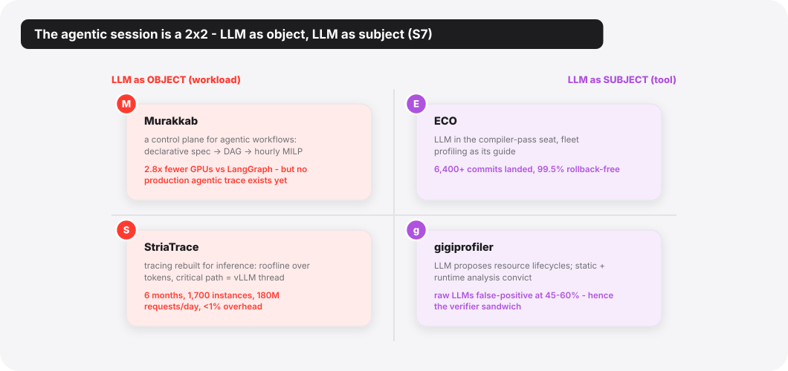

*Figure 10 · The agentic session as a 2×2: on the left the LLM is the workload being orchestrated and traced; on the right it takes the compiler's and the diagnostician's chairs — always sandwiched between non-LLM verifiers.*

The inversion even echoes elsewhere in the track: Wednesday's eBPF-virtualization paper cites tenants' AI agents auto-generating kernel extensions as a motivating pressure, and Sereno's whole premise is the LLM as *perpetrator* — the workload other things must be protected *from*. Subject, object, and now suspect — the same set of roles every real workload has eventually occupied.

## The control group: where the wave thins out

<details class="tw"><summary>🔍 New terms for this chapter</summary>

- **eBPF**: the mechanism for running small verified programs inside the kernel — networking, observability, and security's current darling.
- **memory bandwidth**: how much data the DRAM bus moves per second; shared by all cores and consumed implicitly by loads and stores — no queue to wait in, which is exactly Svalinn's opening.
- **struct field**: a member of a C struct; the in-memory layout of fields decides cache behavior — TypeCraft attributes cost down to this level.
- **softirq**: kernel execution context that belongs to no process, so its time is billed to whoever got interrupted.
- **verifier** (eBPF's): statically proves a program bounded and safe before it may load; PeeR borrows its guarantees for safe preemption points.
- **sched_ext**: the Linux framework for writing schedulers in eBPF; both MUSCHED and PeeR use it.
- **CFS / RT**: Linux's completely-fair and real-time scheduling classes — the VIP class wedges between them.
- **Binder**: Android's inter-process communication; one UI tap rides a cross-process call chain.
- **big.LITTLE**: Arm's mix of performance and efficiency cores.
- **AQM** (active queue management): drop or mark early when a queue grows, rather than letting it jam.
- **SEDA**: the 2001 staged event-driven architecture paper, the ancestor of this overload-control lineage.
- **CapEx / OpEx**: capital expenditure (buying the machines) / operating expenditure.
- **telemetry trio**: logs / metrics / traces.

</details>

This section is where my thesis stops working. Reading only the sessions above, you would conclude OSDI has been annexed. Track 1's own Wednesday afternoon says otherwise, in two escalating steps.

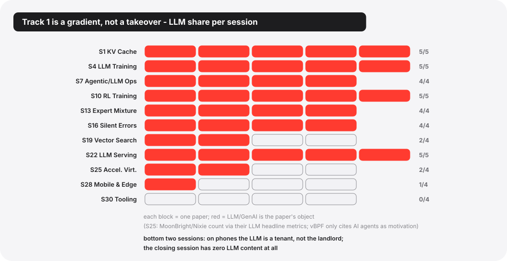

*Figure 11 · The full picture: LLM share per Track 1 session. Seven sessions are saturated; vector search is half; mobile is one paper in four (and that one makes the LLM yield); the closing session is the control group at zero.*

The *Mobile and Edge* session is one part LLM to three parts classic. LifeLine aligns Java object lifetimes with physical pages so Android's GC can remap instead of copy — memcpy volume down 57.4%, and the motivating case is Twitter's GC copying 80.9× the app's live memory per minute. SANI dissolves the big.LITTLE paradox (adding little cores can make inference up to 37% *slower*) with affinity-aware kernels. It pointedly declares on-device LLMs out of scope, someone else's NPU problem. MUSCHED, Honor's production scheduler on more than 20 million devices, wedges a VIP scheduling class between RT and CFS and propagates priority along Binder IPC chains. Three quarters of the mobile session, zero LLMs: on phones, the LLM is a new tenant, not the new landlord; and the tenant's only Track 1 appearance (Sereno) is a paper about making it behave.

Then the track's closing session, *Tooling Potpourri*, drops to zero parts LLM in four. A full-text search across all four PDFs finds no LLM content beyond one incidental citation. And yet it is the same intellectual move everywhere: **Svalinn** names the *single-queue fallacy*: overload controllers that treat a server binary as a monolith, throttling everything because one resource saturated, forfeiting "up to 83%" of aggregate throughput. Its fix is to give the queueless resource a queue. Memory bandwidth is accessed implicitly by loads and stores; nothing about it can be admission-controlled — until an `m_semaphore` caps the threads inside memory-intensive code sections, its capacity tuned online by a bandit maximizing

$$
R = \alpha \cdot \frac{BW_{\text{cur}}}{BW_{\max}} - (1-\alpha) \cdot \frac{\text{cores}_{\text{cur}}}{\text{cores}_{\max}}
$$

— saturate the bandwidth with as few cores as possible. In the paper's own words, the semaphore works by "turning an implicit bottleneck to an explicit bottleneck." Its neighbors do the same for other invisible things: PeeR makes eBPF programs schedulable, first-class citizens with CPU accounting (a full preemption-resumption cycle: 247 ns), resurrecting *cooperative multitasking*, now safe because the verifier guarantees clean states at yield points. TypeCraft raises profiler resolution from functions to struct fields and re-prices the ancient art of field reordering. DiTing harvests idle cycles across a million nodes to run telemetry queries at up to 1/65th the CapEx of a self-built unified stack.

The control group is what makes T3 — the gradient — more than hedging. (A fair objection: this "control group" was not randomly assigned; Tooling Potpourri is, by name, the PC's residual bucket. I read its zero-LLM content as informative anyway — nothing forced the PC to close the ML track with four LLM-free papers.) Giving old words new objects is simply what this community does for a living; this season's objects are eBPF hooks and struct fields *and* KV caches and sampling groups. The LLM is the biggest new object in forty years, not the only one on the program.

## Steelman: maybe the words are hiding the wrong continuity

The strongest objection to my framing is not that the count is off; it is that "old words, new objects" flatters the field's continuity while the load-bearing assumptions quietly rot. The strongest version of it goes like this.

First: some of these transplants may be *category errors with good benchmarks*. Time-sharing assumed jobs that yield or block; LLM inference is a run-to-completion tenant whose "time slice" costs a 16 GB migration. MLFQ assumed the scheduler can observe idleness; Nixie has to infer it from 100 ms of API silence. When the borrowed word's core assumption fails, the resulting system is not a renovation — it is a workaround wearing a famous name, and its performance may not survive the next hardware generation. (Strata's own GH200 benchmark section, where 6× bandwidth fails to deliver, can be read either as "software lags" or as "the swap-centric frame is wrong and DirectKV's don't-move frame is right." The session contains its own refutation attempt.)

Second: the determinism dividend may be a training-era artifact. Old Dog's whole leverage — workloads so deterministic the storage layer can be told the future — is true of pre-training and materially less true of agentic inference, whose arrival processes are the very thing Murakkab admits nobody has traces of. A doctrine built on determinism could age exactly as badly as the doctrines built on "memory is scarce relative to compute."

Third, the sharpest version: the evidence for T2 is partly manufactured by how it was collected. Accepted OSDI papers are a sample pre-filtered by a program committee trained on the classical vocabulary, submitted by authors who frame classically *because* that committee rewards it — "effectively serving as a page table" is also a move that gets a paper accepted at OSDI. Work minting genuinely new vocabulary would rationally go to MLSys or arXiv, and would be invisible here. The session names are not observations either; they are editorial acts, a dozen PC members clustering already-accepted papers with the words they were trained on — and on this reading my appendix is not a discovery but the same ritual completed one paper at a time. You can file Seer under "scheduling" and feel continuity; you could equally say the interesting object (a group of stochastic text generators whose lengths correlate because they share a prompt) has no precedent in the scheduling literature at all. T2, strictly, is a claim about what OSDI publishes, not about what the field thinks.

What would settle it — signals I will actually watch: **(1)** Does OSDI '27 keep a dedicated ML track, and does the Operational Systems share of it keep growing, or was this a peak? (Committed now, so it can't be read both ways later: a dedicated track dissolving *while per-track ML share rises* counts as deeper absorption; fewer than eight ML-majority sessions with the spillover also shrinking counts as the peak.) **(2)** Does a production *agentic* trace get published (Murakkab names the gap; OpenTela shows the community rewards trace-givers), and do agent-serving papers built on real traces overturn the chat-trace conclusions? **(3)** Do the CPU-proxy networking results (UEP/UCCL-Tran) survive the next NIC generation? Re-offload to hardware *while dispatch and routing schemes are still churning yearly* would refute "software wins arguments about change"; re-offload after the workload ossifies would confirm it. **(4)** Does anyone ship NPU-visible QoS (MPAM-class hooks for accelerators), which would delete Sereno's reason to exist and mark the moment mobile OSes formally adopted the LLM as a first-class tenant? **(5)** Do this track's own coinages — the single-queue fallacy, lossless prefetch, macro instances — get cited as standard vocabulary by 2028 papers? Uptake of new coinages is the one thing that would show the lexicon growing rather than merely re-pointing: a direct check on T2.

## The institutional map

Stepping back from mechanisms, the affiliations draw their own picture.

**The production papers set the agenda.** The Operational Systems label (OSDI's category for deployed-systems experience) does disproportionate work in Track 1: the Best Paper (ByteDance's data pipelines), the GPU-forensics study of silent corruption (SDCs in the Wild), Alibaba's trillion-parameter pipeline scheduler and LLM-inference tracing, Xiaohongshu's vector-search fleet, Honor's 20-million-device scheduler, ETH's 22-month serving federation. The evidentiary currency of this track is GPU-hours and fleet-months, and only operators have it. **The published RL systems layer is a Chinese-ecosystem product right now** (five papers, three teams, a shared substrate — Mooncake, under two of them), while the two American hyperscaler entries point elsewhere: Google puts the model to work on the infrastructure (ECO), and Azure builds the control plane for the agentic cloud it expects to run (Murakkab). If you want a one-line caricature of the 2026 division of labor (a caricature that can only see what gets *published*): China's labs are showing how to *train and serve* the models; US platform groups are showing how to *run them as a business*. Berkeley, meanwhile, is doing what Berkeley does: building the portable substrate underneath everyone (UEP/UCCL-Tran and, with UCLA, Prism's kvcached), betting that commodity software layers outlive proprietary hardware couplings. And one camp the poles miss deserves its own pin: the sovereign, public-infrastructure path — OpenTela federating public HPC scraps into a serving plane is its flagship, and the anti-hyperscaler route on this map. And the academic systems groups without fleets have carved a viable niche at the kernel-and-allocator layer (MoonBright, Nixie, DirectKV, PP-Revisit), where a 4-GPU testbed still suffices to move a number that matters.

One more pattern, quieter: the artifact-evaluation badges and open-source releases concentrate in exactly the papers that *cannot* show production numbers. The field has stumbled into a two-currency economy: operators pay in trace-months, academics in reproducibility — and Track 1 accepts both. The exchange rate is not fixed, either: Prism's kvcached is academic-built *and* in production on a 10K+ GPU fleet, paying in both currencies at once.

## Closing: the words survived the object

On the last afternoon, I walked out of Ballroom I past the easel with the printed program, the same one from the opening morning. Eleven session titles: *KV Cache and Long Context. LLM Training at Scale. Agentic AI and LLM Operations. RL Training at Scale. Expert Mixture. Training Reliability and Silent Errors. Graphs, ANN, and Vector Search. Resource-Efficient LLM Serving. Accelerator and Device Virtualization. Mobile and Edge Systems. Tooling Potpourri.* Cross out the model names and nine of the eleven could sit in a program from 1996: caching, training pipelines, operations, reliability, search, serving, virtualization, mobile, tools.

At the start of the week I read that as the field absorbing a new workload into an old vocabulary. By the end I thought the causality runs the other way. The vocabulary is not a filing system that the new workload got sorted into; it is a set of *bets about what stays true when everything else changes* — that residency will always beat re-fetching, that admission beats collapse, that determinism is leverage, that lies need oracles, that whoever holds the queue holds the policy. The LLM era did not pass those bets unchanged — it repriced the ones it touched, broke a few (the trusted hardware base did not survive; the scheduler's ignorance of job lengths turned out to be optional), and minted at least two objects the words are still arguing over: a workflow whose nodes are stochastic, and a correctness that became a dial — ECO ships with a wrong-commit budget, Murakkab profiles accuracy as a resource to spend, and no old word yet prices a component that is permitted to be slightly wrong. The old words hold these systems' substrates; the semantics are where the arguing is.

That is what a healthy forty-year-old field looks like when a comet hits its ecosystem: selection. The words that earned their tenure keep it, one object at a time. I went to Seattle wondering whether systems research was becoming a service department for machine learning. I left convinced the dependency runs the other way more often than I expected walking in: the models are teaching the old words which of them still deserve the curriculum.

The proceedings are open-access, and the full Track 1 paper list — with each paper's old word and new object — follows in the appendix table. If you read only three: the Best Paper on feeding exabyte-scale training from legacy HDFS, Seer on scheduling jobs whose lengths the scheduler learns from the jobs themselves, and Helmsman on the day the SSD got fast enough to fire the graph.

## Appendix A · A glossary of borrowed words

The master table below is organized by paper. This one is organized by *word* — the actual systems vocabulary the track borrowed, each with what it classically meant (so the term is learnable on its own) and the new object it now points at. If you know the left column, you already know most of the conference; the papers just swapped the right column.

**Memory & the storage hierarchy**

| Old word | What it classically meant | New object (paper) |
|---|---|---|
| **paging** | Split memory into fixed-size pages, moved between RAM and disk on demand. | KV-cache blocks (Strata); FFN neurons (Kairox) |
| **page table** | The map from virtual pages to physical frames that the MMU walks to translate an address. | GPU memory mappings, now written by the GPU itself (MoonBright) |
| **TLB shootdown** | After changing a mapping, forcing every core to flush its cached translations — a stop-the-world tax. | Deferred to a rare address-space rollover via always-fresh VAs (MoonBright) |
| **working set** | The set of pages a process actually touches in a time window (Denning, 1968). | A whole model / a GPU-filling ML app (Prism, Nixie) |
| **ballooning** | A hypervisor driver that makes a guest hand back idle memory for another guest to use. | An idle LLM's KV memory, inflated away to a busy neighbor (Prism) |
| **swap** | Evict pages to backing store when memory is short; fault them back when needed. | A token's KV (ECHO); sub-layer weights (Local-MoE) |
| **prefetch** | Fetch data into a faster tier *before* it's needed, betting on predictable access patterns. | KV of high-probability tokens, predicted from index scores (ECHO) |
| **zero-copy** | Access data in place instead of copying it across kernel/user or device boundaries. | KV tensors read straight from CPU memory (DirectKV) |
| **memory tiering / near-data processing** | Place hot/cold data across tiers of different speed & price; move compute next to the data. | Differential-privacy noise history across GPU/CPU/CXL, computed in-memory (Cocoon) |

**Scheduling**

| Old word | What it classically meant | New object (paper) |
|---|---|---|
| **time-sharing** | Many tasks take turns on the CPU in slices, faking simultaneity (1960s). | A whole local-LLM app on the GPU (Nixie); prefill/decode phases within one instance (EcoServe) |
| **MLFQ** (multi-level feedback queue) | Several priority queues; a task's priority rises/falls by how it behaves (does it yield or hog?). | Interactive vs. long-running ML apps (Nixie) |
| **SJF / LFS** (shortest/longest-job-first) | Provably good scheduling *if* you know job lengths — which you usually don't. | GRPO sampling groups, whose length is learned online from a probe (Seer) |
| **delay scheduling** | For data locality, let a task wait briefly rather than run it away from its data (Hadoop, 2010). | Decode requests migrated between microbatches (PP-Revisit) |
| **co-scheduling / gang scheduling** | Put an interdependent group of tasks on-CPU together so they don't wait on each other. | Rollout/training phases of different RL jobs, interleaved (Weave) |
| **process migration** | Move a running process, address space and all, to another core or machine. | A trainer with its optimizer state, moved mid-iteration (DynaRL) |
| **priority inversion** | A low-priority task holding a resource stalls a high-priority one. | A background NPU LLM starving the foreground UI of memory bandwidth (Sereno) |
| **priority inheritance** | Cure inversion by temporarily lending the blocked task's high priority to the holder. | Priority propagated along Binder IPC chains (MUSCHED) |
| **admission control** | Under overload, reject some requests at the door to protect the SLO of the rest (SEDA). | Multiple resource bottlenecks, incl. queueless memory bandwidth (Svalinn) |
| **preemption** | The scheduler forcibly interrupts a running task to run another. | eBPF programs in softirq (PeeR); draft subgraphs (Sereno) |
| **cooperative multitasking** | Tasks yield the CPU voluntarily at safe points (vs. preemptive; Win 3.x / classic Mac). | eBPF yielding at verifier-checked helper-call boundaries (PeeR) |
| **PGO** (profile-guided optimization) | Run once to collect a profile (branch frequencies…), then optimize against it. | Agentic workflows, profiled by accuracy/token/energy (Murakkab); the LLM optimizer's guide (ECO) |
| **pipeline bubble** | A stretch where a pipeline stage sits idle waiting on another — throughput leaking out of a CPU (or any) pipeline. | MoE layer-pair schedules (Tessera); serving microbatches (PP-Revisit); free slots for deferred verification (AEGIS) |

**Storage, data & reliability**

| Old word | What it classically meant | New object (paper) |
|---|---|---|
| **replication** | Keep multiple copies for durability, availability, or read throughput. | Checkpoint shards — replica factor now serves restart storms, not durability (Old Dog) |
| **pushdown** | Push computation (filter/transform) down to a layer closer to the data. | Video decoding pushed onto storage-node CPUs (Old Dog) |
| **record-and-replay** | Log the nondeterministic inputs of an execution, then replay it deterministically to reproduce a bug. | 10,000-GPU training jobs, replayed as a GPU diagnostic (SDCs in the Wild) |
| **ABFT checksum** | Add row/column checksums to matrix ops; a mismatch after the multiply reveals a fault (Huang–Abraham, 1984). | bf16 operators, with the checksum read from the fp32 accumulator (AEGIS) |
| **interrupt top/bottom half** | Split interrupt handling into a tiny critical-path top half and a deferred bottom half. | A `cSensor` on the critical path + a `cVerifier` deferred into pipeline bubbles (AEGIS) |
| **delta debugging / bisection** | Bisect / minimize the difference to localize a bug to its first divergence. | The bitwise tensor prefix of two training executions (OpGuard) |
| **crash-only / fault isolation** | Components only "run or crash"; recover by isolation + fast restart. | RL *roles* (trainer/rollout) instead of the whole job (RobustRL) |
| **kernel bypass** | Skip the kernel stack and touch the device (NIC/SSD) from user space (SPDK/DPDK, Exokernel). | Embedding cluster-lists read straight off raw NVMe (Helmsman) |
| **GC compaction** | During collection, move live objects together to squeeze out fragmentation. | Object lifetimes aligned to pages so GC can remap, not copy (LifeLine) |
| **cycle scavenging** | Harvest a fleet's idle compute for low-priority work (Condor). | Running observability/telemetry queries (DiTing) |

**Networking**

| Old word | What it classically meant | New object (paper) |
|---|---|---|
| **syscall / delegation** | User code that wants a privileged resource must trap into a privileged party that acts for it. | A GPU that issues commands while a CPU proxy executes the RDMA (UEP) |
| **transport layer** | The TCP layer — sequence numbers, acks, retransmit, congestion control — for reliable ordered bytes. | GPU collective traffic, the whole lexicon moved back into software (UCCL-Tran) |
| **coroutine** | A lightweight unit that can suspend/resume at chosen points, keeping local state (Apache→NGINX). | Inference sequences carrying KV (BatchGen) |
| **gossip / DHT / CRDT** | The P2P trio: gossip membership, distributed hash-table lookup, conflict-free replicated state. | The registry & routing of inference endpoints (OpenTela) |

**Virtualization & compilation**

| Old word | What it classically meant | New object (paper) |
|---|---|---|
| **SPMD** (single program, multiple data) | One program running over data shards on many devices (the MPI era). | Heterogeneous GPUs + variable-length corpora, via asymmetric SPMD (Hetu v2) |
| **microkernel / IPC / capability** | Keep only minimal mechanism in-kernel; services run in user space, talk via IPC, authorize via unforgeable capabilities. | Hardware modules on an FPGA (μShell) |
| **late binding** | Defer the choice of *which* implementation to run until run time / event time (polymorphic dispatch). | eBPF hook binding, deferred until the event is attributed (vBPF) |
| **roofline / critical path** | Roofline bounds performance by arithmetic intensity; the critical path is the longest dependency chain setting total time. | Token count as the x-axis; vLLM's main thread as the path (StriaTrace) |
| **autotuning / superoptimization** | Exhaustively search implementations offline, measure, and bake the winner into a table (ATLAS/FFTW). | Mixed-precision GEMM kernel dispatch (ADAngel); the LLM taking the pass's seat (ECO) |
| **profiler / field reordering** | A profiler localizes hot code; field reordering tweaks struct layout for cache behavior. | Attribution down to the struct field (TypeCraft) |

## Appendix B · The full Track 1 ledger

Every Track 1 paper, its one-line contribution, and the old word it renovates. Sessions in program order. (Ops) marks Operational Systems papers; ★ marks the Best Paper.

| # | Paper | One line | Old word → new object |
|---|---|---|---|
| **S1 · KV Cache and Long Context (Mon)** | | | |
| 1 | Strata (Stanford/NVIDIA) | GPU-assisted I/O + cache-aware scheduling make hierarchical KV caching compute-bound again; up to 5× over vLLM-LMCache | paging, page table, delay hit → KV blocks |
| 2 | ECHO (SJTU/Huawei) | Token-level KV offloading for native sparse attention, with lossless prefetch off index-score predictability | prefetch, swap → single tokens' KV |
| 3 | DirectKV (UVA) | Zero-copy attention reading KV straight from CPU memory on GH200; 43% GPU memory saved | zero-copy, staging buffer → KV tensors |
| 4 | LMetric (SJTU/Alibaba) | Router score = P-token × batch size; hyperparameters cancel, TTFT −92% vs vLLM-v1; in production at BAILIAN | cache-affinity scheduling → prefix caches |
| 5 | Prism (UCLA/Berkeley+) | GPU memory ballooning across models at 2 MB granularity; 3.3× TTFT SLO attainment; balloon driver in production on 10K+ GPUs | ballooning, working set → multi-LLM fleets |
| **S4 · LLM Training at Scale (Mon)** | | | |
| 6 | Tessera (Ops; Alibaba/HUST) | Overlap-aware pipeline partitioning + runtime bubble filling; 39% MFU on a trillion-param model (8,192 GPUs), scaling to 12,288 | pipeline bubble, backfilling → MoE layer pairs |
| 7 | Hetu v2 (PKU) | Hierarchical, heterogeneous SPMD annotations; 1.8–2.0× over standard-SPMD systems on mixed H800+H20 | SPMD (1980s) → heterogeneous GPU fleets |
| 8 | Syncopate (UCSD) | Chunk-granular compute-communication overlap inside fused kernels; tile order alone worth 2× | overlap I/O with compute, DMA engines → NVLink chunks |
| 9 | ★ Old Dog (Ops; ByteDance Seed/USTC) | Deterministic-workload hints turn HDFS into an adequate exabyte-scale training feeder; eval waste 16,800→4,000 GPU-h | replication, prefetch, pushdown → checkpoints & transforms |
| 10 | Cocoon (PSU/SK hynix) | Differential-privacy (DP) correlated-noise history tiered across GPU/CPU/CXL-NMP; $113K of GPUs → $18.3K of hardware | memory tiering, near-data processing → DP noise history |
| **S7 · Agentic AI and LLM Operations (Mon)** | | | |
| 11 | Murakkab (MIT/Azure) | Declarative agentic workflows compiled and globally optimized on a shared substrate; 2.8× fewer GPUs vs LangGraph | control plane, PGO → agentic workflows |
| 12 | ECO (Ops; Google DeepMind) | LLM in the optimizer's chair: 6,400+ production commits, 99.5% rollback-free | superoptimizer, PGO → LLM as subject |
| 13 | StriaTrace (Ops; Alibaba/SJTU) | Inference-semantic tracing at <1% overhead; 6 months, 1,700 instances, 180M req/day | roofline, critical path → autoregressive steps |
| 14 | gigiprofiler (BU/UW) | LLM proposes app-resource lifecycles, static+runtime analysis verifies; 15/15 root causes | acquire-use-release resources → app-defined resources |
| **S10 · RL Training at Scale (Tue)** | | | |
| 15 | Weave (HKUST/Alibaba) | Cluster-level co-scheduling weaves rollout/training phases of different jobs; 1.84× cost efficiency | co-scheduling, context switch → RL job phases |
| 16 | RLinf (Tsinghua/Infinigence) | Logical→physical plan compilation for RL; empirically no universal execution mode | logical/physical plans, multiplexing → RL workflows |
| 17 | DynaRL (PKU/Infinigence) | Mid-iteration GPU reassignment with stateful trainer migration; plans in 200 ms | process migration → trainers with optimizer state |
| 18 | RollArt (HKUST/Alibaba) | Sub-phase disaggregation: prefill→H800, decode→H20, envs→CPU, reward→serverless; reward GPU util 6%→88% | processor affinity, stragglers → rollout sub-phases |
| 19 | Seer (Moonshot/Tsinghua) | GRPO group probes teach the scheduler job lengths online; 2.04× rollout, tails −72–94% | SJF/LFS, swapping → sampling groups |
| **S13 · Expert Mixture (Tue)** | | | |
| 20 | Local-MoE (Tsinghua) | Sub-layer weight streaming + AVX-512 FP8 GEMV: DeepSeek-R1 671B at ~20 tok/s on two RTX 5090s | swapping, SLO → expert weights on desktops |
| 21 | UEP (Berkeley+) | GPU issues 128-bit commands, CPU proxy executes RDMA; O(m×n)→O(m) porting, 2.1× on EFA | syscall, delegation → GPU→NIC doorbells |
| 22 | BatchGen (Edinburgh/Tencent) | Sequences as yieldable coroutines; only system running a 1T model on 8×H20 | coroutines, Apache→NGINX → inference sequences |
| 23 | UCCL-Tran (Berkeley+) | TCP's lexicon (SACK, CUBIC, spraying) back in host software; single core drives 400G | transport layer → GPU collective traffic |
| **S16 · Training Reliability and Silent Errors (Tue)** | | | |
| 24 | SDCs in the Wild (Ops; ByteDance Seed/SJTU) | Deterministic replay of production training as GPU diagnostic; synthetic tests miss >60% of bad GPUs | record-and-replay, burn-in → 10K-GPU jobs |
| 25 | Safeguarding/AEGIS (ByteDance/Tsinghua) | Online SDC detection in pipeline bubbles at 0.86%; 35M GPU-h, 18 SDCs, 15 silent | ABFT checksum, bottom half → bf16 operators |
| 26 | OpGuard (UMich/ByteDance Seed) | Bitwise longest-common-prefix as correctness oracle; 21 SDC machines that passed vendor checks | delta debugging, bisection → training executions |
| 27 | RobustRL (Zhejiang) | Role-granular restarts for RL post-training; ETTR 80% vs 60% | fault isolation, crash-only → RL roles |
| **S19 · Graphs, ANN, and Vector Search (Tue)** | | | |
| 28 | FlowANN (SJTU) | Node-level dependency windows make billion-scale GPU graph search work; 4.08–45.7× | memory tiering, dependency decoupling → embeddings |
| 29 | POEGA (CityU HK) | Proxy graph turns evolving-graph I/O into compute; 8.9× average | oversubscription, paging → graph snapshots (no LLM) |
| 30 | Pluto (UT Austin) | Kills the full-mirroring dogma; up to 12× (homogeneous graphs), labeled graphs on 50–90% of the hosts | replication, coherence → distributed graphs (no LLM) |
| 31 | Helmsman (Ops; Xiaohongshu) | Clustering + Gen5 flash retires PB-scale in-DRAM HNSW; 40 machines replace 35,000 cores | kernel bypass, scan-vs-pointer-chase → embeddings |
| **S22 · Resource-Efficient LLM Serving (Wed)** | | | |
| 32 | EcoServe (Sun Yat-sen) | Temporal phase splitting + macro-instance rotation on Ethernet clusters; goodput ~2× | time-sharing → prefill/decode phases |
| 33 | PP-Revisit (Korea Univ.) | Dynamic chunks + delay scheduling rehabilitate pipeline parallelism on PCIe; SLO attainment: TP 1.9% → dynamic PP ~94% | pipeline bubble, delay scheduling (Hadoop) → microbatches |
| 34 | OpenTela (Ops; ETH/Cambridge) | P2P overlay federates HPC scraps into a serving plane; 22 months, 142 models in production | gossip, DHT, CRDT → inference endpoints |
| 35 | Kairox (Sun Yat-sen/EPFL) | Online neuron balancing between GPU and CPU with momentum caching; 7.57× over llama.cpp | paging, working set → FFN neurons |
| 36 | ADAngel (SJTU) | Offline-exhaustive kernel dispatch for arbitrary-precision GEMM; 448× on an adversarial shape | autotuning (ATLAS/FFTW) → mixed-precision GEMM |
| **S25 · Accelerator and Device Virtualization (Wed)** | | | |
| 37 | MoonBright (ICT CAS) | GPU writes its own page tables at memory bandwidth; 2 GB mapping 36 ms→14 μs | page table, TLB shootdown → GPU memory |
| 38 | Nixie (Duke) | Whole-application GPU time-sharing with exactly-one-copy memory; TTFT −44–82% (Ollama) | time-sharing, MLFQ, working set → 24 GB local LLMs |
| 39 | μShell (TUM) | Microkernel principles in FPGA fabric; modularity for 3.3% throughput | microkernel, IPC, capability → FPGA modules (no LLM) |
| 40 | vBPF (SJTU) | Hook binding deferred to event time; 54× under 160-program contention | virtualization, late binding, namespace → eBPF hooks |
| **S28 · Mobile and Edge Systems (Wed)** | | | |
| 41 | Sereno (SJTU IPADS) | Speculative decoding repurposed as a bandwidth regulator so background LLMs yield; jank −58.5%, throughput +26.4% | priority inversion, preemption → NPU LLM traffic |
| 42 | LifeLine (CityU HK) | Object lifetimes aligned to pages so GC remaps instead of copies; copy volume −57.4% | GC compaction, page remapping → Java heaps (no LLM) |
| 43 | SANI (Wuhan/Macau) | Asymmetry-aware kernels dissolve the big.LITTLE inference paradox; latency −17.6–23.7% | heterogeneous scheduling → DNN operators (no LLM) |
| 44 | MUSCHED (Ops; Honor) | VIP scheduling class + priority propagation over Binder; 20M+ devices in production | scheduling class, priority inheritance → UI threads (no LLM) |
| **S30 · Tooling Potpourri (Wed)** | | | |
| 45 | Svalinn (Georgia Tech) | Names the single-queue fallacy; gives queueless memory bandwidth an explicit queue; goodput up to 6.51× | admission control (SEDA) → memory bandwidth (no LLM) |
| 46 | PeeR (MIT/Tufts) | eBPF programs become schedulable first-class citizens; preemption cycle 247 ns | preemption, CPU accounting, cooperative multitasking → eBPF (no LLM) |
| 47 | TypeCraft (NCSU/Google) | Profiler resolution down to struct fields; upstreaming into Linux perf | profiler, field reordering → data types (no LLM) |
| 48 | DiTing (Alibaba) | Harvested idle cycles run telemetry queries on a million nodes; CapEx up to 1/65 | cycle scavenging (Condor) → observability queries (no LLM) |

*All papers: OSDI '26 proceedings, USENIX (open access). Session titles and structure per the official program.*

<!--ENDMATTER-->

---

*All 48 Track 1 papers are in the [OSDI '26 proceedings](https://www.usenix.org/conference/osdi26/technical-sessions), open access; session titles and structure follow the official program. Quotes are verbatim from the papers, cited inline.*

## Citation

If you found this field report useful, please cite it as:

```bibtex
@misc{shen2026osdi26,
  author = {Shen, Hongyu},
  title = {Old Words, New Objects: A Field Report from OSDI 2026},
  year = {2026},
  url = {https://www.drshy.xyz/notes/osdi26/},
  note = {Agent Learning Notes, Learning with Maps}
}
```

Corrections are welcome — anything that turns out wrong lands back in the post, with credit.

*© 2026 Hongyu Shen — original writing and figures, all rights reserved. Paper excerpts are quoted with attribution to their authors.*
