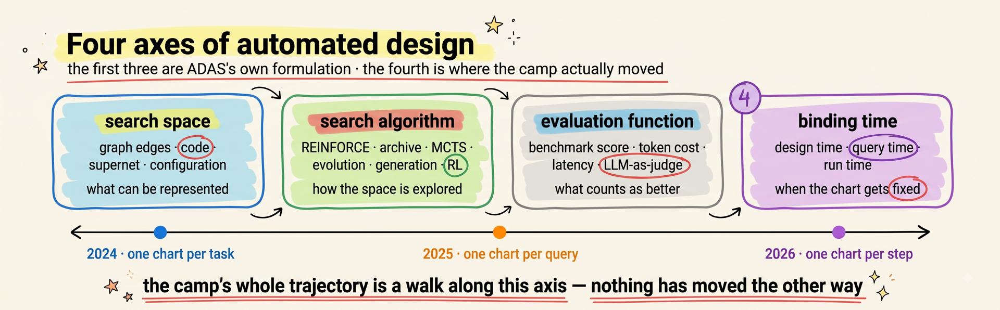
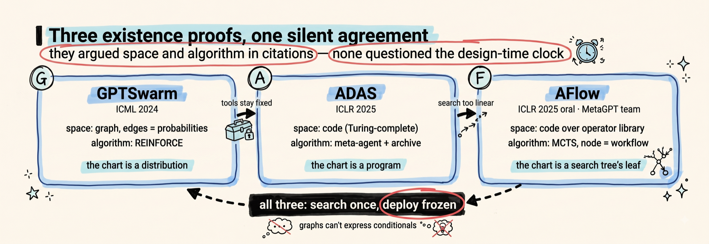
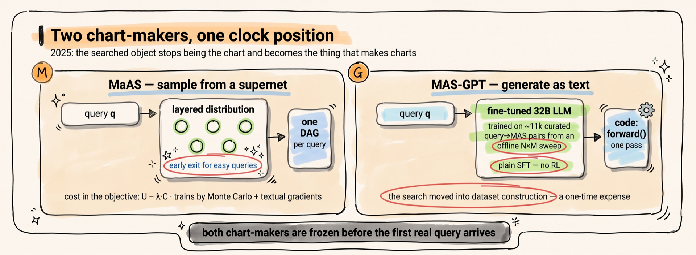
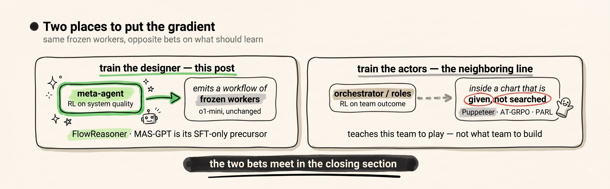
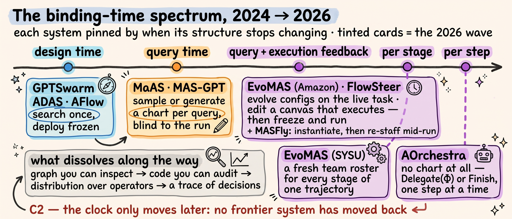
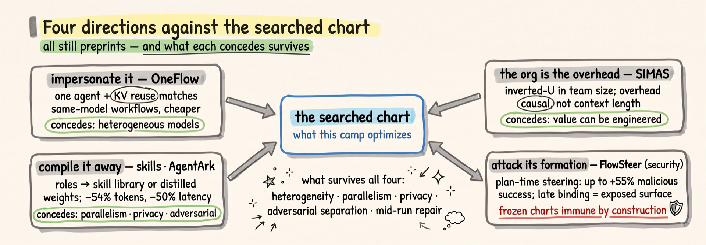
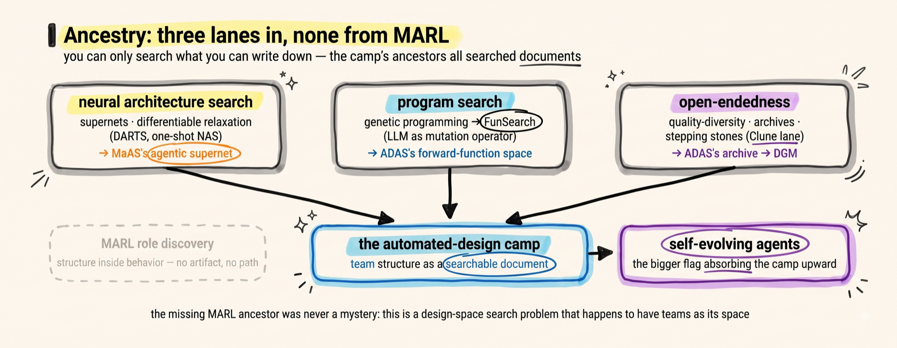

# Can You Search for an Org Chart?

> *One camp of the LLM multi-agent world holds that the org chart — which agents exist, who talks to whom, in what order — is not something you write but something you search for, with every model weight frozen. This post maps that camp from its 2024 existence proofs to 2026, when the chart it was searching for began to dissolve: built per query, then per stage of a task, then never built at all — while the searchers themselves started being trained. A search problem, quietly turning into a training problem.*

On July 6, 2026, in a poster hall at ICML, a system called AOrchestra was presented by FoundationAgents — the research group behind MetaGPT, the defining hand-written multi-agent pipeline of the LLM era, and behind AFlow, the ICLR 2025 oral that searched workflow space by Monte Carlo tree search (MCTS). Six authors appear on both the AFlow and AOrchestra papers. AOrchestra's design contains no workflow. There is no graph, no pipeline, no chart of any kind drawn before the task starts: an orchestrator holds a four-part recipe — instruction, context, tools, model — and cooks up each specialist agent on demand, mid-task, one delegation at a time.

The team that wrote the era's defining hand-written org chart, then built its best-known org-chart search, now ships a system in which no org chart is ever drawn. That arc — written, then searched, then gone — is the subject of this post.

<div style="display:flex;flex-wrap:wrap;gap:10px;margin:1.3em 0 .4em"><div style="flex:1 1 150px;min-width:150px;background:#F5F5F7;border:1px solid #E2E2E7;border-radius:14px;padding:12px 14px;text-align:center"><div style="font-size:23px;font-weight:800;color:#1D1D1F;line-height:1.1">6–45%</div><div style="font-size:11px;color:#6E6E73;margin-top:5px;line-height:1.4">of existing systems' inference cost — MaAS, ICML'25 oral</div></div><div style="flex:1 1 150px;min-width:150px;background:#F5F5F7;border:1px solid #E2E2E7;border-radius:14px;padding:12px 14px;text-align:center"><div style="font-size:23px;font-weight:800;color:#1D1D1F;line-height:1.1">4.55%</div><div style="font-size:11px;color:#6E6E73;margin-top:5px;line-height:1.4">of GPT-4o's cost, where a smaller model matches it on a coding benchmark — AFlow</div></div><div style="flex:1 1 150px;min-width:150px;background:#F5F5F7;border:1px solid #E2E2E7;border-radius:14px;padding:12px 14px;text-align:center"><div style="font-size:23px;font-weight:800;color:#1F7A42;line-height:1.1">+10.52%</div><div style="font-size:11px;color:#6E6E73;margin-top:5px;line-height:1.4">over o1-mini, by a 14B model that designs the team — FlowReasoner</div></div><div style="flex:1 1 150px;min-width:150px;background:#F5F5F7;border:1px solid #E2E2E7;border-radius:14px;padding:12px 14px;text-align:center"><div style="font-size:23px;font-weight:800;color:#5A3FAE;line-height:1.1">66→80</div><div style="font-size:11px;color:#6E6E73;margin-top:5px;line-height:1.4">GAIA pass@1, with no workflow drawn at all — AOrchestra, ICML'26</div></div><div style="flex:1 1 150px;min-width:150px;background:#F5F5F7;border:1px solid #E2E2E7;border-radius:14px;padding:12px 14px;text-align:center"><div style="font-size:23px;font-weight:800;color:#D70015;line-height:1.1">$0.82 vs $2.34</div><div style="font-size:11px;color:#6E6E73;margin-top:5px;line-height:1.4">one agent re-using its own cache vs the searched workflow, MATH — the counter-camp's exhibit, OneFlow</div></div></div>
<div style="font-size:11.5px;color:#86868B;margin:0 2px 1em">Sources: MaAS, AFlow, FlowReasoner, AOrchestra, OneFlow — full citations in the references.</div>

The camp behind that arc has, in two years, produced two ICML orals and an ICLR oral — and it sits oddly in the multi-agent literature. Its central problem, searching the team's topology as a designed artifact, has no real ancestor in multi-agent reinforcement learning, the field that spent a decade on how teams learn; it arrived from somewhere else entirely, and a later section traces where. This post maps the automated-design camp on its own terms — what it searches, how the search operators evolved, why the 2026 systems are dismantling the very artifact the camp was founded to optimize, and why the road ends somewhere the camp's founders did not advertise: at training.

The route: the formal seed first, then the three stages in order, the steelman, a stock-take of where the camp has and hasn't been measured, the ancestry, and a closing that scores the three claims.

---

## 1 · The problem, formally: three axes and a clock

The cleanest formal statement of what this camp does was written by the camp itself. ADAS — Automated Design of Agentic Systems, the ICLR 2025 paper whose title named the field — states it as a one-sentence formulation: "using a search algorithm to discover agentic systems across a search space that optimize an evaluation function." Three named components, each a design axis: the **search space** ("defines which agentic systems can be represented and thus discovered"), the **search algorithm** ("defines how ADAS algorithms explore the search space"), and the **evaluation function** — performance, cost, latency, safety.

AFlow, from the MetaGPT team, wrote the same statement as an optimization problem, and its notation is worth adopting for the whole post:

$$
W^{*} = \arg\max_{W \in \mathcal{S}}\ G(W, T)
$$

$W$ is a candidate workflow — in AFlow's definition, a set of LLM-invoking nodes (each carrying a model, a prompt, a temperature, an output format) wired together by edges, with code as the edge representation; $\mathcal{S}$ is the search space of all representable workflows; $T$ is the task; $G$ is the evaluation function — run the workflow, score the result. The org chart is $W$. The camp's founding claim is that $W^{*}$ found by machine beats $W$ written by hand.

But the equation hides the distinction that, in hindsight, organizes the camp's entire development. Ask: **when is $W$ fixed?** ADAS's three axes say what can be searched and how; they do not say when the search happens relative to the work. Call that fourth axis the **binding time** of the structure. The framing is mine, not any paper's — ADAS's formulation names the space, the algorithm, and the evaluator, and stops there. It is the axis the camp actually moved along:

$$
W^{*} = \arg\max_{W}\ G(W,T)
\quad\longrightarrow\quad
\mathbb{P}^{*}(W \mid q)
\quad\longrightarrow\quad
\pi^{*}(W_t \mid s_t)
$$

Read left to right: first the chart is a frozen artifact, searched once against a validation set and deployed (GPTSwarm, ADAS, AFlow — 2024); then it is a conditional distribution, sampled fresh for every incoming query (MaAS, MAS-GPT — 2025); finally it is a policy $\pi$, emitting structure step by step as the task's state $s_t$ evolves (the 2026 wave). Each arrow binds the structure later. Nothing in the camp's history moves the other way.

Reading this history, I stake three checkable claims:

- **C1 (search beats the hand).** On matched tasks and budgets, machine-searched team structures outperform hand-designed pipelines of comparable scaffolding. This is the camp's founding claim, and its headline numbers — AFlow's 5.7% average over state-of-the-art baselines, MaAS's gains at a fraction of the cost — are its evidence. It dies if tuned hand pipelines keep winning at matched budgets outside the originating labs.
- **C2 (the clock only moves later).** Every successful successor system in this camp binds structure later than its predecessor — design time, to query time, to run time — and no frontier system has moved back. It dies if a 2026-or-later state-of-the-art system returns to a frozen, design-time workflow.
- **C3 (search grows training).** Search operators recur — REINFORCE, archives, MCTS, evolution all reappear in 2026 — but each recurrence carries more trained machinery, and the trajectory points at a trained designer. This is the post's one forward-looking claim, and the weakest-supported: training-free evolution and retrieval are still at the frontier today (the closing keeps this honest). It dies if, across the next two ICML/ICLR cycles, the best automated-design system on GAIA's 165-task validation split or the SWE-bench Verified leaderboard has no trained constructor.

<details class="tw"><summary>🔍 Terms that recur all through this post — workflow, operator, meta-agent, orchestrator</summary>

- **Workflow / agentic workflow** — the org chart as an executable object: which agent-steps exist, what each one's prompt and model is, who feeds whom. AFlow's $W$.
- **Operator** — a reusable building block of workflows: Generate, Review-and-Revise, Ensemble, Test, Programmer… Most systems search over compositions of operators rather than raw prompts. (§1's *search operators* — REINFORCE, MCTS, evolution — are a different, algorithm-side use of the same word; unqualified, 'operator' here always means the workflow building block.)
- **Meta-agent** — an LLM whose *output* is an agent system (as code, config, or graph). The designer, as opposed to the workers who execute the task.
- **Orchestrator** — the runtime coordinator that decides who acts next. In this camp's 2026 systems the orchestrator increasingly *is* the structure — the chart exists only as its decisions.
- **Frozen weights** — throughout this post, the worker models' parameters never change. Everything that is "learned" or "searched" lives in the structure around them — until the final sections, where that boundary is exactly what dissolves.

</details>

<figure style="margin:1.6em 0;text-align:center">

<figcaption style="font-size:13px;color:#8a929c;margin-top:.4em">The problem's four axes. ADAS formalized the first three — space, algorithm, evaluator. The fourth, binding time (when the structure gets fixed relative to the work), is this post's organizing lens: the camp's history is a steady move rightward along the timeline below, from charts frozen at design time to charts that exist only step by step. The evaluator card mixes ADAS's axis examples with common practice — the paper's own list ends at safety; LLM-as-judge is the field's frequent stand-in.</figcaption>
</figure>

---
## 2 · Stage I — The existence proofs (2024–early 2025)

**The problem.** The hand-written chart's weakness was becoming common knowledge, and a 2025 failure taxonomy — MAST, which annotated over 1,600 execution traces across seven frameworks — later put numbers on it: agents largely obey the roles written for them (role disobedience is 1.5% of failures, the second-rarest mode), yet the systems fail anyway, and the largest failure category is *system design itself*, at 44.2%. The engineering question was blunt: if the chart is the weak part, can a machine find a better one? Three papers, arriving within eight months of each other, answered yes three different ways. They disagreed about the search space and the search algorithm; they agreed, silently, about the clock — all three bind the structure at design time, before any real query arrives. I compress them here because this post's center of gravity is what came after; but the three-way disagreement about *what kind of object an org chart is* set the menu for everything downstream.

**GPTSwarm (ICML 2024 oral): the chart is a graph, and the graph is a distribution.** Nodes are agent operations, edges are who-talks-to-whom, and each potential edge carries a probability — a parameter vector $\theta$ defines a distribution $D_{\theta}$ over graphs, tuned by REINFORCE (the classic policy-gradient estimator — the $\nabla\log p$ update GRPO later descends from) against measured task utility:

$$
\theta^{*} = \arg\max_{\theta \in \Theta}\ \mathbb{E}_{G \sim D_{\theta}}\left[ u_{\tau}(G) \right]
$$

$$
\nabla_{\theta} \mathbb{E}_{G \sim D_{\theta}}\left[ u_{\tau}(G) \right] \approx \frac{1}{M} \sum_{i=1}^{M} \hat{u}_{\tau}(G_i) \nabla_{\theta} \log p_{\theta}(G_i)
$$

— $G$ a candidate communication graph (GPTSwarm's own notation; not the evaluator the formal section called $G$ — the evaluator here is $u$), $u_{\tau}(G)$ its measured utility on task $\tau$, $p_{\theta}(G_i)$ the probability of drawing graph $G_i$, $M$ the number of graphs sampled per round: draw $M$ team shapes, score each, push probability mass toward the shapes that worked. The existence proof in its purest form — team topology as a trained quantity. (A note that holds for the whole post: each system's equations use *that paper's* symbols, at most lightly normalized — decorated variants like $G'$ or the bold indicator $\mathbf{1}$ appear here undecorated, long reward subscripts in short form, nothing meaning-bearing touched — so a letter can change meaning between sections — $G$, $\tau$, $\lambda$, $K$, $T$ each do; the local gloss is always the authority.)

**ADAS (ICLR 2025): the chart is code.** A graph can only express what its node and edge vocabulary allows. ADAS's move is to drop the vocabulary restriction entirely: a *meta-agent* writes candidate agent systems as Python programs — a "forward" function inside a roughly hundred-line framework, a practice the paper credits to FunSearch (DeepMind's LLM-driven program search) — and since programming languages are Turing-complete, the paper argues, the search space now contains any possible agentic system. The search algorithm is an archive loop: the meta-agent reads everything discovered so far, proposes a novel design in prose, implements it in code, evaluates it, and adds the result — win or lose — back to the archive that conditions the next proposal. No gradient anywhere; the "optimizer" is an LLM reading its own history. It works: against the best hand-designed agents of the day, discovered systems improved DROP reading comprehension by 13.6 F1 and MGSM math accuracy by 14.4 points, and the discovered designs transferred across domains and models.

**AFlow (ICLR 2025 oral, the MetaGPT team): the chart is code, but the search needs structure.** ADAS's archive loop is an almost unstructured walk. AFlow — from the same group that hand-wrote MetaGPT's SOP (standard-operating-procedure) pipeline — keeps the code representation but mounts a Monte Carlo tree search over it: each tree node is a *complete workflow*, expansion is an LLM optimizer rewriting the selected workflow informed by accumulated experience, and selection mixes uniform exploration with a softmax over scores:

$$
P_{\mathrm{mixed}}(i) = \lambda \cdot \frac{1}{n} + (1-\lambda) \cdot \frac{\exp(\alpha (s_i - s_{\max}))}{\sum_{j=1}^{n} \exp(\alpha (s_j - s_{\max}))}
$$

— $n$ candidate workflows so far, $s_i$ workflow $i$'s score, $s_{\max}$ the best score, $\alpha$ (0.4) sharpening the preference for winners, $\lambda$ (0.2) reserving probability for uniform exploration so early losers still get revisited. Nodes assemble from a seven-operator library — Generate, Format, Review-and-Revise, Ensemble, Test, Programmer, and a Custom fallback — rather than raw prompts. The headline: a 5.7% average improvement over state-of-the-art baselines across six benchmarks, and — the number that made the camp's economic argument for it — workflows that let a smaller model match GPT-4o *on specific tasks* at 4.55% of its inference cost — and beat it, per the paper's own cost table, at 5.92–8.05%.

The three papers reviewed each other in public, and the criticism thread is the clearest record of what each thought the object was. ADAS on GPTSwarm: reinforcement learning over node connections optimizes the wiring, but "many components like tool usage remain fixed" — the graph vocabulary is too small. AFlow on GPTSwarm: GPTSwarm "struggles to represent workflows with conditional states" — no if-branches in an edge list. AFlow on ADAS: an almost-linear heuristic search is too inefficient to find good workflows. Space, then algorithm — precisely ADAS's first two axes, argued in citations. Nobody argued about the clock. All three systems search once, against a validation split, and deploy the winner frozen: one chart per task distribution, however many thousands of queries it will face. That assumption is what 2025 broke.

<figure style="margin:1.6em 0;text-align:center">

<figcaption style="font-size:13px;color:#8a929c;margin-top:.4em">The 2024–25 existence proofs and their criticism thread: each label is the charge that pushed the line to its next design; the shared banner records what none of the three questioned. Blue throughout: searched structure, this post's hue for the camp. The disagreements were about representation and search operator; the design-time clock — one frozen chart per task — went unquestioned by all three.</figcaption>
</figure>

---

## 3 · Stage II — One size fits none: the chart becomes per-query (2025)

**The problem.** A workflow tuned on a math validation set is a math workflow. Run it on an easy query and it burns the full committee's tokens on a two-line problem; run it on a different domain and it is the wrong committee. MaAS's abstract states the indictment of its own predecessors plainly: existing automation seeks "a static, complex, one-size-fits-all system, which, however, fails to dynamically allocate inference resources based on the difficulty and domain of each query." The fix, in both of this stage's systems, is the same move at the formal level — stop searching for a chart, start searching for a *chart-maker*: an object that maps each incoming query to its own structure. The two papers disagree about what that object is.

**MaAS (ICML 2025 oral): the chart-maker is a supernet.** MaAS — Multi-agent Architecture Search, and the name is a deliberate import, which the ancestry section returns to — defines an *agentic supernet*: a layered, probabilistic superposition of architectures. At each of $L$ layers, a distribution $\pi_{\ell}$ picks which operators (an operator here is a composite agent step — its own LLM backbone, prompt, and tools) are active, conditioned on what previous layers chose; a full architecture $\mathcal{G}$ is a sample from the joint:

$$
p(\mathcal{G}) = \prod_{\ell=1}^{L} \prod_{\mathcal{O} \in \mathbb{O}} \pi_{\ell}(\mathcal{O})^{\mathbb{I}_{\mathcal{O} \in \mathcal{V}_{\ell}}}
$$

($\mathbb{O}$ the operator vocabulary, $\mathcal V_\ell$ the operators actually active at layer $\ell$, $\mathbb{I}$ an indicator — read the double product as: an architecture's probability is the product, over layers, of picking exactly its active operators.) What gets optimized is not one architecture but the query-conditional distribution, under an explicit cost term:

$$
\max_{\mathbb{P}(\mathcal{G} \mid q)}\ \mathbb{E}_{(q,a) \sim \mathcal{D},\ \mathcal{G} \sim \mathbb{P}(\mathcal{G} \mid q)} \left[ U(\mathcal{G}; q, a) - \lambda \cdot C(\mathcal{G}; q) \right], \quad \text{s.t.}\ \mathcal{G} \subset \mathcal{A}
$$

— $q, a$ a query and its reference answer drawn from the training set $\mathcal{D}$, $U$ task utility, $C$ token cost, $\lambda$ the exchange rate between them, and the constraint saying every sampled architecture must be a sub-network of the supernet $\mathcal{A}$. The optimized object is the whole conditional distribution $\mathbb{P}(\mathcal{G} \mid q)$ — how does it read the query? A small controller network takes $q$ and emits the per-layer operator probabilities $\pi_{\ell}$ (the $q$ that is missing from the plain $p(\mathcal{G})$ above enters here, through the controller); that controller is the trained object, and it samples architectures per query, with an early-exit operator so easy queries can leave the supernet after one layer — difficulty-adaptive spending is built into the *structure*, not the prompt. Since executing an architecture (API calls, tools) is not differentiable, the update is a Monte Carlo estimate ($\mathcal{L}$ shorthand for the objective above) with what the paper calls cost-aware importance weights:

$$
\nabla_{\boldsymbol{\pi}} \mathcal{L} \approx \frac{1}{K} \sum_{(q,a) \in \mathcal{D}} \sum_{k=1}^{K} \left[ m_k \nabla_{\boldsymbol{\pi}} p(\mathcal{G}_k) \right],
\qquad
m_k = \frac{p(a \mid q, \mathcal{G}_k)}{\sum_i p(a \mid q, \mathcal{G}_i)} - \lambda \cdot \frac{C(\mathcal{G}_k; q)}{\sum_i C(\mathcal{G}_i; q)}
$$

— sample $K$ architectures per query, weight each sample's gradient by its *share* of the group's success minus $\lambda$ times its share of the group's cost: an architecture that answers well and cheaply pulls probability toward itself on both terms. (The same REINFORCE-family estimator GPTSwarm used, upgraded with a baseline of siblings and a price tag — the paper writes the gradient with $\nabla p$ rather than $\nabla\log p$, but it is the score-function idea.) The textual parts — prompts, sampling temperature, node structure (merging, splitting, altering operators) — cannot take even that gradient, so MaAS updates them not by numbers but with *textual gradients*: at each round an LLM reads the operator's failures and writes a critique, which is applied as an edit to the prompt or wiring — a language-model stand-in for a gradient step, run during training. The receipts made the camp's cost argument concrete: 6–45% of the inference cost of existing hand-crafted or automated systems while outperforming them (by 0.54–16.89% in the camera-ready — the arXiv listing's abstract still carries the older 11.82% ceiling, a version-drift trap worth flagging), and against AFlow specifically, comparable accuracy on MATH at 15% of the training cost — $3.38 against $22.50 of search spend.

**MAS-GPT (ICML 2025): the chart-maker is a generator.** The supernet still runs a sampling procedure at query time. MAS-GPT asks: why keep any machinery at all — "reframing it as a generative language task, where the input is a user query and the output is a corresponding MAS." A multi-agent system, in its representation, is literally a Python forward function — "agent prompts are defined as variables, agent inferences are implemented as function calls, and interactions between agents are represented through string concatenation" — so producing an org chart is producing text, and a 32B coder model can be fine-tuned to do it in one inference. The search did not disappear; it moved into the dataset. Offline, the authors run an everything-by-everything sweep — a pool of queries times a pool of over forty base MAS designs, every pair executed and scored — then curate the winners into ~11k consistent query→MAS training pairs (similar queries forced to share a target chart; each chart then LLM-refined and kept only if it re-scores at least as well). One supervised fine-tune later, the marginal cost of a bespoke org chart is one forward pass: "Although training incurs some cost, it is a one-time expense, whereas inference is potentially endless." It generalizes — +3.89% over the second-best method averaged across eight benchmarks with a Llama-3-70B driver, and it holds up across five different driver LLMs, and the generated charts even lift o1-preview by 13.34% on AIME-2024 — with one detail worth registering against this post's third claim: the generator is trained by plain supervised fine-tuning on curated search results. No reinforcement learning anywhere. The trained-designer turn had not happened yet; MAS-GPT is its supervised precursor.

Two different objects, one clock position: the chart is now made per query — but in both systems the chart-maker itself was still built *before* any real query arrived, its knowledge frozen at training time. The supernet's distribution and the generator's weights encode what worked on the training distribution; neither learns anything from the query it is currently serving, and neither can revise a chart once execution starts. Search had moved from the chart to the chart-maker; the next two stages move it again — first into the chart-maker's own training loop, then into the running task.

<figure style="margin:1.6em 0;text-align:center">

<figcaption style="font-size:13px;color:#8a929c;margin-top:.4em">Stage II's two answers to one-size-fits-all, in this post's orange — structure generated per query. MaAS keeps a searchable object (a layered supernet, sampled per query, cost in the objective); MAS-GPT amortizes the whole search into training data and emits the chart as code in one forward pass. Neither learns from the queries it serves.</figcaption>
</figure>

---
## 4 · Stage III — Training the designer: the searcher takes its first gradient (2025)

**The problem.** AFlow's tree search is powerful and blind. Every new task distribution restarts it from near-zero: twenty rounds of expand-execute-score (MCTS's "backpropagation" is score bookkeeping up the tree, not gradient descent), five validation runs per candidate, an LLM optimizer prompted with accumulated experience it will forget when the run ends. The search *procedure* carries no knowledge between problems. The obvious move — obvious in hindsight, at least — is the one deep learning always makes when a hand-designed procedure plateaus: make the procedure itself the thing that learns.

**FlowReasoner (Sea AI Lab, 2025, a preprint)** does precisely this, and it is the hinge of this post's third claim — C3, search grows training. The system keeps AFlow's outer shape: a meta-agent proposes a workflow for the query, executes it, reads the feedback, revises, for a fixed budget of ten iterations. What changed is what the meta-agent *is*. Instead of a frozen prompted LLM, it is a 7B/14B model trained in two phases: first supervised fine-tuning (SFT) on roughly 1,400 reasoning-plus-workflow traces distilled from DeepSeek-R1, teaching the raw format of "reason about the query, then emit a system"; then reinforcement learning — GRPO, the group-relative policy optimization the reader likely knows from R1-style training, which replaces a value network with the mean reward of a group of sampled candidates — against *external execution feedback*, with per-round scores turned into advantages:

$$
\tilde{r}_{j}^{(i)} = k^{j} \cdot \frac{r_{j}^{(i)} - \operatorname{mean}(\mathbf{R})}{\operatorname{std}(\mathbf{R})},
\qquad
\hat{E}_{i} = \sum_{j \geq T} \tilde{r}_{j}^{(i)}
$$

— $r_{j}^{(i)}$ the score candidate $i$ earns in refinement round $j$, normalized against $\mathbf{R}$ — the pool of scores from every round of every candidate sampled for that query, GRPO's group, whose mean is the baseline — and scaled by $k^{j}$ ($k = 1.1$) so later rounds — where the workflow has been refined the most — count more; rounds before a threshold $T$ are dropped; the sum is the advantage the policy gradient sees. (The paper writes this advantage $\hat E_{i,m}$, carrying a token index $m$ that never reappears on the right-hand side; I drop it.) Each round's score, per the method section, combines the proposed system's pass rate, the complexity of its code (measured on the abstract syntax tree), and the diversity of the workflow — the paper's abstract summarizes this triple as "performance, complexity, and efficiency"; I follow the method section's wording, since "efficiency" never appears in the mechanism it describes. The result: FlowReasoner-14B beats o1-mini — the very model working inside its workflows — "by 10.52% accuracy across three benchmarks" (the paper's words), and beats MaAS, its strongest automated-design baseline, by 5 points.

Two asterisks, both from the paper's own tables. The evaluation is code-only — execution feedback needs test cases, so the method's home turf is exactly where verification is cheap; and at 14B, the RL phase adds just +0.39 over supervised fine-tuning alone (81.50 → 81.89). The turn matters more than the delta: for the first time in this lineage, *the search operator itself has a gradient flowing through it*. And note what did **not** change — the trained searcher still searches. Ten iterations of propose-execute-revise happen for every query at inference; training made the proposals better, not unnecessary. That is a real cost the headline accuracy does not show: FlowReasoner pays a per-query search loop that AFlow's frozen deployed chart does not, buying adaptivity with inference-time compute. Search did not disappear into the weights; it moved its knowledge there and kept its loop.

The vocabulary gets slippery here, so one boundary. FlowReasoner trains the **designer** — the model whose output is a *system*. It does not train the workers inside that system; o1-mini stays frozen. There is a neighboring 2025–26 literature that does the complement: train the **actors** — the orchestrator that picks who speaks next (Puppeteer), the role-conditioned policies optimized with per-role baselines (AT-GRPO and its relatives), the frontier-lab version that trains orchestration into a flagship model's weights over frozen sub-agents (Kimi K2.5's PARL, on the vendor's own report). That literature is its own line of work, and the two make opposite bets: training the actors teaches this team to play well; training the designer teaches a model what teams are worth building. This post stays on the designer side of the line; the closing section returns to where the two bets meet.

<figure style="margin:1.6em 0;text-align:center">

<figcaption style="font-size:13px;color:#8a929c;margin-top:.4em">The designer/actor boundary, drawn once. Green — this post's hue for trained components — marks where the gradient goes. FlowReasoner trains the model that designs systems; the neighboring RL literature trains the agents acting inside a given design. Frozen workers in both.</figcaption>
</figure>

---

## 5 · Stage IV — The chart at run time: 2026 dismantles the artifact

**The problem.** A chart made per query is still made *blind*. At the moment the supernet samples or the generator writes, no part of the task has run: nothing is known about which sub-problems will turn out hard, which tools will fail, which intermediate result will change what the rest of the job needs. For a two-line math query that hardly matters. For the tasks 2026 systems actually target — GAIA's tool-using research problems, SWE-bench's repository surgery, long-horizon web work — the mid-task state is most of the information. Five systems, all from a four-month stretch of early 2026, read in order of how late they fix the structure, form a spectrum; by the far end, there is no longer a chart to point at.

<details class="tw"><summary>🔍 Name collisions in this wave — two EvoMAS, four FlowSteers</summary>

- **EvoMAS** is two unrelated 2026 papers: the Amazon one (evolutionary *generation*, config space — ICML 2026, discussed first below) and a Sun Yat-Sen one (*execution-time* workflows, discussed fourth). They share nothing but the name; citations in this post's references carry both arXiv ids.
- **FlowSteer** is at least four unrelated 2026 papers. The one in this section is the workflow-design system (reinforced canvas editing); a same-named security paper — workflow *steering as an attack* — appears in the steelman section; two others are computer-vision methods and do not appear here. The workflow-design one also changed its title between arXiv versions; the reference pins the id.
- The near-miss family is worse than the exact collisions: **AOrchestra** (this section) and **AgentOrchestra** (a hand-built orchestration framework, Uno-Orchestra's main opponent in the master table) are one edit apart and unrelated.
- The only practical consequence: match these papers by arXiv id, not by name.

</details>

**Per query, evolved against the live task — EvoMAS, the Amazon one (ICML 2026).** The chart here is a *configuration*, not code: a declarative tuple — communication graph, plus each agent's backbone, prompt, and tools — run by a fixed interpreter. The paper's argument for configs over code is robustness, and it brings receipts: generated-code systems fail to even execute at startling rates (MAS-GPT, in their measurement, executes on 71.5% of one reasoning benchmark and 1.2% of SWE-bench Lite), while EvoMAS configurations execute at 96.8–98.9% across five benchmarks. The search is evolutionary — select promising configs from a pool, mutate one component at a time conditioned on execution feedback, and cross over agent-level attributes while each offspring inherits one parent's topology whole — under a reward with the by-now-standard shape, $R(q, C) = \mathrm{Metrics}(q, C) - \beta \cdot \mathrm{Cost}(C)$, with one twist that moves the clock: the evolution happens *per incoming task, at test time*, candidates actually executed against the live query, scored by an LLM judge because no ground truth is available at deployment. Structure search as test-time compute. Note what changed along with the clock: the earlier stages scored candidates against verifiable signals — held-out answers, unit tests, execution feedback — and a system evolving on a live query has no answer key to check against. Selection pressure applied against a judge is where reward hacking lives; that exposure is the price of the last notch, and the verifier-scored stages did not carry it. The economics still amortize — the config pool stabilizes after 300–400 queries, after which the system mostly retrieves and runs — and the results were enough for ICML 2026: 79.1% on SWE-bench Verified (backbone Claude-4.5-Sonnet), which the paper reports as edging the public leaderboard's top (78.8%) at the time of writing, and — in a separate matched-budget comparison — 79.1 against a looped single agent's 71.4 at the same 31M tokens.

**Per query, designed in dialogue with execution — FlowSteer (preprint).** Here the designer works like an engineer at a whiteboard that runs. A policy model (an 8B LLM with LoRA adapters) builds the workflow *one atomic edit per turn* — add a node, wire an edge, set a prompt — on a "workflow canvas" that executes and type-checks each edit and returns "success status, failure reasons, and repair suggestions" before the next move. Training is GRPO with two guards: a token mask that keeps policy gradients off the canvas's feedback tokens (the environment should not be reinforced, only the policy's own choices), and a gated reward,

$$
R(\tau) = -1 + R_{\mathrm{div}}(\tau) + \mathbb{I}\{R_{\mathrm{div}}(\tau) = 1\} \cdot R_{\mathrm{ans}}(\tau)
$$

— $\tau$ here the canvas-editing episode, $R_{\mathrm{div}}$/$R_{\mathrm{ans}}$ shortening the paper's $R_{\mathrm{diversity}}$/$R_{\mathrm{answer}}$: the structural checks must pass in full before the answer reward unlocks, "avoiding shortcuts like skipping workflows to answer directly": without the gate, the cheapest policy is to ignore the canvas and just answer, and the designer collapses into a chatbot. Binding time: later than MaAS — the design loop sees real execution — but the finished graph is then frozen and run once for the final answer. Design and execution interleave; they do not merge.

**Per query, then repaired mid-run — MAS-on-the-Fly (preprint).** The Tsinghua–Ant system (MASFly) is the wave's training-free member, and its two halves sit on opposite sides of the clock. Before execution: retrieve the top-K similar standard-operating-procedures from a library of past successes (scored by a weighted cosine over query and LLM-written need-analysis embeddings) and have an LLM instantiate a bespoke agent roster and communication graph from them. During execution: a **Watcher** agent supervises both the agents' messages and their environment interactions against a pool of past failure post-mortems, and intervenes — either coaching a faltering agent with retrieved experience, or the structural act: *removing a critically flawed agent and instantiating a replacement mid-run*. The re-staffing is what earns its place on this spectrum, with a bonus result on the security side: under a prompt attack that forces the coding agent to emit empty functions, most baselines degrade substantially; MASFly holds performance because the Watcher detects the compromised agent and swaps it out. On TravelPlanner it reaches 61.7% success, against a best baseline of 32.2%.

**Per stage of one task — EvoMAS, the Sun Yat-Sen one (preprint).** The most explicit formalization of run-time structure: workflow construction as a *meta-level Markov decision process along a single task trajectory*. The state is a structured text summary of the task so far — objective, active subtask, completed subtasks with their artifacts, feedback — maintained by a planner-evaluator-updater loop; the meta-action at each stage is *an entire stage workflow* $\mathcal G_t$, assembled by a trained adapter that scores a fixed pool of candidate agents against the current state and samples a layered roster:

$$
a_t^{m} \equiv \mathcal{G}_t = (\mathcal{V}_t, \mathcal{E}_t),
\qquad
\nabla_{\Theta} \mathcal{J}(\Theta) \approx \mathbb{E}\left[ \sum_{t=1}^{T} U(\tau) \nabla_{\Theta} \log P_{\Theta}(\mathcal{G}_t \mid \tilde{s}_t) \right]
$$

— $\tilde s_t$ the textual task state, $\tau$ the trajectory over horizon $T$, $\Theta$ the trained adapter's parameters, $U(\tau)$ terminal task success, and the gradient is plain REINFORCE: the same estimator GPTSwarm used on edge probabilities in 2024, now applied to *which team takes the next stage* — the wheel comes full circle with the clock moved two notches. Process rewards from the evaluator are deliberately reserved for the very-sparse regime, where they produce the paper's most interesting result: first non-zero success on GAIA Level 3 — on a four-task validation split — where terminal-only training stays at zero. Two caveats, both from the paper itself: the agent pool is fixed and the layer wiring is always fully-connected — only the roster changes — and the headline gaps (65.0 average against 34.8 for the best prior automated systems) rest on a held-out pool of about 43 tasks in all — roughly nine GAIA Level-1 and fourteen Level-2, ten HLE, ten DeepResearcher, with the four-task diagnostic splits (the Level-3 result above among them) sitting outside that pool — run on GPT-4o-mini, the weakest worker model anywhere on this spectrum.

**Per step, no chart at all — AOrchestra (ICML 2026).** The endpoint, and the opening image. The FoundationAgents system deletes the workflow as an object: an orchestrator whose entire action space is two moves,

$$
\mathcal{A}_{\mathrm{AOrchestra}} = \{ \mathrm{Delegate}(\Phi), \mathrm{Finish}(y) \},
\qquad
\max_{\pi}\ \mathbb{E}\left[ \mathbb{I}\{\mathrm{Success}(G)\} - \lambda \cdot \mathrm{Cost}(\tau) \right]
$$

— $G$ the user's task goal, $\tau$ the full delegation trajectory, $\lambda$ the same cost exchange rate MaAS used — at each step, the orchestrator either delegates to a sub-agent it instantiates on the spot from the four-tuple $\Phi = (I, C, T, M)$ — instruction, curated context, tools, model, the paper's "compositional recipe for capabilities" — or finishes with an answer. The orchestrator never touches the environment itself; it only decides, again and again, what specialist the next piece of work deserves and builds that specialist to order. There is no graph to draw because nothing persists between delegations except the orchestrator's own evolving context. (The paper's curation machinery — and its ablation showing curated context beating both no-context and full-context — is about the $C$ field handed *down* to each sub-agent; how the orchestrator's own trajectory is compacted over a long run it says little about.) The chart has fully dissolved into a policy — exactly the right-hand end of the formal section's arrow, $\pi(W_t \mid s_t)$, with $W_t$ now a single delegation. On GAIA it lifts pass@1 from the best baseline framework's 66.06 to 80.00; the paper's cross-benchmark headline (a 16.28% relative improvement with Gemini-3-Flash) is its own summary framing, quoted here as such. The three benchmarks are not sampled alike, and it changes how the numbers read: GAIA is the full 165-task validation split, but Terminal-Bench 2.0 is a random 70 of its 89 tasks and SWE-bench Verified a random 100 of 500 — subsampled, the paper says plainly, "due to cost reasons" — and on that SWE-bench slice AOrchestra's 82.00 in fact trails mini-SWE-agent — the minimal single-agent baseline — at 84.00 (a DeepSeek-V3.2 run; best-vs-best across backbones); the cross-benchmark win is carried by GAIA and Terminal-Bench. And that headline number is *training-free* — which makes the paper's two learning add-ons the most instructive part of it. Swap the orchestrator for a weak 8B model and GAIA falls to 56.97; fine-tuning that orchestrator recovers 11.51 points, to 68.48 — real evidence that the orchestration policy is learnable, and still twelve points short of the prompted Gemini-3-Flash orchestrator it was meant to catch. The in-context loop tells the same story from the cost side: on a mixed-model configuration it adds 3.03 points while cutting average cost 18.5%, off a 72.12 baseline rather than the 80.00 one. The designer can be trained; on this paper's own numbers, training it has not yet beaten prompting it.

Two things move rightward across this spectrum, and it is worth separating them: *when* the structure stops changing, and *how much of the run* informs the choice. EvoMAS-Amazon and FlowSteer move mainly the second — both fix a complete structure before the final answer runs, but let execution feedback shape it first; MASFly, the Sun Yat-Sen EvoMAS, and AOrchestra move the first, actually constructing or re-staffing after the task is underway. The spectrum figure's header calls the axis "when structure stops changing" for brevity; read it as the pair.

The spectrum, laid end to end: evolved per query against the live task; designed per query in dialogue with execution; instantiated per query then re-staffed mid-run; reassembled per stage; dissolved per step. C2 — the clock only moves later — reads cleanly across these systems, and each notch was claimed within months of the last. Two dents in it. First, later binding is also the *publishable* next step — "we re-froze the chart and it worked" does not headline ICML — so the published record would drift rightward even if matched-budget performance were flat; the record that supports C2 is the record novelty bias produces, which is why C2's falsifier is stated over SOTA systems, not papers. Second, design-time search did not stop: Google and Cambridge's MASS kept optimizing prompts-and-topologies offline, concurrent with the query-time turn, and reported wins over ADAS (its AFlow comparison is marked reference-only) — and it cleared peer review at ICLR 2026, in the same cycle as the run-time wave. And run-time binding is not even new — 2023's hand-policed orchestrators (AutoGen's speaker selection, HuggingGPT's controller) already chose sub-agents step by step; the 2024 search wave arose partly because those were unreliable, so the field's real shape is dynamic → searched → dynamic-again, with trained policies and execution feedback the second time. C2 is a claim about the search camp's own successors, not a law of the field.

What did the camp give up along the way? The artifact. GPTSwarm ended with an inspectable graph; AFlow with a code file you could read, version, and audit; MaAS with at least a distribution over named operators. AOrchestra ends with a trace — what the orchestrator happened to decide, this time. (Two of the run-time systems quietly re-precipitate the artifact at deployment scale: EvoMAS-Amazon's config pool stabilizes after 300–400 queries into mostly retrieval, and MASFly serves from an SOP library — a cache of frozen structures with a lookup key, which is an org chart reborn under another name.) The artifact was not the only thing traded, either. This camp's founding argument was economic — AFlow's 4.55%, MaAS's 6–45% — and moving construction into the query puts the search itself on the user's critical path. EvoMAS-Amazon states the trade in its own conclusion: it is "trading inference-time computation for stronger results," and "targets settings where accuracy is prioritized over latency." The line that began by making org charts cheap now buys quality with wall-clock time.

<figure style="margin:1.6em 0;text-align:center">

<figcaption style="font-size:13px;color:#8a929c;margin-top:.4em">The full spectrum. Blue: design-time search (2024's frozen charts). Orange: query-time structure (2025). Purple — this post's hue for the run-time wave — from evolving configurations against the live task to AOrchestra, where structure exists only as a stream of delegation decisions. The gray summary card tracks the casualty: each step rightward trades away artifact legibility. MASFly sits pinned at its binding moment — instantiate, then re-staff mid-run — with the later edits noted on its card.</figcaption>
</figure>

The camp in one table — the master card this post's argument rests on, with its four nearest non-camp neighbors appended in the last rows for triangulation (MASS, the peer-reviewed design-time counter-example, stays in the spectrum section's concession rather than taking a row):

| system | year · venue | search space | search operator | binding time | what it showed | what it left open |
|---|---|---|---|---|---|---|
| GPTSwarm | ICML 2024 oral | graph, edges = probabilities | REINFORCE | design time | topology is trainable at all | vocabulary too small (tools fixed) |
| ADAS | ICLR 2025 | code (Turing-complete) | meta-agent + archive | design time | code search finds novel systems | search nearly unstructured |
| AFlow | ICLR 2025 oral | code over operators | MCTS, node = workflow | design time | 5.7% avg over SOTA; small models match GPT-4o at 4.55% of its cost | one frozen chart per task |
| MaAS | ICML 2025 oral | agentic supernet | MC gradient + textual gradients | query time | per-query structure at 6–45% of the cost | maker frozen before deployment |
| MAS-GPT | ICML 2025 | code, generated | offline sweep → SFT generator | query time | the chart as one forward pass | SFT only; blind to the run |
| FlowReasoner | 2025 preprint | code over operators | trained reasoner + iterative refine (RL) | query time † | the searcher itself takes a gradient | code-only; +0.39 from RL at 14B |
| EvoMAS (Amazon) | ICML 2026 | declarative configs | evolution on the live task | query + execution feedback | configs execute where generated code fails | LLM-judge as reward proxy |
| FlowSteer | 2026 preprint | canvas graph | RL, one atomic edit per turn | query + execution feedback | design in dialogue with execution | frozen at handoff; error propagation (the design's early errors compound downstream) |
| MASFly | 2026 preprint | SOP library → roster | retrieval + instantiate; Watcher repairs | query, re-staffed mid-run | mid-run agent replacement works | heuristic triggers; training-free ceiling |
| EvoMAS (SYSU) | 2026 preprint | layered roster from fixed pool | REINFORCE over stage workflows | per stage | structure as a mid-task decision | fixed pool; ≈43 held-out tasks in all |
| AOrchestra | ICML 2026 | none — agents as 4-tuples | orchestrator policy, prompted; SFT / ICL (in-context learning) as add-ons | per step | the chart dissolved into delegation | no artifact left to audit |
| Uno-Orchestra | 2026 preprint | none — scheduling-policy weights (decompose? × how deep × which worker, over a fixed pool of nine commercial worker models, each admissible for a sparse set of primitives) | verifier-gated SFT + "Agentic-GRPO" (gradient through schedule → execution → outcome) | per step, trained | a 7B scheduler (Qwen2.5-7B) matches expensive hand-built orchestration: 77.0% macro pass@1 (per-benchmark average) over 13 benchmarks, claimed +16% over the strongest workflow baseline at an order of magnitude lower per-query cost | fixed worker pool; no artifact to audit; loses two of three head-to-heads to AgentOrchestra, a hand-built orchestration framework — no relation to AOrchestra (82.0/57.2/81.8 vs 83.4/54.2/82.4 on GAIA/TB/SWE-V); ⚠️ Terminal-Bench version unstated |
| AgentNet | 2025 preprint | weighted DAG topology + a retrieval memory per agent | decentralized: each agent adjusts its own connectivity and routing from experience; no orchestrator anywhere | run time, continually | structure and knowledge both evolve in flight, with no central designer at all | the structure never freezes and no one place holds it — nothing to audit (tasks enter via capability-matched entry-agent selection) |
| ReCreate | 2026 preprint | one agent's scaffold — role, process, tools, memory (single-agent, not a MAS) | agent-as-optimizer: a stronger LLM reads execution traces, routes edits to the right component, aggregates instance edits into domain patterns | design time (~20 dev tasks, two rounds, then frozen) | experience-driven editing beats score-only search: 66.15% avg over 13 benchmarks vs 60.62% for the runner-up, with ADAS and AgentSquare (a modular agent-search baseline) among the beaten baselines | single-agent only — the team version is the next row |
| Meta-Team | 2026 preprint | teammate profiles + roster + shared charter — all text; explicitly not the communication graph | post-task collective retrospection → distilled experience (evolved offline on held-out training tasks; frozen at test) | design time | team-level experience beats the single agent and hand-built MAS on long-horizon work: SWE-bench Pro (Ansible subset) 53.9 vs 44.7 / 43.4 / 39.0 for single-agent / MASFly / AgentSquare; best-in-column on all nine columns of its six-benchmark suite — LOCA-Bench-val 87.9 vs 82.9 for a re-implemented AOrchestra, GAIA-val 77.3 vs 74.7 for the hand-built MAS (backbone Claude Sonnet 4.6 throughout) | the communication graph is untouched by design — though the roster itself evolves (roles added and removed mid-evolution); Pro scored on per-repo subsets, not the full set |

† FlowReasoner sits at query time, not with the runtime wave: its per-query refinement loop runs AFlow-style against validation scoring to *produce* a system, which is then executed — the loop is design, not mid-task adaptation. FlowSteer's canvas, by contrast, returns execution feedback on each atomic edit. Both freeze before the final answer; only the systems below the runtime line keep constructing after it starts. A ⚠️ in any cell marks something the sources do not settle; the cell says what.

The appended rows complete a compass the camp sits inside. Every route on it optimizes *from data* — what differs is the object the optimization lands in. AOrchestra's headline run is training-free: it validates a fixed meta-mechanism, and what its data tunes (so far at a loss, as the ablation above showed) is the orchestrator's weights. Uno-Orchestra puts the data straight into a scheduling policy's weights — no structural object exists at any point, and its ledger reads like AOrchestra's: nothing to audit, a fixed worker pool, and a 1–2 split of the head-to-heads with the hand-built orchestrator it set out to replace. AgentNet lets the data move the structure itself, but decentrally and without ever stopping: each agent re-weights its own links and accretes its own retrieval memory as tasks flow — structure everywhere, an artifact nowhere.

ReCreate and Meta-Team are one research group's two steps (Zhejiang–Tencent, same first author, the second paper benchmarking against the first), and together they make the experience-driven alternative precise. ReCreate distills execution traces into edits on a *single* agent's scaffold — role, process, tools, memory — and beats score-only search with them; its stated criticism of the ADAS lineage is that black-box generation relies solely on final performance metrics and discards the evidence of *why* a run failed. Meta-Team then runs that same mechanism per team member and adds the two team-level layers — teammate profiles, and a shared charter whose roster can add and drop roles — while drawing its structural line explicitly: "rather than optimizing a binary communication graph," it "updates agents' teammate profiles." It evolves the org chart's box list and refuses to touch the wiring; and since it outperforms ReCreate on its own benchmarks, the group has in effect run the ablation showing the team layers earn their keep. Against all of this the camp's distinction stands out plainly: it alone lands the optimization in the wiring itself — an explicit, freezable structural artifact. Meta-Team's charter can be diffed too, but it holds no wiring; on this compass, only the camp's object records who connects to whom. What the compass adds is that the alternatives have now each been built, and each pays its own cost in the currency the camp's critics keep on the table: legibility, pool lock-in, wiring left unsearched, or a structure that never sits still long enough to examine.

These reference rows force one more reading. Meta-Team's suite is the cleanest same-conditions comparison on the table: one paper, one backbone, nine columns across six long-horizon benchmarks — and the design-time evolver takes every column, including LOCA-Bench-val 87.9 against 82.9 for a re-implemented AOrchestra, with the communication graph never touched. Terminal-Bench 2.0 points the same way: as of 2026-08-16, its top belongs to the single-agent harness-engineering line — the harness being one model's fixed scaffolding of prompts, tools, and control loop; the between-the-benchmarks section carries the reading and its caveats. C2 is a claim about the camp's own succession — that one-way trajectory remains true — but it describes where the camp went, not where the strongest results live. Design time is not dead; of the dents C2 carries, this is the heaviest, and the same fact joins the scoreboard that keeps C3 a bet. And whether the artifact only this camp still carries is worth its price — that is exactly what the steelman section contests.

---
## 6 · The steelman: maybe there was nothing to search for

The sharpest attack on this camp does not defend hand-written charts. The attack here is more radical: maybe the org chart, hand-written *or* searched, was never load-bearing. A cluster of 2026 results — all preprints still, riding the same publication currents the spectrum section charged the camp with — makes the case from four directions, plus a fifth that needs no paper. Several are single-agent-versus-multi-agent arguments, which is a larger fight than this post; I take the academic versions here because they quantify, and leave the June 2025 industry debate around the same question to [the division-of-labor post](https://www.drshy.xyz/notes/division-of-labor/), which walks it in full.

**Direction one: one agent can impersonate the searched chart — OneFlow.** If a workflow's every agent runs on the *same* base model, then the "team" is one model prompted several ways, and a single multi-turn agent can simulate it while re-using its own KV cache instead of re-reading context from scratch at every hop. The paper's cost accounting is a clean inequality — multi-agent cost scales with each step's full context length, single-agent cost with the *increments*:

$$
C_{\mathrm{multi}} \propto \sum_{t=1}^{T} L_t + \mathrm{gen}_t,
\qquad
C_{\mathrm{single}} \propto \sum_{t=1}^{T} \Delta L_t + \mathrm{gen}_t \leq C_{\mathrm{multi}}
$$

— $L_t$ the full context read at step $t$, $\Delta L_t$ its increment, $gen_t$ the tokens generated — with equality only when agent contexts are disjoint — and for workflows with substantial contextual overlap, "single-LLM execution is asymptotically no worse and often cheaper, while preserving behavior under the conditions above." On AFlow-optimized workflows the dollars are stark: $2.34 → $0.82 on MATH, $1.13 → $0.62 on GSM8K. The scope line matters as much as the claim: the clean result covers *homogeneous* workflows; against heterogeneous ones the paper reports a match but labels it a pilot against "not perfectly optimized" auto-generated baselines, and explicitly concedes the other side — "single-LLM methods cannot capture heterogeneous workflows due to the lack of KV cache sharing across different LLMs." Read strictly: much of what Stage I and II searched for — same-backbone charts, differently prompted — was scaffolding a good single agent could fold into its own context. What survives is the chart whose boxes are genuinely *different models*.

**Direction two: the chart compiles away — skills and distillation.** A single-author UBC technical report makes the compiler argument literally: "a multi-agent system can be compiled into an equivalent single-agent system, trading inter-agent communication for skill selection" — the roles become a skill library one agent switches between, cutting tokens by 54% and latency by 50% on average at similar accuracy. It also maps where compilation *fails*: "when agents require true parallelism (independent sampling), private information, adversarial objectives, or heterogeneous capabilities" — a four-item list of what, on this view, multi-agent structure is actually *for* — and where the compiled form breaks internally: skill selection holds up to a critical library size, then collapses in a measured phase transition (fitted capacity around 84–92 skills for the GPT-4o family), driven by semantic confusability — "adding just one competitor per skill reduces accuracy by 7–30%." AgentArk runs the same argument through training instead of compilation: distill multi-agent debate dynamics into one model's weights — and lands with an honest residue, a single agent improved by 4.8% yet "only slightly worse than the vanilla MAS." The chart's value survives these papers, but diminished: a compile target and a teacher signal, not a runtime necessity.

**Direction three: the org itself is the overhead — SIMAS.** A Fudan study scales homogeneous teams from one to eight agents and finds performance follows an inverted U — rising, peaking at a task- and model-dependent optimum in the middle of the range, then falling — with token cost growing quadratically. The causal control is the interesting part: holding total context length fixed with padding, the degradation persists, so "performance degradation is causally driven by coordination overhead rather than long-context failure." The more boxes the chart has, the more of the budget the chart itself consumes. Scoped, again: single-backbone agents, at most eight, closed-book QA — and the same paper's final finding cuts back the other way: collaboration value "is not automatic but is engineered through specific interaction architectures," which is, read closely, half this camp's founding premise restated by its critics — that structure matters; whether *search* finds it is the half they do not concede.

**Direction four: a late-bound chart is an attack surface.** The 2026 wave's flexibility has a price the wave's own papers do not dwell on. A security paper — also named FlowSteer, no relation to the workflow-designer above — shows that when the workflow is *formed* at plan time from the prompt, the formation step itself can be steered: position a malicious signal on the influential subtask, frame it sycophantically so downstream agents relay it, and malicious task success rises by up to 55% over naive prompting, transferring across MAS setups. Defenses that inspect only the finished workflow give limited protection, because the corruption happened while the chart was being made. A frozen, audited, design-time chart is immune to this *by construction* — binding time, it turns out, is also a security parameter, and the camp has been moving it in the exposed direction. (The paper's own remedy, for what it is worth, is not re-freezing: FlowGuard, an input-side defense, cuts attack success by up to 34% while keeping late binding.)

**The card no paper had to write: revealed preference.** The four directions above are all academic. The hardest one needs no benchmark. Two years after the founding "existence proofs," the deployed agent systems that matter — Anthropic's multi-agent research system, Claude Code's subagent architecture, the shipping deep-research products — run hand-designed, design-time coordination. Public evidence of *searched* structure in production, as of August 2026: none I can find — a claim of absence, held accordingly. If a searched chart beat a hand-written one at matched budget and latency, some team shipping against a deadline would be running one. The counter to this counter is that production selects for auditability, latency, and someone to blame on Monday — constraints that favor legibility independently of benchmark score — precisely the thing the spectrum showed the camp trading away, step by step. But the absence is real, and it is the card a practitioner would play first.

<figure style="margin:1.6em 0;text-align:center">

<figcaption style="font-size:13px;color:#8a929c;margin-top:.4em">The counter-camp's four academic directions (a fifth, revealed preference, is prose-only). Green = the concession each paper's own text records; the security card's red line is instead what it implies — a frozen design-time chart is immune to formation attacks. The residue in the middle is what searched structure still defensibly buys — a shorter list than the camp's founding rhetoric, not an empty one.</figcaption>
</figure>

Where does that leave the search program? In my own reading, the counter-camp has shown that a large fraction of what the 2024–25 systems found was *redundant* structure — same-model committees a single context window can impersonate — and that structure's remaining defensible cargo is short: genuine model heterogeneity, genuine parallelism, private information, adversarial separation, and (per the runtime wave's own robustness results) mid-run repair. A real residue, and a shorter list than "the org chart is the output." Four signals would move me:

1. **A heterogeneous parity result that survives review.** OneFlow's pilot upgraded to tuned heterogeneous workflows, peer-reviewed — the last structural defense would fall. Conversely, a clean demonstration that searched *heterogeneous* charts beat any single model at matched cost entrenches the camp.
2. **The 2026 wave's review verdict.** Where FlowSteer, MASFly, and the Sun Yat-Sen EvoMAS land in review — and with what numbers surviving — is a direct read on how much of the wave is real; counting reviewed systems only, the run-time end of the spectrum is today EvoMAS-Amazon and AOrchestra, a trend line through two dots.
3. **A third-party matched-budget audit.** Every headline in this post is self-reported by its system's authors. One independent evaluation running searched, generated, and single-agent systems at equal token budgets would settle C1 better than any new method paper. (The Illusion result in the coda below is the nearest existing attempt — third-party and adverse, but cost-accounted rather than budget-matched, so this signal stays open.)
4. **Whether anyone moves the clock back.** C2 predicts no frontier system returns to design-time charts. The strongest falsifier would be a 2026–27 SOTA system that deliberately re-freezes structure — for auditability, for security (direction four), or for serving cost — and wins with it. A newcomer that never left design time and takes a frontier leaderboard outright — Meta-Team's nine-column sweep is the near-miss to watch — would count the same way.

---

## Between the benchmarks — where the camp has and hasn't been measured

A coda to the verdict signals: signals 2 and 3 ask what peer review and third-party audits will say; a more basic question is what the camp has even been *measured on*. On 2026-07-26 I swept every 2026 citer of AOrchestra, MaAS, and AFlow — sixteen, seventy-two, and one hundred forty-eight papers respectively — for a snapshot. Literature indexing lags by two to four weeks, so this map is a floor, not a ceiling.

**Occupied.** Terminal-Bench 2.0 has structure-adjacent residents: AOrchestra, Uno-Orchestra (⚠️ whose paper never states the version it ran), and — more pointedly — the single-agent *harness engineering* line. AHE (Agentic Harness Engineering) evolves a lone coding agent's harness automatically and pushes Terminal-Bench 2.0 from 69.7 to 77.0 — and the same evolved harness, run on a stronger model as NexAU-AHE, now tops that leaderboard at 84.7% (a leaderboard reading, not a paper claim; still current on re-check, 2026-08-16). SWE-bench Pro is half-claimed by Meta-Team's self-evolving teams — per-repo subsets, no topology search.

**Blank.** As of the sweep, no automated workflow- or topology-search method has reported results on GAIA2, OSWorld in either version, ITBench, tau2-bench, or TheAgentCompany; BrowseComp and Humanity's Last Exam carry no frontier-grade search result (the Sun Yat-Sen EvoMAS's HLE entry is ten held-out tasks on GPT-4o-mini; the Illusion paper's BrowseComp-Plus runs below are on a related but different set, and while its multi-agent systems are third-party re-runs of six published generators — ADAS, AFlow, and MaAS among them — none is an entry by the camp itself). The camp's evidence base still lives on saturated QA, math, and code sets; the agentic benchmarks its own 2026 rhetoric invokes are, almost without exception, unentered.

**Two adversaries already moved.** The harness line puts a question to the camp that this post cannot answer for it: if search-over-scaffolding works, why search a multi-agent topology rather than a single agent's harness — the harness searchers currently hold the better Terminal-Bench number. And *The Illusion of Multi-Agent Advantage* runs the closest thing yet to signal 3's third-party audit — cost-accounted rather than budget-matched, and adversarial: automatically generated multi-agent systems losing to chain-of-thought self-consistency across reasoning and interactive benchmarks — BrowseComp-Plus the exemplar — at up to ten times the cost. If that result generalizes beyond its benchmarks, C1 — search beats the hand — does not merely lose; it never had an opponent worth beating.

**What the camp can still say.** A 2026 survey of orchestration RL states that no method yet treats the stopping decision with explicit RL — the open problem the camp could claim next. SWIFT reports that optimized workflows converge to a small structural family, which cuts both ways: it grounds structure *transfer* (amortize the search once, reuse the family), and it shrinks what there is to search at all. ClawArena-Team ships a 41-scenario benchmark built specifically for sub-agent orchestration — an evaluation target with no incumbent. And the one rules-based router in the sweep (the retrieval-conditioned topology-selection paper in the references) reports proxy evaluations only, its full SWE-bench Verified and Pro runs left, by its own account, to follow-up work — confirming the blank rather than filling it.

One reading rule, for anyone tempted to compare numbers across the papers in this post: **"GAIA" is not one number.** MaAS scores a 372-task *test* split (GAIA average 20.69); MASFly a 110-task subset; AOrchestra the full 165-task validation split; the Sun Yat-Sen EvoMAS roughly twenty-three GAIA tasks across two levels. A comparison that puts "GAIA" in one column without a size annotation is comparing different exams. The per-paper setups, read from each paper's experiment section, are in the card below; ⚠️ marks an entry that is inferred or unverifiable, not disclosed.

<details class="tw"><summary>🔍 Who measured what — evaluation setups, paper by paper (camp systems only; the neighbor rows' setups are flagged in the master table)</summary>

| system | benchmarks, with split sizes | backbone(s) | notes |
|---|---|---|---|
| MaAS | 6 sets; GAIA = 372-task test split, avg 20.69 | GPT-4o-mini · Qwen2.5-72B · Llama-3.1-70B | not the standard 165 validation split |
| MAS-GPT | 8–9 sets measured, incl. GSM-Hard, HumanEval+, SciBench, AIME-24 | 5 driver LLMs; headline = Llama-3-70B | broader than the commonly cited list |
| FlowReasoner | code only: BigCodeBench · HumanEval · MBPP | workers o1-mini; designer 7B/14B | ⚠️ no acceptance evidence found — cited as preprint |
| FlowSteer | 6 IID + 6 OOD sets; ⚠️ per-set counts undisclosed (scores step in 1/128 increments, suggesting ≈128 per set) | policy Qwen3-8B; evaluation backend GPT-4o-mini | training-time canvas executor GPT-OSS-120B |
| MASFly | TravelPlanner 180 · GAIA 110 (L1 41 / L2 53 / L3 16) · HumanEval 158 · MBPP 341 · MBPP-Pro 367 | Qwen3-235B-A22B-Thinking | |
| EvoMAS (SYSU) | held-out ≈43 tasks total: GAIA L1 ≈9 / L2 ≈14 (⚠️ inferred from score granularity; HLE/DR splits paper-stated) · HLE 10 · DeepResearcher 10; diagnostics 4 each | GPT-4o-mini | smallest sample and weakest worker on the spectrum |
| EvoMAS (Amazon) | BBEH 4,520 · WorkBench 690 · SWE-bench Lite 300 · Verified 500 | several; the 79.1% Verified run = Claude-4.5-Sonnet | the camp's largest evaluation by task count |
| AOrchestra | GAIA full 165 validation · Terminal-Bench 2.0 random 70/89 · SWE-bench Verified random 100/500 ("due to cost reasons") | Gemini-3-Flash (headline config) | SWE-V 82.00 trails mini-SWE-agent's 84.00 (a DeepSeek-V3.2 run); the win rides GAIA + TB. Venue absent from the arXiv page; confirmed via the ICML 2026 program (poster, Jul 6) |

</details>

---

## 7 · The ancestors were elsewhere

Searching team topology as a designed artifact has no real MARL ancestor: none of the camp's methods re-derives a classic multi-agent-RL equation, and none of its papers needs to cite that literature to explain itself. Taken alone, that reads like a claim that the camp came from nowhere — and it did not. It has a rich ancestry — just not in multi-agent learning, and the mismatch is instructive enough to deserve this section.

MARL's own structure-discovery line — the division-of-labor post walks it in full — manipulated latent role vectors, clustered action spaces, contrastive role representations. Structure lived *inside behavior* — carved out of what agents did, never written in a medium a designer could edit. There was no artifact. And you cannot search what you cannot write down: the automated-design camp exists because the LLM era's team structure happens to be *written* — in prompts, graphs, code, configs — and documents are searchable in a way behavior is not. The camp's real ancestors are the fields that were already searching documents:

**Neural architecture search.** MaAS says it in its own name — *Multi-agent Architecture Search* — and its central object is NAS vocabulary transplanted whole: the *supernet*, a weight-sharing superposition of architectures from which candidates are sampled, is the one-shot NAS move, and sampling operators per layer under a cost term is how differentiable NAS (DARTS and its descendants) relaxed a discrete architecture space back in 2018. DARTS's founding move — "relax the categorical choice of a particular operation to a softmax over all possible operations," in the paper's words —

$$
\bar{o}^{(i,j)}(x) = \sum_{o \in \mathcal{O}} \frac{\exp(\alpha_{o}^{(i,j)})}{\sum_{o' \in \mathcal{O}} \exp(\alpha_{o'}^{(i,j)})}\ o(x)
$$

— every candidate operation $o$ on the edge from node $i$ to node $j$ runs, weighted by a softmax over learned mixing weights $\alpha$, so that choosing an architecture becomes differentiable — is, structurally, MaAS's layer distribution $\pi_{\ell}(\mathcal{O})$ with agents in place of convolutions. The lineage is so direct that Stage II can be summarized in one sentence: *NAS, with the network's layers replaced by an org chart's roles.*

**Program search.** ADAS credits its own scaffold in one line — candidate systems are forward functions inside a fixed framework, "similar to the practice in FunSearch," DeepMind's evolutionary program search that had just shown an LLM-in-a-loop could discover genuinely new mathematics. Behind FunSearch stands the older genetic-programming tradition: populations of programs, mutated and selected on measured fitness. ADAS's archive loop *is* that tradition with an LLM as the mutation operator and agent systems as the phenotype.

**Open-endedness.** The third lane is Jeff Clune's research program, and it explains the camp's trajectory better than any benchmark. ADAS is a Clune-group paper; its archive-conditioned search — keep everything, even losers, as stepping stones — is the quality-diversity playbook. Follow the lane forward and it leaves multi-agent design entirely: the Darwin Gödel Machine (ICLR 2026) has a coding agent modify *its own codebase*, archive every variant, and climb from 20.0% to 50.0% on SWE-bench with no human in the loop — the searched artifact is now the searcher itself. By late 2025 a broader literature had filed the whole camp under a bigger flag, *self-evolving agents*, with ADAS and AFlow positioned as the origin — the survey credits them with formally defining the challenge as a search and optimization problem — and DGM and AlphaEvolve (which crossed from improving systems to discovering new algorithms) as the frontier. The camp is being absorbed in two directions at once. This is the first: upward, into a research program where "multi-agent" is one special case of *systems that redesign themselves*. The second is downward, into training, as the search operators acquire gradients.

So the missing-ancestor fact is real but was never a mystery: the camp needed no MARL ancestor because its problem is not a learning-in-teams problem — it is a *design-space search* problem that happens to have teams as its search space. NAS gave it the supernet, program search gave it the mutate-and-select loop, open-endedness gave it the archive. What MARL alone could have given it — and what it is now paying for from scratch — is the part that begins when the searched system must *learn as a team*.

<figure style="margin:1.6em 0;text-align:center">

<figcaption style="font-size:13px;color:#8a929c;margin-top:.4em">Where the camp actually came from. Three document-searching traditions feed it; MARL's role-discovery line (grayed, dashed) had no artifact to offer. On the right, the exit: by 2025–26 the camp is being filed under self-evolving agents, its "multi-agent" identity one special case of systems that redesign themselves.</figcaption>
</figure>

---

## Closing — the search that dissolved its own target

Back to the poster hall. The FoundationAgents arc — MetaGPT's hand-written SOP pipeline in 2023, AFlow's tree search over workflows in 2024, AOrchestra's chartless orchestrator in 2026 — is the camp's whole history in one team's publication list. Ask the title's question of that history and the answer comes in two parts.

Can you search for an org chart? Yes — demonstrably. That is what 2024–25 proved, three ICML/ICLR headliners deep: searched charts beat hand-written ones on their benchmarks (C1 — search beats the hand — holds in the camp's own evidence, with three standing caveats: every number is self-reported, the matched-budget third-party audit has not happened, and — per the benchmark map — the wins live almost entirely on saturated QA, math, and code sets). The steelman trims the claim without killing it: much of what those searches found was redundant same-model scaffolding, and the durable cargo is the five-item list the steelman section ends on.

But the second part is the one the camp's founders did not advertise. Each generation searched *later* — per task, per query, per stage, per step (C2 — the clock only moves later, with the dents the spectrum section and the compass paragraph already conceded — the heaviest being that design time is not dead) — and at the limit, the thing being searched for stopped existing — on the frontier configurations, if not in the deployment caches. There is no chart in AOrchestra to find; "which structure is best" dissolved into "what should happen next," and that question is answered by a policy. The camp ends holding a decision-maker, and decision-makers can be trained. The scoreboard — walked in full across the spectrum and the compass — still blocks the last step: the trained designers' gains are small so far, and training-free evolution, retrieval, and half the neighboring routes hold their ground today. So C3 — search grows training — stays a bet, not a description. What tips me toward it is the direction of travel: every surviving operator family now has a trained instance, and even the boundary question — when is training the workflow worth it — is now answered by experiment rather than by rhetoric (a 2026 boundary study's short version: usually an improvement, and heavily configuration-dependent). Where the trained designer's gradient finally lands — including inside a frontier model's own weights, as one vendor's technical report already describes — is a different battle, past the edge of this map.

A camp with no MARL ancestor has no old coursework to repeat — its ancestry runs through NAS, program search, and open-endedness instead. But watching its operators get replaced by gradients one by one — REINFORCE to archives to MCTS to a fine-tuned reasoner to trained orchestrators — it is hard to miss that a first payment is being made after all, just on a different bill: the LLM era is learning, at its own expense, what happens when the thing you were searching for becomes the thing you have to train. The chart was searchable. It was searched so well it disappeared — and what stands where it stood is a designer with a gradient flowing through it, which is no longer a search problem. That is not the camp losing its question; it is the question growing up.

---

## References & further reading

**The hand-written consensus (context):**
- Hong, Zhuge, Chen, et al. — *MetaGPT: Meta Programming for a Multi-Agent Collaborative Framework*, ICLR 2024 (oral) — [arxiv.org/abs/2308.00352](https://arxiv.org/abs/2308.00352)

**The search line (2024–2025):**
- Zhuge, Wang, Kirsch, Faccio, Khizbullin, Schmidhuber — *Language Agents as Optimizable Graphs* (GPTSwarm), ICML 2024 (oral) — [arxiv.org/abs/2402.16823](https://arxiv.org/abs/2402.16823)
- Hu, Lu, Clune — *Automated Design of Agentic Systems* (ADAS), ICLR 2025 — [arxiv.org/abs/2408.08435](https://arxiv.org/abs/2408.08435)
- Zhang, Xiang, Yu, Teng, Chen, Chen, Zhuge, Cheng, Hong, Wang, Zheng, Liu, Luo, Wu — *AFlow: Automating Agentic Workflow Generation*, ICLR 2025 (oral) — [arxiv.org/abs/2410.10762](https://arxiv.org/abs/2410.10762)
- Zhang, Niu, Fang, Wang, Bai, Wang — *Multi-agent Architecture Search via Agentic Supernet* (MaAS), ICML 2025 (oral) — [arxiv.org/abs/2502.04180](https://arxiv.org/abs/2502.04180)
- Ye, Tang, Ge, Du, Yin, Chen, Shao — *MAS-GPT: Training LLMs to Build LLM-based Multi-Agent Systems*, ICML 2025 — [arxiv.org/abs/2503.03686](https://arxiv.org/abs/2503.03686)
- Gao, Liu, He, Dou, Du, Deng, Hooi, Lin, Pang — *FlowReasoner: Reinforcing Query-Level Meta-Agents*, preprint 2025 — [arxiv.org/abs/2504.15257](https://arxiv.org/abs/2504.15257)
- Cemri et al. — *Why Do Multi-Agent LLM Systems Fail?* (MAST), NeurIPS 2025 Datasets & Benchmarks — [arxiv.org/abs/2503.13657](https://arxiv.org/abs/2503.13657)

**The 2026 run-time wave:**
- Ruan, Xu, Peng, Ren, Yu, Liang, Xiang, Chen, Liu, Wu, Luo, Zhang — *AOrchestra: Automating Sub-Agent Creation for Agentic Orchestration*, ICML 2026 — [arxiv.org/abs/2602.03786](https://arxiv.org/abs/2602.03786)
- Hu, Zhang, Trager, Zhang, Yang, Xia, Soatto — *EvoMAS: Evolutionary Generation of Multi-Agent Systems*, ICML 2026 — [arxiv.org/abs/2602.06511](https://arxiv.org/abs/2602.06511)
- Zhang, Liu, Shen, Lin, Mao, Cambria, Tang, Luo — *FlowSteer: Towards Agents Designing Agentic Workflows via Reinforced Progressive Canvas Editing*, preprint 2026 — [arxiv.org/abs/2602.01664](https://arxiv.org/abs/2602.01664)
- Liu, Lin, Zeng, Wang, Yao — *MAS-on-the-Fly: Dynamic Adaptation of LLM-based Multi-Agent Systems at Test Time*, preprint 2026 — [arxiv.org/abs/2602.13671](https://arxiv.org/abs/2602.13671)
- Xu, Ke, Liu, Wei, Shao, Guo, Yu — *EvoMAS: Learning Execution-Time Workflows for Multi-Agent Systems*, preprint 2026 — [arxiv.org/abs/2605.08769](https://arxiv.org/abs/2605.08769)

- Zhou, Wan, Sun, Palangi, Iqbal, Vulić, Korhonen, Arık — *Multi-Agent Design: Optimizing Agents with Better Prompts and Topologies* (MASS), ICLR 2026 — [arxiv.org/abs/2502.02533](https://arxiv.org/abs/2502.02533)

**The counter-camp:**
- Xu et al. — *Rethinking the Value of Multi-Agent Workflow: A Strong Single Agent Baseline* (OneFlow), preprint 2026 — [arxiv.org/abs/2601.12307](https://arxiv.org/abs/2601.12307)
- Li — *When Single-Agent with Skills Replace Multi-Agent Systems and When They Fail*, technical report 2026 — [arxiv.org/abs/2601.04748](https://arxiv.org/abs/2601.04748)
- Luo et al. — *AgentArk: Distilling Multi-Agent Intelligence into a Single LLM Agent*, preprint 2026 — [arxiv.org/abs/2602.03955](https://arxiv.org/abs/2602.03955)
- Li, Gu, Cai, Feng — *Scaling Behavior of Single LLM-Driven Multi-Agent Systems* (SIMAS), preprint 2026 — [arxiv.org/abs/2606.00655](https://arxiv.org/abs/2606.00655)
- Li, Wu, Fu, Jaques, Zhou, Kan — *FlowSteer: Prompt-Only Workflow Steering Exposes Planning-Time Vulnerabilities in Multi-Agent LLM Systems*, preprint 2026 — [arxiv.org/abs/2605.11514](https://arxiv.org/abs/2605.11514)
- Zeng, Wu, Zhang, Zhao, Wan, Wu, Wang — *When Does Multi-Agent RL Improve LLM Workflows? Workflow, Scale, and Policy-Sharing Tradeoffs*, preprint 2026 — [arxiv.org/abs/2605.24202](https://arxiv.org/abs/2605.24202)

**Neighbors and the evaluation frontier (2026):**
- Cui et al. — *Uno-Orchestra: Parsimonious Agent Routing via Selective Delegation*, preprint 2026 — [arxiv.org/abs/2605.05007](https://arxiv.org/abs/2605.05007)
- Hao et al. — *Evolve as a Team: Collaborative Self-Evolution for LLM-based Multi-Agent Systems* (Meta-Team), preprint 2026 — [arxiv.org/abs/2605.29790](https://arxiv.org/abs/2605.29790)
- Hao, Wang, Luo, Zhang, Zhou, Lin, Wang, Dong, Chen — *ReCreate: Reasoning and Creating Domain Agents Driven by Experience*, preprint 2026 — [arxiv.org/abs/2601.11100](https://arxiv.org/abs/2601.11100)
- Yang, Chai, Shao, Song, Qi, Rui, Zhang — *AgentNet: Decentralized Evolutionary Coordination for LLM-based Multi-Agent Systems*, preprint 2025 — [arxiv.org/abs/2504.00587](https://arxiv.org/abs/2504.00587)
- *Agentic Harness Engineering: Observability-Driven Automatic Evolution of Coding-Agent Harnesses* (AHE), preprint 2026 — [arxiv.org/abs/2604.25850](https://arxiv.org/abs/2604.25850)
- *The Illusion of Multi-Agent Advantage*, preprint 2026 — [arxiv.org/abs/2606.13003](https://arxiv.org/abs/2606.13003)
- *Reinforcement Learning for LLM-based Multi-Agent Systems through Orchestration Traces* (survey), preprint 2026 — [arxiv.org/abs/2605.02801](https://arxiv.org/abs/2605.02801)
- *Why Search When You Can Transfer? Amortized Agentic Workflow Design from Structural Priors* (SWIFT), preprint 2026 — [arxiv.org/abs/2604.25012](https://arxiv.org/abs/2604.25012)
- *ClawArena-Team: Benchmarking Subagent Orchestration and Dynamic Workflows in Language-Model Agents*, preprint 2026 — [arxiv.org/abs/2606.31174](https://arxiv.org/abs/2606.31174)
- *Retrieval-Conditioned Topology Selection with Provable Budget Conservation for Multi-Agent Code Generation*, preprint 2026 — [arxiv.org/abs/2605.05657](https://arxiv.org/abs/2605.05657)

**Ancestry and absorption:**
- Liu, Simonyan, Yang — *DARTS: Differentiable Architecture Search*, ICLR 2019 — [arxiv.org/abs/1806.09055](https://arxiv.org/abs/1806.09055)
- Romera-Paredes et al. — *Mathematical discoveries from program search with large language models* (FunSearch), Nature, 2024
- Zhang, Hu, Lu, Lange, Clune — *Darwin Gödel Machine: Open-Ended Evolution of Self-Improving Agents*, ICLR 2026 — [arxiv.org/abs/2505.22954](https://arxiv.org/abs/2505.22954)
- Novikov, Vũ, Eisenberger et al. — *AlphaEvolve: A coding agent for scientific and algorithmic discovery*, DeepMind, 2025 — [arxiv.org/abs/2506.13131](https://arxiv.org/abs/2506.13131)
- Gao, Geng, Hua et al. — *A Survey of Self-Evolving Agents: What, When, How, and Where to Evolve on the Path to Artificial Super Intelligence*, TMLR 2026 — [arxiv.org/abs/2507.21046](https://arxiv.org/abs/2507.21046)
- Kimi Team — *Kimi K2.5: Visual Agentic Intelligence* (introduces PARL), 2026 — [arxiv.org/abs/2602.02276](https://arxiv.org/abs/2602.02276)

## Citation

If you found this map useful, please cite it as:

```bibtex
@misc{shen2026orgchart,
  author = {Shen, Hongyu},
  title = {Can You Search for an Org Chart?},
  year = {2026},
  url = {https://www.drshy.xyz/notes/searching-the-org-chart/},
  note = {Agent Learning Notes, Learning with Maps}
}
```

Corrections are welcome — anything that turns out wrong lands back in the post, with credit.

*© 2026 Hongyu Shen — original writing and figures, all rights reserved. Paper excerpts are quoted with attribution to their authors.*
